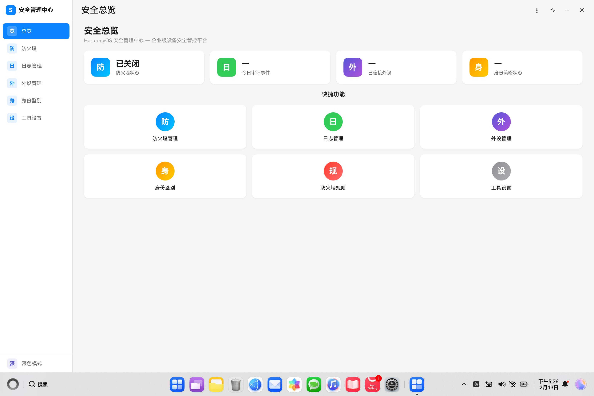

# HarmonyShield

**HarmonyOS 企业级安全管理中心** | Enterprise Security Management for HarmonyOS

[](https://developer.huawei.com/consumer/cn/harmonyos/)
[](https://developer.huawei.com/consumer/cn/arkts/)
[](DEVLOG.md)
[](LICENSE)
[](https://github.com/Deslord319/security_tool/actions/workflows/ci.yml)
[](TEST_COVERAGE_ANALYSIS.md)

---

## 项目介绍

HarmonyShield 是一款基于 HarmonyOS/OpenHarmony 平台的**企业级安全管理应用**，专为企业 IT 管理员设计。

### 应用截图



### 核心功能

| 模块 | 功能 | 状态 |
|------|------|------|
| **安全总览** | 安全状态概览、统计卡片、快捷入口、威胁告警 | 已完成 |
| **防火墙管理** | IP/域名/DNS 规则配置、流量方向过滤、规则启停 | 已完成 |
| **外设管理** | USB/蓝牙接口管控、设备黑白名单、策略配置 | 已完成 |
| **身份鉴别** | 口令复杂度策略、有效期设置、启动认证 | 已完成 |
| **日志管理** | 安全事件审计、日志查询、导出功能 | 已完成（含高频订阅稳定性优化） |
| **工具设置** | 启动认证、认证方式配置、密码修改、主题切换 | 已完成 |

### 适用场景

- 企业 IT 管理与安全合规
- 政府公共部门设备管控
- 医疗金融机构数据保护
- 工业制造敏感设备管理

---

## 项目优势

### 1. 深度系统集成

- **MDM Kit**：企业设备管理，USB/蓝牙外设精细化管控
- **netFirewall API**：原生网络防火墙，IP/域名/DNS 多维度过滤
- **userAuth (userIAM)**：生物识别与口令认证
- **Asset Store Kit**：敏感数据安全存储

### 2. 零信任安全架构

- 细粒度访问控制
- 设备级别的策略隔离
- 实时安全事件监控

### 3. 原生 HarmonyOS 体验

- ArkUI 声明式开发
- 深色/浅色主题自动适配
- 自定义窗口标题栏，保留系统三键区
- 流畅的动画与交互

### 4. 开箱即用

- 完整签名工具链
- 一键构建脚本
- 详细开发文档

---

## 工具包位置

```
HarmonyShield/
├── hapsigner/                      # HAP 签名工具包
│   ├── hap-sign-tool.jar           # 签名工具主程序 (12MB)
│   ├── OpenHarmony.p12             # 密钥库文件
│   ├── OpenHarmonyApplication.pem  # 应用证书
│   ├── OpenHarmonyProfileDebug.pem # 调试配置证书
│   ├── UnsgnedDebugProfileTemplate.json  # 签名配置模板
│   ├── 1-debug-p7b.bat             # 生成签名描述文件
│   ├── 2-debug-sign.bat            # 签名 HAP 包
│   └── signApp.hap                 # 已签名的应用包
│
├── entry/src/main/ets/             # 源代码目录
│   ├── entryability/               # 应用入口
│   ├── pages/                      # 页面组件
│   ├── views/                      # 视图模块
│   ├── components/                 # 通用组件
│   ├── services/                   # 服务层 (API 封装)
│   ├── models/                     # 数据模型
│   └── constants/                  # 常量定义
│
├── security-app/                   # UX 设计原型 (Web 版)
│   └── index.html                  # 原型预览入口
│
├── build_hap.bat                   # 一键构建脚本
├── AGENTS.md                       # AI 开发助手指南
└── DEVLOG.md                       # 版本记录与踩坑经验
```

---

## 快速入门

### 环境要求

| 工具 | 版本 | 说明 |
|------|------|------|
| DevEco Studio | 5.0+ | HarmonyOS IDE |
| HarmonyOS SDK | 5.0+ | 开发套件 |
| Java | 11+ | 签名工具依赖 |
| hdc | 最新版 | 设备连接工具 |

### 方式一：直接安装（推荐）

如果只需体验应用，可直接安装已签名的 HAP：

```bash
# 连接设备
hdc list targets

# 安装应用
hdc install hapsigner/signApp.hap

# 启动应用
hdc shell aa start -a EntryAbility -b com.huawei.securitytool
```

### 方式二：源码构建

#### 1. 克隆项目

```bash
git clone https://github.com/Deslord319/security_tool.git
cd security_tool
```

#### 2. 构建 HAP

**方式 A - 使用 DevEco Studio：**
- 打开项目 → Build → Build Hap(s)/APP(s) → Build Hap(s)

**方式 B - 使用命令行：**
```bash
# Windows
build_hap.bat

# 或直接调用 hvigor
hvigorw assembleHap --mode module -p product=default -p module=entry
```

构建产物位于：
```
entry/build/default/outputs/default/entry-default-unsigned.hap
```

#### 3. 签名 HAP

```bash
# 进入签名目录
cd hapsigner

# 复制未签名包
copy ..\entry\build\default\outputs\default\entry-default-unsigned.hap .

# 执行签名
2-debug-sign.bat
```

> 如果修改了包名或权限，需要先运行 `1-debug-p7b.bat` 重新生成签名描述文件。

#### 4. 安装到设备

```bash
hdc install signApp.hap
```

---

## 基本信息

| 项目 | 值 |
|------|------|
| 项目名称 | HarmonyShield |
| 包名 | `com.huawei.securitytool` |
| 当前版本 | v15 |
| 目标设备 | 2in1 |
| SDK | HarmonyOS 5.0 |
| 语言 | ArkTS (ETS) |

---

## 技术架构

```
┌─────────────────────────────────────────────────────────────┐
│                     Presentation Layer                       │
│   MainPage │ DashboardPage │ FirewallPage │ PeripheralPage  │
├─────────────────────────────────────────────────────────────┤
│                      Component Layer                         │
│    SideBar │ StatCard │ RuleTable │ DeviceList │ Dialog     │
├─────────────────────────────────────────────────────────────┤
│                       Service Layer                          │
│   FirewallService │ PeripheralService │ AuthService │ Log   │
├─────────────────────────────────────────────────────────────┤
│                        Data Layer                            │
│     FirewallRule │ DeviceRecord │ PolicyConfig │ Theme      │
├─────────────────────────────────────────────────────────────┤
│                       System APIs                            │
│   netFirewall │ MDM Kit │ userAuth │ Asset Store │ Window   │
└─────────────────────────────────────────────────────────────┘
```

---

## 权限说明

| 权限 | 用途 |
|------|------|
| `MANAGE_NET_FIREWALL` | 管理网络防火墙规则 |
| `GET_NET_FIREWALL` | 读取防火墙状态 |
| `ENTERPRISE_MANAGE_USB` | USB 外设管控 |
| `ENTERPRISE_MANAGE_BLUETOOTH` | 蓝牙设备管控 |
| `ENTERPRISE_MANAGE_NETWORK` | 企业网络管理 |
| `ENTERPRISE_MANAGE_RESTRICTIONS` | 设备限制策略 |
| `ENTERPRISE_GET_DEVICE_INFO` | 获取设备信息 |
| `ENTERPRISE_MANAGE_WIFI` | WiFi 管理 |
| `ENTERPRISE_ADMIN_MANAGE` | 企业管理员管理 |
| `ENTERPRISE_MANAGE_SECURITY` | 安全策略管理 |
| `ENTERPRISE_SET_ACCOUNT_POLICY` | 账户策略设置 |
| `QUERY_AUDIT_EVENT` | 订阅和查询系统安全审计事件 |

---

## 相关文档

| 文档 | 说明 |
|------|------|
| [AGENTS.md](AGENTS.md) | AI 开发助手指南，详细签名流程 |
| [DEVLOG.md](DEVLOG.md) | 版本记录与踩坑经验 |
| [security-app/index.html](security-app/index.html) | UX 设计原型预览 |

---

## 版本历史

详见 [DEVLOG.md](DEVLOG.md)

| 版本 | 日期 | 主要更新 |
|------|------|----------|
| v15 | 2026-03-03 | 修复日志订阅参数映射、批量入库与刷新节流，过滤内部审计自激，优化 OOM/卡顿稳定性 |
| v14 | 2026-03-03 | 日志管理模块与帮助反馈页面，补齐日志模型与服务层能力 |
| v13 | 2026-02-25 | 启动认证功能、AuthService 增强与测试框架搭建 |
| v12 | 2026-02-25 | 文档同步更新：版本号、权限列表与模块状态对齐代码 |
| v11 | 2026-02-25 | 工具设置模块、AuthService/SecureStorageService 服务 |
| v10 | 2026-02-13 | 隐藏系统标题栏，外设管理接入 MDM API |
| v9 | 2026-02-12 | 深色模式主题系统，身份鉴别模块 |
| v8 | 2026-02-11 | UI 布局优化，修复 Scroll 空白问题 |
| v7 | 2026-02-10 | 外设管理模块（接口管控、黑白名单） |
| v5 | 初始版本 | 安全总览 + 防火墙模块 |

---

## License

Apache License 2.0
