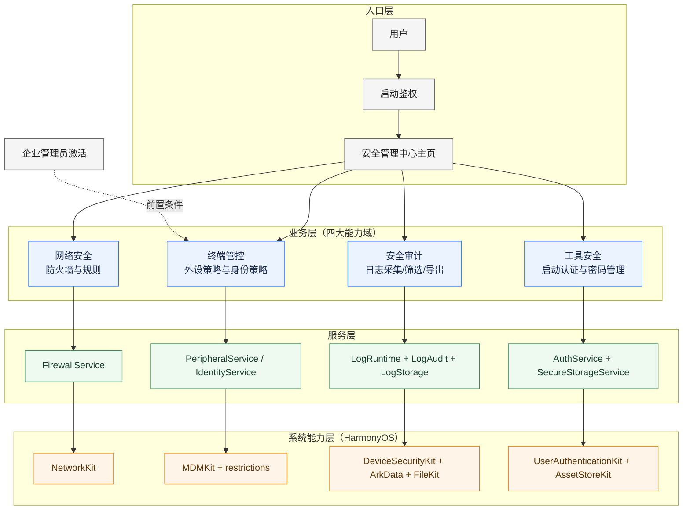
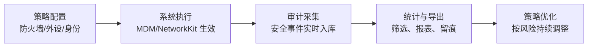

# SecurityTool 产品设计图（领导汇报版）

## 图 1：分层架构（一图看懂）

## 图 2：安全运营闭环（汇报重点）

## 汇报话术（30 秒）

SecurityTool 是一个面向 2in1 设备的企业安全管理中台，采用“一个入口、四大能力域”的架构：网络安全、终端管控、安全审计、工具安全。产品核心价值不是单点功能，而是完整闭环: 策略可下发、执行可验证、事件可审计、结果可复盘。对高风险能力，系统通过企业管理员激活机制做前置保护，确保安全策略可控且可追溯。

## 领导关注点（可直接放 PPT）

1. 结构简洁: 入口统一、能力分层、职责清晰。
2. 闭环完整: 从策略到审计到优化形成持续运营链路。
3. 风险可控: 关键策略受管理员激活机制保护，降低误操作与越权风险。
