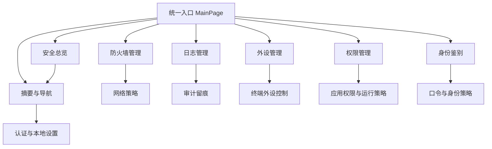

# SecurityTool PRD

> 状态：Active
> 最后更新：2026-04-08
> 适用范围：SecurityTool 当前代码基线与后续模块迭代
> 关联文档：
> - `docs/02-总体设计/总体设计RFC.md`
> - `docs/03-模块设计/安全总览组件设计说明.md`
> - `docs/03-模块设计/防火墙管理组件设计说明.md`
> - `docs/03-模块设计/外设管理组件设计说明.md`
> - `docs/03-模块设计/权限管理组件设计说明.md`
> - `docs/03-模块设计/身份鉴别组件设计说明.md`
> - `docs/03-模块设计/日志管理组件设计说明.md`
> - `docs/03-模块设计/工具设置组件设计说明.md`
> - `docs/03-模块设计/帮助与反馈组件设计说明.md`

## 1. 文档目的

本文档用于替代原“领导汇报版”单页图，作为 SecurityTool 当前阶段的产品需求基线，统一回答以下问题：

- 这个产品解决什么问题
- 当前版本包含哪些模块与边界
- 每个模块的核心用户价值和验收目标是什么
- 后续 RFC 和模块设计应该围绕什么目标收敛

本文不是 UI 视觉稿，也不是实现细节文档。总体架构、统一约束和模块挂靠关系以 `docs/02-总体设计/总体设计RFC.md` 为准；页面结构、状态设计和模块内部实现以模块设计文档与专项执行文档为准。

## 2. 产品概述

SecurityTool 是一个面向 HarmonyOS 2in1 设备的企业安全管理中心，服务对象是企业 IT 管理员、安全管理员和设备运营人员。产品目标不是提供零散安全开关，而是提供一套围绕“策略配置、系统执行、审计留痕、风险收敛”的本地安全治理入口。

当前产品以单应用统一入口承载七个能力模块：

- 安全总览
- 防火墙管理
- 日志管理
- 外设管理
- 权限管理
- 身份鉴别
- 工具设置

其中高风险能力依赖企业管理员激活、系统权限和本地认证保护，确保关键操作可控、可追溯、可审计。

## 3. 产品目标

### 3.1 业务目标

1. 为企业设备提供统一安全控制入口，降低管理员在多个系统设置项间切换的成本。
2. 把网络、外设、身份、审计、工具安全这五类能力收敛到同一操作闭环。
3. 让关键策略配置具备“配置后能生效、生效后可验证、异常时可追踪”的最小闭环能力。

### 3.2 产品目标

1. 首页在 1 个屏内完成核心安全态势概览和模块跳转。
2. 所有高价值模块都具备独立页面、明确状态反馈和失败兜底提示。
3. 日志、外设连接记录、防火墙策略、身份策略等关键状态在页面刷新或重进后保持一致。
4. 关键敏感操作具备认证保护、管理员激活感知或权限前置校验。

### 3.3 非目标

- 不做服务端多设备统一编排平台
- 不做远程策略下发 SaaS 后台
- 不做复杂报表中心或 BI 系统
- 不做终端杀毒、漏洞扫描、补丁分发等超出当前系统能力边界的功能

## 4. 用户与场景

### 4.1 目标用户

| 用户角色 | 核心诉求 | 典型动作 |
|---|---|---|
| 企业 IT 管理员 | 快速完成设备安全策略配置 | 配置防火墙、外设接口、启动认证 |
| 安全管理员 | 关注策略合规与风险留痕 | 查看日志、导出审计、校验配置状态 |
| 运维/交付人员 | 交付前完成本机安全基线初始化 | 激活管理员、初始化认证、验证默认策略 |

### 4.2 核心场景

1. 新设备交付：初始化认证能力、启用关键安全开关、验证管理员激活状态。
2. 安全基线配置：设置防火墙模式、限制 USB/蓝牙、配置口令复杂度。
3. 事件追踪：发现异常后进入日志管理查看安全事件与导出留痕。
4. 日常巡检：通过安全总览快速识别哪些模块处于风险态或未配置态。
5. 策略调整：在不离开应用的前提下完成策略修改、查看结果、复核状态。

## 5. 产品原则

### 5.1 单一入口

所有核心能力均从 `pages/MainPage` 进入，避免同类安全能力散落在多个入口。

### 5.2 状态可信

界面展示必须尽量对应系统真实状态或仓储真相，禁止页面层长期维护镜像态。

### 5.3 先保护后执行

高风险操作先做认证、权限或管理员状态校验，再执行写操作。

### 5.4 可回看

关键安全动作最终都应能沉淀为状态变化、连接记录或日志证据，而不是只给瞬时提示。

## 6. 信息架构

### 6.1 页面与路由

| 路由 ID | 页面 | 产品定位 |
|---|---|---|
| `dashboard` | 安全总览 | 首页、风险概览、快捷入口 |
| `firewall` | 防火墙管理 | 网络边界策略控制 |
| `firewall-rules` | 防火墙规则详情 | 自定义规则与用户模式下发 |
| `log-manage` | 日志管理 | 安全事件采集、查询、导出 |
| `peripheral-manage` | 外设管理 | USB/蓝牙与设备连接记录管控 |
| `permission-manage` | 权限管理 | 应用级安装、运行、目录、网络和保活管控入口 |
| `identity` | 身份鉴别 | 口令复杂度与有效期策略 |
| `tool-settings` | 工具设置 | 启动认证与工具级安全设置 |
| `help-feedback` | 帮助与反馈 | 辅助信息入口，不属于核心安全闭环 |

### 6.2 能力分层

## 7. 模块需求

### 7.1 安全总览

模块目标：在首页聚合关键安全状态，并作为其它模块的跳转中枢。

核心需求：

1. 展示防火墙、日志、外设等模块摘要卡，并提供权限、身份、工具设置等快捷入口。
2. 提供快捷入口，减少二级页面跳转成本。
3. 页面显示时能基于当前状态进行静态校准和必要刷新。
4. 允许基于日志和外设运行时事件更新首页摘要。

核心验收信号：

- 首页进入后可以看到关键模块摘要与状态文案。
- 快捷入口跳转到正确页面。
- 页面重进后摘要状态不明显滞后。

### 7.2 防火墙管理

模块目标：提供系统防火墙总开关、预设模式、自定义规则及按用户模式下发能力。

核心需求：

1. 支持主防火墙总开关启停。
2. 支持 `public`、`private`、`custom` 三种主模式切换。
3. 支持自定义规则新增、编辑、删除与保存。
4. 支持自定义模式下的按用户策略下发。
5. 对高风险动作增加认证保护和锁定语义。

核心验收信号：

- 主开关和主模式切换可回显系统状态。
- 自定义规则保存后重新进入仍可恢复。
- 用户级模式下发在受保护流程后能成功生效。

### 7.3 日志管理

模块目标：提供安全事件采集、筛选、分页查看、详情查看和导出能力。

核心需求：

1. 支持运行时日志采集与存储状态展示。
2. 支持按关键字段筛选、分页浏览日志列表。
3. 支持查看详情，避免列表态和详情态相互污染。
4. 支持日志导出与存储配置管理。
5. 支持高频刷新下的状态收敛，避免页面卡顿和错误镜像态。

核心验收信号：

- 日志列表在刷新、筛选、分页间状态稳定。
- 详情弹窗内容与选中记录一致。
- 导出动作有成功/失败结论且可追踪。

### 7.4 外设管理

模块目标：围绕 USB、蓝牙和设备连接记录建立终端外设安全控制入口。

核心需求：

1. 支持 USB/蓝牙等接口级开关控制。
2. 支持设备连接记录采集、展示、详情查看和清空。
3. 支持单设备策略黑白名单及策略清理。
4. 页面状态要区分接口管控、连接记录、单设备策略三个子域。
5. 对运行时能力不可用、蓝牙权限受限等场景给出明确降级反馈。

核心验收信号：

- 接口级开关能正确读取与修改状态。
- 连接记录列表、详情、清理动作语义一致。
- 单设备策略在刷新后可恢复。

### 7.5 权限管理

模块目标：提供应用级安装、运行、目录权限、网络和保活策略的统一入口，首版先完成可导航只读骨架。

核心需求：

1. 在侧边栏和安全总览快捷入口中提供权限管理入口。
2. 首版页面展示策略摘要、首版范围和应用清单空态，不执行系统写操作。
3. 后续真实能力接入前，必须完成管理员激活态、权限声明和签名模板闭环。

核心验收信号：

- 入口可达，页面不白屏。
- 首版不新增企业权限声明，也不触发安装、卸载、运行、网络或保活写操作。
- 后续能力拆分能回到模块设计文档中找到阶段边界。

### 7.6 身份鉴别

模块目标：提供口令复杂度、有效期等账户策略配置能力，并感知企业管理员状态。

核心需求：

1. 支持最低密码长度、复杂度等策略配置。
2. 支持密码有效期、自定义有效期等策略输入。
3. 在未激活管理员时，能提示策略不可写或能力受限。
4. 将页面编辑态与系统真实策略态分离，避免误提交。

核心验收信号：

- 页面初始化可正确加载当前系统策略。
- 修改后保存结果明确，失败时不丢失编辑上下文。
- 管理员状态变化会影响可编辑性与提示信息。

### 7.7 工具设置

模块目标：围绕本工具自身的启动认证和系统密码入口提供安全设置能力。

核心需求：

1. 支持启动认证开关控制。
2. 支持认证方式选择，并对不可用方式做显式校验。
3. 支持跳转系统密码修改入口。
4. 支持保存结果回显和页面刷新恢复。

核心验收信号：

- 启动认证配置保存后重新进入可恢复。
- 不可用认证方式不会被误保存。
- 系统密码入口跳转链路可达。

## 8. 模块协同关系

### 8.1 首页与业务模块

- 首页读取模块摘要，不承载各业务模块的完整编辑逻辑。
- 业务模块的状态变化可以反向影响首页摘要，但不应让首页成为业务真相源。

### 8.2 工具设置与高风险操作

- 工具设置负责本应用启动认证偏好，不直接替代防火墙模块内的敏感操作认证保护。
- 防火墙等模块仍可保留自己的受保护执行链路。

### 8.3 日志管理与其它模块

- 日志管理承担安全审计的留痕能力。
- 其它模块发生关键策略变化时，应尽量形成可观测事件或日志证据。

## 9. 非功能需求

### 9.1 平台与设备

- 目标平台：HarmonyOS / OpenHarmony
- 目标设备：2in1
- 入口页固定为 `pages/MainPage`

### 9.2 安全与权限

- 包名固定为 `com.huawei.securitytool`
- 涉及防火墙、外设、身份策略的权限必须与签名模板保持一致
- 企业管理员能力是部分 MDM 功能的前置条件

### 9.3 稳定性

- 页面重进、切页、刷新后状态不能明显错乱
- 日志高频刷新与外设运行时事件不应导致页面无响应
- 降级场景必须输出明确提示，不允许静默失败

### 9.4 可维护性

- 模块设计和 RFC 需要与代码目录结构对应
- 页面层不直接承担复杂业务编排
- 新增模块迭代优先遵循 MVVM 与单一服务入口原则

## 10. 当前版本范围与状态

| 模块 | 当前状态 | 说明 |
|---|---|---|
| 安全总览 | 已完成 | 已具备摘要卡、快捷入口和基础刷新机制 |
| 防火墙管理 | 已完成并持续增强 | 已具备总开关、模式切换、自定义规则和用户级模式下发设计说明 |
| 日志管理 | 已完成并持续增强 | 已具备采集、查询、分页、详情、导出和存储配置设计说明 |
| 外设管理 | 已完成并持续增强 | 已具备接口管控、连接记录、设备策略和运行时采集设计说明 |
| 权限管理 | 首版接入中 | 已具备设计说明、路由、首页快捷入口和只读骨架页；真实 MDM 写操作后续分阶段开放 |
| 身份鉴别 | 已完成 | 已具备密码复杂度、有效期、管理员激活态和保存流程设计说明 |
| 工具设置 | 已完成 | 已具备启动认证、认证方式、系统密码入口和启动阶段消费链路设计说明 |
| 帮助与反馈 | 已完成 | 辅助页，已具备使用指南、FAQ、反馈邮箱和静态页面边界设计说明 |

### 10.1 PRD / RFC / 实现对齐矩阵

当前 PRD 描述的是产品范围，总体 RFC 描述架构与拆分方式，模块设计文档描述实际开发细节。三者与当前代码基线的对齐关系如下：

| 产品模块 | PRD 交付能力 | RFC / 模块设计落点 | 当前代码落点 | 测试证据 |
|---|---|---|---|---|
| 安全总览 | 摘要卡、快捷入口、管理员状态入口 | 总体 RFC 6.1；`docs/03-模块设计/安全总览组件设计说明.md` | `views/dashboard/overview/DashboardPage.ets`、`viewmodels/dashboard/overview/DashboardViewModel.ets` | `entry/src/test/dashboard/viewmodel.test.ets`、`entry/src/ohosTest/ets/test/simple/RouteAction.test.ets`、`scripts/e2e/cases/dashboard/*` |
| 防火墙管理 | 总开关、模式切换、自定义规则、规则页 | 总体 RFC 6.2；`docs/03-模块设计/防火墙管理组件设计说明.md` | `views/firewall/**`、`viewmodels/firewall/**`、`services/firewall/**` | `entry/src/test/firewall/*`、`entry/src/ohosTest/ets/test/firewall/subroute-state.test.ets`、`entry/src/ohosTest/ets/test/simple/RouteAction.test.ets`、`scripts/e2e/cases/firewall/*` |
| 日志管理 | 采集、查询、筛选、分页、详情、导出、留存配置 | 总体 RFC 6.3；`docs/03-模块设计/日志管理组件设计说明.md` | `views/log-manage/**`、`viewmodels/log-manage/**`、`services/log-manage/**`、`storage/rdb/**` | `entry/src/test/log-manage/*`、`entry/src/ohosTest/ets/test/simple/RouteAction.test.ets`、`scripts/e2e/cases/logs/*` |
| 外设管理 | 接口管控、USB/蓝牙策略、连接记录、运行时采集 | 总体 RFC 6.4；`docs/03-模块设计/外设管理组件设计说明.md` | `views/peripheral/**`、`viewmodels/peripheral/**`、`services/peripheral/**`、`runtime/ApplicationRuntimeManager.ets` | `entry/src/test/peripheral/*`、`entry/src/test/viewmodels/Peripheral*.test.ets`、`entry/src/ohosTest/ets/test/peripheral/connection-record-contract.test.ets`、`entry/src/ohosTest/ets/test/simple/RouteAction.test.ets`、`scripts/e2e/cases/peripheral/*` |
| 权限管理 | 应用级管控入口、首版只读骨架 | 总体 RFC 6.5；`docs/03-模块设计/权限管理组件设计说明.md` | `views/permission-manage/**`、`viewmodels/permission-manage/**`、`services/permission-manage/**` | `entry/src/test/permission-manage/*`、`entry/src/ohosTest/ets/test/simple/RouteAction.test.ets` |
| 身份鉴别 | 口令复杂度、有效期、企业管理员状态、认证能力 | 总体 RFC 6.6；`docs/03-模块设计/身份鉴别组件设计说明.md` | `views/identity/**`、`viewmodels/identity/**`、`services/identity/**` | `entry/src/test/identity/*`、`entry/src/test/auth/*`、`entry/src/ohosTest/ets/test/simple/RouteAction.test.ets`、`scripts/e2e/cases/identity/*` |
| 工具设置 | 启动认证、认证方式、系统密码入口 | 总体 RFC 6.7；`docs/03-模块设计/工具设置组件设计说明.md` | `views/tool-settings/**`、`viewmodels/tool-settings/**`、`services/tool-settings/**`、`entryability/EntryAbility.ets` | `entry/src/test/tool-settings/*`、`entry/src/test/entryability/entryability.test.ets`、`entry/src/ohosTest/ets/test/simple/RouteAction.test.ets`、`scripts/e2e/cases/tool_settings/*` |
| 帮助与反馈 | 使用指南、FAQ、反馈邮箱、辅助入口 | 总体 RFC 6.8；`docs/03-模块设计/帮助与反馈组件设计说明.md` | `views/help-feedback/overview/HelpFeedbackPage.ets`、`constants/modules/HelpFeedbackStrings.ets` | `entry/src/test/help/strings.test.ets`、`entry/src/ohosTest/ets/test/simple/RouteAction.test.ets`、`scripts/e2e/cases/navigation/help_feedback*.json` |

## 11. 后续文档约束

1. `docs/02-总体设计/总体设计RFC.md` 负责回答“整体怎么设计、各模块怎么挂靠、统一约束是什么”。
2. `docs/03-模块设计/` 负责回答“模块怎么设计、后续怎么演进、如何拆分阶段实施”。
3. 不再保留独立过程文档目录；模块专项演进内容应收敛到对应模块设计文档。
4. 后续若新增模块能力，必须先更新本 PRD 的模块范围，再同步总体 RFC 和对应模块设计。
5. 若路由、能力边界或核心术语发生变化，优先更新本 PRD 和总体 RFC，再同步模块文档。
6. PRD 只记录产品范围、模块状态和验收目标；总体 RFC 记录架构分层、实现对照、拆分步骤和不走路径；模块设计记录具体类、状态、数据、异常、测试和验收口径。
7. 若代码新增页面、ViewModel、Service、Repository、权限、路由或 E2E 场景，必须能在上表和对应模块设计文档中找到文档落点。

## 12. 里程碑建议

### M1：当前可用基线

- 七个核心模块均已可进入，其中权限管理为首版只读骨架
- 权限管理首版可从侧边栏和首页快捷入口进入
- 帮助与反馈辅助页可从顶部菜单进入
- 构建、签名、安装链路稳定
- 基础文档已与代码结构对齐

### M2：模块收口

- 维持 PRD / 总体 RFC / 模块设计 / 实现 / 测试的对齐矩阵，不再新增分散的过程文档目录
- 所有模块变更继续先落到对应模块设计文档的实施步骤、测试覆盖和验收口径
- 首页与各模块状态同步口径持续收敛，新增摘要或快捷入口必须同步路由、E2E 和对应模块设计

### M3：质量强化

- 模块级测试补齐
- 关键链路构建 fresh deploy 验证
- 统一日志、错误码、降级提示和维护规范

## 13. 附：汇报版结构图

