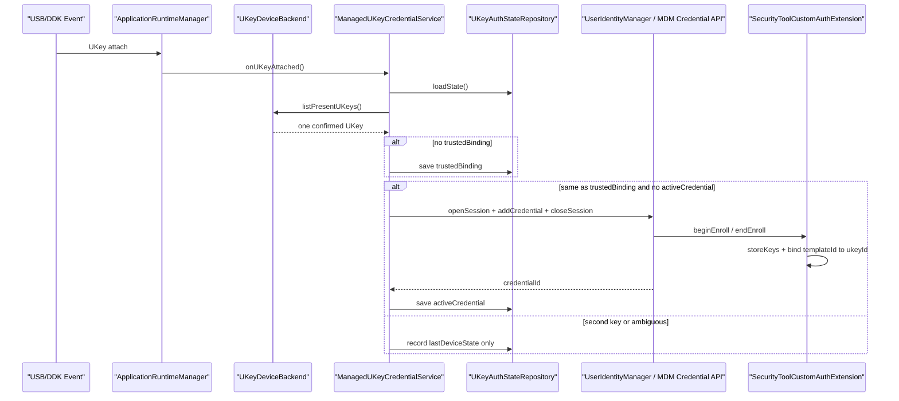
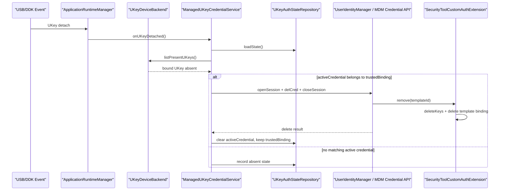

# UKey 管理与认证器核心接入设计说明

## 0. 文档契约与状态 (Document Contract)

- **描述对象**:
  - [ ] 当前已落地代码 (As-Is)
  - [x] 目标架构设计 (To-Be)
  - [x] 重构中过渡方案 (WIP)
- **维护规则**: 本文档描述 UKey 设备管理、DDK 接入、CustomAuth 核心执行逻辑和凭据注入/删除链路。修改 UKey 插拔策略、凭据生命周期、CustomAuth 协议接入、DDK 权限或验收口径时，必须同步更新本文档。
- **一致性原则**: 本文档是 UKey 管理专项设计。身份鉴别页面的口令策略、页面结构和单开关入口仍以 `docs/03-模块设计/身份鉴别组件设计说明.md` 为准；外设连接记录、黑白名单策略和 trace 语义仍以 `docs/03-模块设计/外设管理组件设计说明.md` 为准。本文档不把锁屏解锁体验作为本阶段验收重点，锁屏只保留系统调度 CustomAuthenticator 的后续入口。
- **裁剪原则**: 不把 `CustomAuthenticator` 测试应用整体内置到 SecurityTool，不迁移它的页面、EntryAbility、调试 AppStorage 状态、模拟 UKey 切换、轮换调试和无关资源。只复用能让系统 CustomAuth 服务调度的核心协议、IPC、密码学、SecurityAsset 存储和认证流程骨架；UKey 枚举、读取、首把规则和拔出处理由 SecurityTool 自己实现。

## 1. 业务概述与对外接口 (Overview & Public Interfaces)

- **核心目标**: SecurityTool 作为 MDM 应用管理 UKey 插拔和凭据生命周期。确认一把 UKey 后，按 CustomAuthTestHAP 的凭据注入链路调用系统身份凭据接口添加 CustomAuth 凭据；UKey 拔出后删除对应活动凭据；SecurityTool 的 CustomAuth appService 入口只承载认证器核心逻辑，并通过自研 UKey backend 判断当前 UKey 与模板绑定关系。
- **入口路由 (Route Entry)**: 无独立页面路由。身份鉴别页只保留 `UKey 锁屏认证` 单开关；UKey 管理由应用运行时 USB/DDK 事件驱动，CustomAuth appService 只作为系统认证服务回调入口。
- **对外暴露能力 (Public APIs)**:
  - `UKeyDeviceBackend`: UKey 枚举、确认、稳定标识读取、插拔事件适配端口。
  - `FakeUKeyBackend`: 当前阶段的伪 UKey 后端，用 USB 描述符或测试状态模拟第一把 UKey。
  - `DdkUKeyBackend`: 后续真实 UKey 后端，基于 USB/HID/SCSI/USB Serial DDK 读取硬件状态和稳定标识。
  - `UKeyAuthStateRepository`: UKey 认证专用持久化仓库，保存开关、首把绑定、活动凭据和最近设备状态。
  - `CustomAuthCredentialManager`: 封装 CustomAuth 凭据添加、查询、删除，复用测试 HAP 的 `openSession -> addCredential -> closeSession` 和 `openSession -> delCred -> closeSession` 调用模型。
  - `ManagedUKeyCredentialService`: 编排 UKey 插入确认、首把绑定、凭据注入、拔出删除、启动对账。
  - `SecurityToolCustomAuthExtension`: 本应用声明的 `ICustomAuthenticatorV1` appService 入口，只挂接裁剪后的 CustomAuth 核心逻辑，不包含测试认证器应用外壳。
  - `CustomAuthCoreService`: 从参考实现裁剪出的 IPC、密码学、SecurityAsset 和认证流程核心。
  - `AuthenticatorUKeyProvider`: CustomAuth 核心内部 UKey 抽象，不再使用页面 `AppStorage` 或参考实现的伪 UKey 状态。
- **业务边界**:
  - ✅ **包含**: UKey 插入/拔出状态管理；首把 UKey 绑定；活动凭据注入和删除；伪 UKey 后端；DDK 后端预留；从 CustomAuthenticator 参考实现裁剪核心协议和密钥逻辑；认证器核心按 UKey 绑定模板；第二把 UKey 不自动注册、不替换首把绑定。
  - ❌ **不包含**: SystemUI 锁屏页面改造；真实锁屏解锁 UI 验证；UKey 私钥、PIN、证书私密材料展示；多把 UKey 管理界面；UKey 换新流程；外设黑白名单策略替代；整体迁移或安装外部 `com.demo.customauthenticator` 测试认证器；迁移测试认证器页面、调试按钮、AppStorage fake UKey、轮换模拟和无关资源。

本阶段主链路不是“锁屏页面怎么解锁”，而是把 UKey 硬件状态和 CustomAuth 凭据生命周期打通：

```text
UKey 插入/拔出
  -> SecurityTool 运行时事件
  -> UKeyDeviceBackend 确认当前 UKey
  -> ManagedUKeyCredentialService 维护绑定和活动凭据
  -> CustomAuthCredentialManager 调用系统凭据接口
  -> SecurityToolCustomAuthExtension / CustomAuthCoreService 保存或删除模板侧密钥和 UKey 绑定
```

锁屏只保留后续系统调度入口：

```text
SystemUI / UserAuth
  -> CustomAuth 系统服务
  -> SecurityToolCustomAuthExtension / CustomAuthCoreService
  -> AuthenticatorUKeyProvider 严格匹配当前 UKey
```

## 2. 状态与数据流 (Data Flow & State)

> **设计原则**: MDM 管理侧只管理 UKey 状态和系统凭据生命周期；认证器执行侧只管理模板密钥和 UKey 认证判断；两侧通过同一 UKey 认证仓库共享非私密状态。

- **核心业务状态 (Core Business State)**:
  - `ukeyAuthEnabled: boolean`: 是否启用 UKey 认证管理，默认 `true`。当前页面仍只展示一个开关。
  - `trustedBinding: TrustedUKeyBinding | null`: 首把 UKey 绑定。绑定建立后保留，不因 UKey 拔出而删除，用于保证第二把 UKey 不能成为新的默认 key。
  - `activeCredential: ManagedCustomAuthCredential | null`: 当前系统侧已注入的活动 CustomAuth 凭据。UKey 拔出时删除该凭据，但不删除 `trustedBinding`。
  - `lastDeviceState: UKeyPresenceState`: 最近一次 UKey 后端判断结果，取值为 `unknown / absent / present / multiple / backend_error`。
  - `lastPresentUKeyId: string`: 最近确认在场的 UKey 稳定标识。伪后端可由 USB VID/PID/SN 或测试状态生成，DDK 后端应来自硬件协议读取。
  - `credentialLifecycle: idle / enrolling / active / deleting / deleted / failed`: 当前凭据生命周期，防止插拔事件并发导致重复注册或重复删除。
  - `templateBinding[templateId]: ukeyId`: CustomAuth 核心内的模板到 UKey 绑定。录入成功时写入，删除或对账时清理。
- **关键流转路径**:
  - 初次插入 UKey -> `UKeyDeviceBackend.listPresentUKeys()` -> 仅一把可确认 UKey -> 建立 `trustedBinding` -> 调用 `addCredential` -> 保存 `activeCredential`。
  - 已有首把绑定后插入同一把 UKey -> 若无活动凭据，则重新注入凭据；若已有活动凭据，则只刷新在场状态。
  - 已有首把绑定后插入第二把 UKey -> 不调用 `addCredential`，不覆盖 `trustedBinding`。
  - 首把 UKey 拔出 -> 若存在该 UKey 对应 `activeCredential`，调用 `delCred` 或 MDM 删除接口 -> 删除成功后清空 `activeCredential`，保留 `trustedBinding`。
  - 第二把或无关 USB 拔出 -> 不删除首把绑定，不删除非对应活动凭据。
  - 应用启动/重启 -> 读取 `trustedBinding` 和 `activeCredential` -> 用 UKey 后端做一次对账 -> key 不在场但凭据仍活动时删除 stale 凭据；key 在场但无活动凭据时按首把绑定重新注入。
  - CustomAuth 核心 `endEnroll` -> 生成并保存模板密钥 -> 通过 `AuthenticatorUKeyProvider.onEnrolled(templateId)` 将模板绑定到当前确认的 UKey。
  - CustomAuth 核心 `beginAuthenticate` -> 枚举模板 -> 通过 `AuthenticatorUKeyProvider.getPresentTemplateId(candidates)` 严格匹配当前 UKey -> 无匹配直接失败，不走顺序尝试或自动轮换。
  - CustomAuth 核心 `remove(templateId)` -> 删除 SecurityAsset 密钥 -> 删除 `templateBinding[templateId]`。

### 2.1 插入和凭据注入数据流



### 2.2 拔出和凭据删除数据流



## 3. 核心功能场景 (Core Functional Scenarios)

### 3.1 首把 UKey 绑定和凭据注入

- **业务目标**: 只有首把确认成功的 UKey 可以建立绑定并注入 CustomAuth 凭据。
- **入口/触发**: 应用启动对账、UKey attach 事件、开关从关闭切到开启。
- **涉及能力**: `UKeyDeviceBackend`、`UKeyAuthStateRepository`、`CustomAuthCredentialManager.addCredential`、`ICustomAuthenticatorV1`。

| 条件/分支 | 前置状态 | 处理规则 | 预期表现 | 状态/持久化影响 | 覆盖要求 |
|---|---|---|---|---|---|
| 首次插入一把可确认 UKey | 无 `trustedBinding`，无 `activeCredential` | 建立首把绑定，调用凭据注入 | 注册成功后该 UKey 成为唯一可信 key | 保存 `trustedBinding` 和 `activeCredential` | UT + 设备手工 |
| 首次存在 0 把 UKey | 无绑定 | 不调用凭据注入 | 无可用 UKey，等待下次事件 | 记录 `absent` | UT |
| 首次存在多把 UKey | 无绑定 | 不调用凭据注入 | 防止误绑定 | 记录 `multiple` | UT + 手工 |
| DDK/USB 后端失败 | 无绑定或已有绑定 | 不伪造成功，不注入凭据 | 记录失败，下次事件重试 | 记录 `backend_error` | UT |

### 3.2 第二把 UKey 不可替换首把

- **业务目标**: 首把绑定建立后，第二把 UKey 不自动注册、不替换、不触发认证成功路径。
- **入口/触发**: 第二把 UKey attach、应用启动对账。
- **涉及能力**: `UKeyDeviceBackend`、`ManagedUKeyCredentialService`、`AuthenticatorUKeyProvider`。

| 条件/分支 | 前置状态 | 处理规则 | 预期表现 | 状态/持久化影响 | 覆盖要求 |
|---|---|---|---|---|---|
| 插入第二把 UKey | 已有 `trustedBinding` | 只更新当前设备状态，不调用 `addCredential` | 第二把不能获得系统凭据 | 不改变 `trustedBinding` | UT + 手工 |
| 首把和第二把同时在场 | 已有 `trustedBinding` | 若后端可稳定识别首把且无活动凭据，可为首把补注册；否则保持不注册 | 不因多设备误绑第二把 | `trustedBinding` 不变 | UT |
| 认证器收到第二把 UKey | 已有模板绑定首把 | `getPresentTemplateId` 返回 null，认证失败 | 不走顺序 fallback，不轮换 | 无状态改变 | UT |

### 3.3 UKey 拔出删除活动凭据

- **业务目标**: UKey 拔出后删除系统侧活动凭据，避免 key 不在场时系统仍保留可认证凭据；同时保留首把绑定，避免后续第二把变成首把。
- **入口/触发**: UKey detach 事件、启动对账发现绑定 key 不在场。
- **涉及能力**: `CustomAuthCredentialManager.delCredential`、`UserIdentityManager.delCred` 或 `mdm.deleteUserCustomCredential`、`CustomAuthCoreService.remove`。

| 条件/分支 | 前置状态 | 处理规则 | 预期表现 | 状态/持久化影响 | 覆盖要求 |
|---|---|---|---|---|---|
| 首把 UKey 拔出 | 存在对应 `activeCredential` | 调用删除凭据，成功后清空活动凭据 | 系统侧凭据被删除 | `activeCredential = null`，`trustedBinding` 保留 | UT + 设备手工 |
| 第二把 UKey 拔出 | 活动凭据属于首把 | 不删除首把活动凭据 | 无关拔出不影响首把 | 只刷新设备状态 | UT |
| 删除失败 | 存在活动凭据 | 标记删除失败，后续对账重试 | 不伪装删除成功 | `credentialLifecycle = failed` | UT |
| 系统已删除但本地仍记录活动凭据 | 本地 stale | 查询不到或 delCred 返回不存在时清空本地活动凭据 | 状态收敛 | 清空 `activeCredential` | UT |

### 3.4 重启和异常恢复

- **业务目标**: 应用、设备或认证器进程重启后，UKey 绑定和系统凭据状态能重新对账。
- **入口/触发**: `ApplicationRuntimeManager` 初始化、身份鉴别页初始化、CustomAuth 核心 `initAuthenticator`。
- **涉及能力**: `UKeyAuthStateRepository`、`getAuthInfo`、`initAuthenticator` 对账、DDK/USB 当前设备枚举。

| 条件/分支 | 前置状态 | 处理规则 | 预期表现 | 状态/持久化影响 | 覆盖要求 |
|---|---|---|---|---|---|
| 重启后首把在场且无活动凭据 | 有 `trustedBinding` | 重新注入凭据 | 可恢复到 active | 保存新的 `credentialId` | 设备手工 |
| 重启后首把不在场但有活动凭据 | 有 stale `activeCredential` | 删除 stale 凭据或标记待删 | 不保留不在场凭据 | 清空或标记删除失败 | UT + 手工 |
| CA 有孤立 SecurityAsset | 系统侧有效 templateIds 不包含该模板 | `initAuthenticator` 调 `reconcile` 清理 | CA 状态与系统收敛 | 删除孤立记录 | UT |
| 本地绑定 JSON 损坏 | 读取失败 | 不自动绑定第二把，要求重新建立可信绑定策略 | 避免误绑定 | 清空损坏状态并记录错误 | UT |

### 3.5 锁屏能力预留

- **业务目标**: 保留后续 SystemUI 锁屏调用 CustomAuth appService 的协议路径，本阶段不把真实锁屏解锁作为验收重点。
- **入口/触发**: 后续系统锁屏认证、测试 HAP `authUser` 手工验证。
- **涉及能力**: `UserAuth.authUser`、CustomAuth 系统服务、`CustomAuthCoreService.beginAuthenticate`。

| 条件/分支 | 前置状态 | 处理规则 | 预期表现 | 状态/持久化影响 | 覆盖要求 |
|---|---|---|---|---|---|
| 首把 UKey 在场 | 模板已绑定首把 | 认证器选择对应 templateId | 后续可由系统完成解锁 | 不改变绑定 | 后续专项 |
| 无 UKey 或第二把在场 | 模板绑定首把 | 认证器返回失败，`templateId = 0` | 不允许通过 | 不改变绑定 | UT |
| 锁屏页未完成联调 | 本阶段 | 不作为阻塞项 | 可先用注册、删除、认证器 UT 验收 | 无 | 文档验收 |

## 4. 模块结构与组件设计 (Module Components)

### 【核心层】(Core Domain Layers)

#### 4.1 Model & Types (核心数据模型与类型)

* **核心实体与依赖路径**:
  * `TrustedUKeyBinding`
    * **建议路径**: `entry/src/main/ets/models/identity/ukey-auth/UKeyAuthModels.ets`
    * **业务作用**: 记录首把可信 UKey，不因拔出而删除。
    * **关键字段**: `ukeyId`、`backendType`、`deviceFingerprint`、`stableIdentifier`、`boundAt`。
  * `ManagedCustomAuthCredential`
    * **建议路径**: `entry/src/main/ets/models/identity/ukey-auth/UKeyAuthModels.ets`
    * **业务作用**: 记录当前系统侧活动凭据，拔出时删除。
    * **关键字段**: `credentialIdHex`、`userId`、`pluginInfo`、`ukeyId`、`createdAt`、`lifecycle`。
  * `UKeyPresence`
    * **建议路径**: `entry/src/main/ets/models/identity/ukey-auth/UKeyAuthModels.ets`
    * **业务作用**: 表示 UKey 后端枚举结果。
    * **关键字段**: `state`、`devices`、`errorCode`、`errorMessage`、`source`。
  * `UKeyDevice`
    * **建议路径**: `entry/src/main/ets/models/identity/ukey-auth/UKeyAuthModels.ets`
    * **业务作用**: MDM 侧设备管理标识，不承载私钥、PIN 或证书私密材料。
    * **关键字段**: `ukeyId`、`vendorId`、`productId`、`serial`、`interfaceClass`、`transport`、`stableIdentifier`。
  * `AuthenticatorTemplateBinding`
    * **建议路径**: `entry/src/main/ets/services/identity/custom-auth-core/ukey/AuthenticatorUKeyProvider.ets`
    * **业务作用**: CustomAuth 核心记录 `templateId -> ukeyId`。
    * **关键字段**: `templateId`、`ukeyId`、`boundAt`。

#### 4.2 Service / Domain (领域业务层)

* **建议路径**:
  * `entry/src/main/ets/services/identity/ukey-auth/UKeyDeviceBackend.ets`
  * `entry/src/main/ets/services/identity/ukey-auth/FakeUKeyBackend.ets`
  * `entry/src/main/ets/services/identity/ukey-auth/DdkUKeyBackend.ets`
  * `entry/src/main/ets/services/identity/ukey-auth/UKeyAuthStateRepository.ets`
  * `entry/src/main/ets/services/identity/ukey-auth/CustomAuthCredentialManager.ets`
  * `entry/src/main/ets/services/identity/ukey-auth/ManagedUKeyCredentialService.ets`
* **核心业务用例 (Use Cases)**:
  * `onUKeyAttached(context)`: 处理插入事件，确认首把绑定并按需注入凭据。
    * **副作用**: 读取 UKey 后端；写入 UKey 认证仓库；调用系统凭据添加。
    * **失败策略**: 后端失败或多 key 时不注册；注册失败保留原状态并记录失败。
  * `onUKeyDetached(context)`: 处理拔出事件，删除绑定 UKey 对应活动凭据。
    * **副作用**: 调用系统凭据删除；更新活动凭据状态。
    * **失败策略**: 删除失败标记为 failed，启动对账或下次事件重试。
  * `reconcileOnStartup(context)`: 启动时对账 UKey 在场状态、本地仓库和系统凭据。
    * **副作用**: 可能补注册或删除 stale 凭据。
    * **失败策略**: 不误注册第二把；不吞掉系统删除失败。
  * `addManagedCredential(context, binding)`: 复用测试 HAP 录入模型添加 CustomAuth 凭据。
    * **副作用**: `openSession`、可选 PIN token、`addCredential`、`closeSession`。
    * **失败策略**: `closeSession` best effort；未返回 `credentialId` 视为失败。
  * `deleteManagedCredential(context, credential)`: 复用测试 HAP 删除模型删除 CustomAuth 凭据。
    * **副作用**: `openSession`、可选 PIN token、`delCred`、`closeSession`。
    * **失败策略**: 系统提示不存在时清理本地 stale；其它失败保留待重试。
* **内部架构设计**:
  * **Backend**: `UKeyDeviceBackend` 是唯一硬件抽象。业务服务不直接依赖 `usbManager`、DDK NAPI 或 AppStorage。
  * **Repository**: `UKeyAuthStateRepository` 保存开关、首把绑定、活动凭据和最近状态。该仓库是 UKey 认证专用仓库，不与外设策略仓库、工具设置仓库混写。
  * **Registrar**: `CustomAuthCredentialManager` 只负责系统身份凭据 API，不读取 UI 状态、不判断第二把 UKey。

#### 4.3 ViewModel (视图模型层)

* **建议路径**: 继续复用 `entry/src/main/ets/viewmodels/identity/lockscreen-auth/LockScreenAuthViewModel.ets`，后续可重命名为 `UKeyAuthViewModel.ets`。
* **状态分发逻辑**:
  * 页面只展示 `ukeyAuthEnabled` 单开关。
  * ViewModel 不展示 UKey 列表、验证结果、credentialId 或调试按钮。
  * 开关关闭仅停止自动注入和对账触发；是否删除已有活动凭据由本专项后续需求决定，当前主规则仍是 UKey 拔出删除。

#### 4.4 View / Page (页面视图层)

* **真实文件路径**: `entry/src/main/ets/views/identity/settings/IdentityPage.ets`
* **结构说明**:
  * 身份鉴别页面保留一个 `UKey 锁屏认证` 开关。
  * 不新增 UKey 管理页面，不搬运测试 HAP 的查询、注册、删除、认证 Tab。
  * UKey 插拔和凭据生命周期通过运行时服务和日志验收，不通过页面调试控件验收。

#### 4.5 Components (可复用组件层)

* **真实文件路径**:
  * `entry/src/main/ets/components/SectionRows.ets`
  * `entry/src/main/ets/components/SettingsSectionCard.ets`
* **结构说明**:
  * 继续复用 `SectionToggleRow` 渲染单开关。
  * 不新增调试型按钮、状态面板或凭据列表组件。

---

### 【基础设施与扩展层】(Infrastructure & Extensions)

#### 4.6 Storage / Database (持久化)

* **建议持久化结构**:
  * 初版使用 UKey 认证专用 Preferences store，存一份结构化 JSON：
    * `ukeyAuthEnabled`
    * `trustedBinding`
    * `activeCredential`
    * `lastDeviceState`
  * 后续如果产品要管理多把 UKey、展示历史、导出审计或跨模块查询，再升级为 RDB 表。
* **关键规则**:
  * `trustedBinding` 不因 UKey 拔出而删除。
  * `activeCredential` 在 UKey 拔出并删除系统凭据成功后清空。
  * CustomAuthenticator 的密钥材料继续放在 SecurityAsset，不进入 Preferences 或 RDB。
  * UKey 私钥、PIN、证书私有材料不得进入 MDM 侧仓库。

#### 4.7 Contracts / IPC (通信契约)

* **CustomAuth appService**:
  * 在 SecurityTool `module.json5` 内声明 `extensionAbilities`:
    * `name = "ICustomAuthenticatorV1"`
    * `type = "appService"`
    * `exported = true`
    * `permissions = ["ohos.permission.ACCESS_CUSTOM_AUTHENTICATOR"]`
  * 在同一 `module.json5` 内 `definePermissions` 声明 `ohos.permission.ACCESS_CUSTOM_AUTHENTICATOR`。
* **PluginInfo**:
  * `customAuthenticatorType = "HAP"`
  * `customAuthenticatorBundleName = "com.huawei.securitytool"`
  * `customAuthenticatorAppIdentifier`: 首版可与测试包保持同 bundle 值；如果系统严格校验 AGC appIdentifier，必须替换为实际 appIdentifier。
  * `customAuthenticatorProtocolVersion = 1`
* **系统凭据接口**:
  * 当前可沿用测试 HAP 的 `osAccount.UserIdentityManager.openSession/addCredential/delCred/closeSession`。
  * 若 MDM SDK 可用 `addUserCustomCredential/deleteUserCustomCredential`，后续应封装为同一个 `CustomAuthCredentialManager` 端口，不扩散到业务服务。

#### 4.8 Constants & Utils (业务常量与工具)

* **建议常量**:
  * `CUSTOM_AUTH_TYPE = 128`
  * `CUSTOM_AUTH_SUB_TYPE = 0`
  * `CUSTOM_AUTH_PROTOCOL_VERSION = 1`
  * `SECURITY_TOOL_CUSTOM_AUTH_BUNDLE_NAME = "com.huawei.securitytool"`
  * `UKEY_AUTH_PREF_STORE = "ukey_auth_settings"` 或沿用现有 `lockscreen_auth_settings`，但逻辑上收敛为 UKey 认证专用仓库。
* **日志**:
  * 业务日志统一走 `LogUtils`。
  * DDK/native 层如果必须使用 native 日志，需要在 ArkTS 入口汇总关键失败原因，避免排查只依赖 native 输出。

#### 4.9 Ability / Runtime (系统入口)

* **运行时入口**:
  * `entry/src/main/ets/runtime/ApplicationRuntimeManager.ets` 挂载 UKey 插拔消费者。
  * 该消费者仍返回 `null`，不写外设 trace，不改变外设黑白名单策略。
* **CustomAuth 核心入口**:
  * 从 `CustomAuth` 参考实现只迁移 `CustomAuthExtAbility.ets`、IPC stub/proxy/types/codec、`CustomAuthenticatorService.ets` 中的协议状态机、`KeyStore.ets`、crypto/codec/AAD 等核心文件，并按 SecurityTool 命名和目录裁剪为 `custom-auth-core`。
  * 不迁移参考应用的 `EntryAbility`、`pages/Index.ets`、测试页面、AppStorage fake UKey、调试开关、模拟换新、图标和无关资源。
  * `UKeyProvider` 从 `AppStorage` 调试状态改为读取 `AuthenticatorUKeyStateRepository` 或 `UKeyDeviceBackend`；UKey 枚举、读取、首把判断由 SecurityTool 自研 backend 负责。

## 5. 异常处理与系统依赖 (Dependencies & Errors)

- **关键系统 API**:
  - `@kit.BasicServicesKit.usbManager.getDevices`: 当前可作为粗粒度 USB 枚举和 attach/detach 辅助。
  - `@kit.DriverDevelopmentKit.deviceManager.queryDevices`: 可用于 DDK 设备发现和驱动绑定前的设备列表查询。
  - Native USB DDK: `usb/usb_ddk_api.h`，用于普通 USB 控制/批量传输和描述符读取。
  - Native HID DDK: `hid/hid_ddk_api.h`，用于 HID 形态 UKey 的 report 读写。
  - Native SCSI Peripheral DDK: `scsi_peripheral/scsi_peripheral_api.h`，用于存储形态 UKey。
  - Native USB Serial DDK: `usb_serial/usb_serial_api.h`，用于串口形态 UKey。
  - `@ohos.account.osAccount.UserIdentityManager.openSession/addCredential/delCred/closeSession`: 当前测试 HAP 使用的凭据注入和删除链路。
  - `@ohos.account.osAccount.UserIdentityManager.getAuthInfo`: 对账系统侧 CustomAuth 凭据。
  - `@ohos.security.asset`: CustomAuth 核心存储模板密钥材料。
- **系统权限**:
  - 已有凭据链路权限：`ohos.permission.MANAGE_USER_IDM`、`ohos.permission.USE_USER_IDM`、`ohos.permission.ACCESS_USER_AUTH_INTERNAL`。
  - CustomAuth appService 入口需要定义并使用：`ohos.permission.ACCESS_CUSTOM_AUTHENTICATOR`。
  - DDK 真实接入时按设备类型选择新增：
    - `ohos.permission.ACCESS_DDK_USB`
    - `ohos.permission.ACCESS_DDK_HID`
    - `ohos.permission.ACCESS_DDK_SCSI_PERIPHERAL`
    - `ohos.permission.ACCESS_DDK_USB_SERIAL`
    - `ohos.permission.ACCESS_DDK_DRIVERS`
    - `ohos.permission.ACCESS_EXTENSIONAL_DEVICE_DRIVER`
  - 新增权限必须同步 `entry/src/main/module.json5`、`hapsigner/UnsgnedDebugProfileTemplate.json` 和 `AGENTS.md`，并重新生成 p7b。
- **异常兜底策略**:
  - UKey 后端无法确认稳定标识时，不建立首把绑定。
  - 无绑定时多把 UKey 同时在场，不注入凭据。
  - 已有绑定时第二把 UKey 插入，不替换绑定、不注入新凭据。
  - 首把 UKey 拔出后删除活动凭据，删除失败保留待重试状态。
  - 拔出删除只删除本应用管理的 `activeCredential`，不扫描删除其它来源 CustomAuth 凭据。
  - CustomAuth 核心认证阶段无 UKey 匹配时直接失败，禁止顺序 fallback 和自动轮换。
  - `remove(templateId)` 删除失败时不阻塞系统侧删除结果，后续 `initAuthenticator` 对账清理孤立密钥。
  - DDK native 初始化失败、claim interface 失败、读写超时或设备 busy 时，不伪造 UKey 在场。
  - 当前阶段真实锁屏解锁不作为阻塞验收；可通过注册、删除、认证器 UT 和测试 HAP `authUser` 手工验证前置链路。

### 5.1 实施步骤与测试验收 (Implementation & Acceptance)

- **实施步骤**:
  1. 文档先行：本文档明确 UKey 管理专项设计；身份鉴别文档只保留页面单开关和专项引用。
  2. 抽象 UKey backend：新增 `UKeyDeviceBackend`，当前先接 `FakeUKeyBackend`，保留 DDK backend 端口。
  3. 收敛 UKey 状态仓库：把开关、首把绑定、活动凭据和设备状态放到同一 UKey 认证仓库。
  4. 封装凭据管理器：按测试 HAP 的注入/删除流程封装 `addCredential` 和 `delCred`，页面不直接调用系统 API。
  5. 裁剪 CustomAuth 核心：只迁移参考实现的 appService 入口、IPC、协议状态机、crypto、codec、SecurityAsset 存储；删除页面、调试状态、模拟 UKey、轮换模拟和无关资源。
  6. 改造 UKeyProvider：去掉生产路径 AppStorage，接入 SecurityTool 自己的 UKey backend，录入绑定当前确认 UKey，认证严格匹配。
  7. 接入插拔生命周期：插入时首把绑定和凭据注入，拔出时删除活动凭据，启动时对账。
  8. DDK 实装前硬件确认：先用 `usbManager` 或 HDC 记录真实 UKey 的 VID/PID/class/interface，再决定 HID、USB、SCSI 或 USB Serial DDK 路线。
  9. 实装 DDK 后端：新增 native NAPI 或 DriverExtension 时同步权限、签名模板、构建配置和验收用例。
- **测试覆盖**:
  - UT: `entry/src/test/identity/ukey-auth.test.ets` 覆盖首把绑定、第二把拒绝、拔出删除、启动对账、DDK backend 失败。
  - UT: `entry/src/test/identity/custom-auth-core.test.ets` 覆盖 `getPresentTemplateId` 严格匹配、无匹配失败、remove 清理模板绑定。
  - UT: 继续保留现有 `entry/src/test/identity/lockscreen-auth.test.ets` 中页面单开关和配置默认值覆盖。
  - ohosTest: 覆盖身份鉴别页可达和单开关状态，不要求展示 UKey 调试 UI。
  - 设备手工: 插入第一把 key 后能看到系统 CustomAuth 凭据增加；拔出后该凭据删除；插入第二把不新增凭据。
  - 后续联调: 使用测试 HAP 或系统 `authUser` 验证 SecurityTool 的 CustomAuth appService 可被拉起，锁屏端到端另立专项。
- **验收口径**:
  - 不再依赖外部 `com.demo.customauthenticator` 作为生产认证器，也不整体迁移该测试认证器应用。
  - 当前伪 UKey 规则可复现：第一把 key 可以绑定并注入凭据；第二把 key 不注入、不替换。
  - UKey 拔出后删除活动凭据，但保留首把绑定。
  - 首把重新插入后，可按首把绑定重新注入活动凭据。
  - 多把 UKey 同时在场时不发生误绑定。
  - CustomAuth 核心内无匹配 UKey 时认证失败，不顺序尝试、不自动轮换。
  - 页面仍只有一个 `UKey 锁屏认证` 开关，不出现测试 HAP 的注册、删除、查询、认证调试入口。
  - DDK 权限未实装前，不新增 DDK 权限；实装时必须同步权限清单、签名模板和 p7b。

### 5.2 Story 拆分与执行计划 (Story Plan)

> **执行原则**: 先打通 UKey 管理和凭据生命周期，再接 CustomAuth 核心，最后做运行时和真机闭环。每个 story 完成时都要更新测试或手工验收记录；若引入权限、系统 API、持久化结构或验收口径变化，先回写本文档再改代码。

| Story | 目标 | 主要实施点 | 验收点 | 依赖 |
|---|---|---|---|---|
| S1: UKey 管理模型和仓库 | 明确 UKey 认证状态来源，避免绑定、活动凭据和页面开关混在一起 | 新增 `ukey-auth` 专用模型；拆分 `trustedBinding` 与 `activeCredential`；保存 `lastDeviceState` 和 `credentialLifecycle`；保留当前单开关默认开启语义 | 首次无数据时默认开启；绑定第一把后重启仍可读；删除 `activeCredential` 不影响 `trustedBinding`；读取失败或 JSON 损坏有单测 | 无 |
| S2: UKeyDeviceBackend 抽象与 fake 实现 | UKey 读取由 SecurityTool 自己做，并为 DDK 替换留端口 | 新增 `UKeyDeviceBackend`；实现 `FakeUKeyBackend`；当前可基于 USB 描述符/测试状态生成 `ukeyId`；DDK backend 只留接口，不加权限、不写 native | 0 把不注册；1 把返回稳定 `ukeyId`；多把不绑定；已有首把时第二把判为非可信；UT 覆盖 0/1/多把/第二把 | S1 |
| S3: CustomAuth 凭据管理器 | 把测试 HAP 的凭据注入/删除流程封装到 MDM 侧 | 新增 `CustomAuthCredentialManager`；实现 `openSession -> addCredential -> closeSession`；实现 `openSession -> delCred -> closeSession`；统一 `credentialIdHex` 转换和失败结果 | add 成功返回非空 `credentialIdHex`；add 失败不保存活动凭据；delete 成功清空活动凭据；`closeSession` 失败只记日志；mock UT 覆盖成功/失败/异常 | S1 |
| S4: 插入 UKey 后自动注入凭据 | 打通“第一把插入 -> 绑定 -> 注入凭据”主链路 | 新增 `ManagedUKeyCredentialService.onUKeyAttached()`；开关关闭跳过；无绑定且唯一 key 时建立 `trustedBinding` 并注入；已有绑定且同一 key、无活动凭据时补注入；第二把不注入 | 第一把插入生成 `trustedBinding + activeCredential`；第二把插入不调用 `addCredential`；首把重新插入可补注册；并发 attach 只注册一次；UT 覆盖全部分支 | S1-S3 |
| S5: 拔出 UKey 后删除活动凭据 | 打通“第一把拔出 -> 删除活动凭据 -> 保留绑定”主链路 | 新增 `ManagedUKeyCredentialService.onUKeyDetached()`；判断拔出是否影响首把；存在对应 `activeCredential` 时调用删除；删除成功清空活动凭据；保留 `trustedBinding` | 拔出首把后系统凭据删除；`activeCredential = null`；`trustedBinding` 保留；拔出第二把不删除首把凭据；删除失败标记 failed 并可重试；UT 覆盖 stale/不存在 | S1-S4 |
| S6: 启动对账 | 解决应用重启、设备重启、进程被杀后的状态一致性 | 新增 `reconcileOnStartup()`；读取绑定和活动凭据；枚举当前 UKey；首把在场但无活动凭据时补注入；首把不在场但有活动凭据时删除 stale；多把或后端异常不误注册 | 重启后首把在场可恢复活动凭据；首把不在场可清理活动凭据；第二把在场不注册；后端失败不改绑定、不伪造成功 | S1-S5 |
| S7: 裁剪 CustomAuth 核心逻辑 | 只拿认证器核心，不整体迁移测试应用 | 迁移 appService 入口所需最小代码；迁移 IPC stub/proxy/types/codec；迁移 crypto/AAD/SecurityAsset `KeyStore`；按 `custom-auth-core` 目录重命名；删除页面、EntryAbility、AppStorage fake UKey、模拟换新、调试开关和无关资源 | HAP 声明 `ICustomAuthenticatorV1` appService；没有测试页面和调试入口；构建通过；系统可按 pluginInfo 拉起 appService；生产路径不依赖 AppStorage fake UKey | S1-S3 |
| S8: 认证器 UKeyProvider 改造 | 认证器核心严格按 SecurityTool 管理的 UKey 状态判断 | `AuthenticatorUKeyProvider` 接入自研 UKey backend/状态仓库；`onEnrolled(templateId)` 绑定当前首把；`getPresentTemplateId(candidates)` 只匹配首把；删除顺序 fallback 和自动轮换 | 首把在场匹配 templateId；第二把在场返回 null；无 key 返回 null；认证失败时 `templateId = 0`；UT 覆盖“第二把不能认证” | S2, S7 |
| S9: 运行时接入插拔事件 | 把 UKey 管理服务挂到应用运行时且不影响外设模块 | 在现有外设运行时管线挂 side-effect consumer；USB attach 调 `onUKeyAttached()`；USB detach 调 `onUKeyDetached()`；consumer 返回 `null`，不写 trace、不改黑白名单 | 插入事件触发注册；拔出事件触发删除；外设连接记录数量和黑白名单逻辑不变；外设现有测试通过 | S4-S5 |
| S10: 真机手工验收 | 在设备上确认主链路闭环 | 安装签名 HAP；激活企业管理员；打开身份鉴别页确认单开关；插入/拔出第一把和第二把；使用测试 HAP 或 `authUser` 验证 CustomAuth appService 可拉起 | 第一把插入后 CustomAuth 凭据增加；拔出第一把后该活动凭据删除；第二把不新增凭据；第一把重插可重新注入；重启后重复流程仍成立 | S1-S9 |

**推荐执行顺序**:

1. 第一阶段: S1 -> S2 -> S3 -> S4 -> S5。目标是先跑通“插入注入、拔出删除、第二把不行”。
2. 第二阶段: S6 -> S7 -> S8。目标是完成重启对账和 CustomAuth 核心裁剪接入。
3. 第三阶段: S9 -> S10。目标是运行时事件和真机闭环。

**每个 story 的完成定义**:

- 代码与本文档的职责边界一致，没有把测试 HAP 页面或调试状态迁入生产路径。
- 相关 UT 覆盖成功、失败、边界分支；涉及设备能力的 story 需要补充手工验收记录。
- `python scripts/check_docs_consistency.py` 通过。
- 涉及权限、签名 profile 或构建配置变化时，同步 `entry/src/main/module.json5`、`hapsigner/UnsgnedDebugProfileTemplate.json`、`AGENTS.md` 并重新生成 p7b。
- 最终说明必须列明已完成 story、未完成 story、未验证项和下一步。

## 6. 变更日志 (Changelog)

> *注：仅记录设计级变更，普通 Bugfix 或格式修正请查阅 Git Log。*

| 版本 | 日期 | 修改人 | 核心设计变更内容 (重构/新增表/用例增删) |
|---|---|---|---|
| 1.0.2 | 2026-06-29 | Codex | 保存 UKey 管理与 CustomAuth 核心接入 story 级执行计划，按 S1-S10 拆分模型仓库、UKey backend、凭据管理、插入注册、拔出删除、启动对账、核心裁剪、UKeyProvider 改造、运行时接入和真机验收。 |
| 1.0.1 | 2026-06-29 | Codex | 明确不整体内置或迁移 `CustomAuthenticator` 测试应用，只裁剪复用 CustomAuth 核心协议、IPC、密码学和 SecurityAsset 逻辑；UKey 读取、首把规则和拔出处理由 SecurityTool 自研 backend 负责，删除页面、AppStorage fake UKey、轮换调试和无关资源。 |
| 1.0.0 | 2026-06-29 | Codex | 新增 UKey 管理与认证器接入专项设计：锁屏解锁仅预留；重点收敛 DDK/Fake UKey 后端、MDM 凭据注入、拔出删除活动凭据、首把绑定保留、CustomAuth 执行入口和第二把 UKey 严格失败规则。 |
