# 外设管理组件设计说明

## 1. 文档目的

本文档描述 SecurityTool 中“外设管理”组件在当前版本下的功能边界、MVVM 分层、核心数据模型、运行时判定逻辑和关键数据流，作为后续维护、联调和扩展的基线文档。

当前版本已经完成外设模块重构，核心语义如下：

- 接口管控是全局总控
- 设备连接记录来源于 USB 插拔事件和蓝牙 ACL 连接状态公共事件
- 设备策略基于连接记录中的设备进行单设备 allow / deny 设置
- 清空策略只恢复默认允许，不删除连接历史

---

## 2. 功能范围

外设管理组件当前包含三类核心能力：

1. 接口管控
2. 设备连接记录
3. 单设备策略

### 2.1 接口管控

用于控制某一类接口整体是否允许使用，包括：

- USB
- 蓝牙
- Wi-Fi
- HDC
- 网络共享
- 打印机
- 麦克风
- 摄像头

接口管控属于全局级能力。一旦关闭，该类接口相关设备整体不可用。

### 2.2 设备连接记录

当前围绕以下运行时事件记录：

- USB 设备插入
- USB 设备拔出
- 蓝牙设备 ACL 连接
- 蓝牙设备 ACL 断开
- 事件时间
- 设备名称
- 设备类型
- 设备标识
- 事件发生时命中的策略结果

连接记录只承载“发生了什么”和“识别到了什么设备”，不再承担策略真源职责。

当前蓝牙记录语义约束如下：

- 监听语义是“设备级连接/断开即记录”，事件来源固定为 `COMMON_EVENT_BLUETOOTH_REMOTEDEVICE_ACL_STATE_CHANGE`
- 当前只进入连接记录链路，不进入当前单设备策略页
- 同一设备重复收到相同 ACL 状态时，按事件次数如实落库，不做去重
- 事件中的 `deviceAddr` 先按统一蓝牙设备标识格式落入记录，用于当前连接记录展示

### 2.3 单设备策略

单设备策略基于连接记录中的候选设备生成，可对具体设备进行：

- 允许接入
- 禁止接入

当前策略语义：

- 未配置策略时，默认允许
- 策略页只展示曾经连接过的设备
- 清空策略后，设备仍然可见，但状态恢复为默认允许
- 清空连接记录后，候选设备列表清空；设备再次插入后重新出现

---

## 3. 业务语义模型

### 3.1 三层控制模型

```text
第 1 层：接口总控
- 控制某一类接口整体启用 / 禁用

第 2 层：USB 存储策略
- 只对 USB 存储设备生效
- 支持只读 / 读写 / 禁止访问

第 3 层：单设备策略
- 以设备标识为 key
- 支持 allow / deny
- 未命中时默认 allow
```

### 3.2 优先级

策略判定优先级如下：

1. 接口总控
2. USB 存储策略
3. 单设备策略
4. 默认允许

解释：

- 如果 USB 接口已被全局禁用，则单设备 allow 不生效
- 如果 USB 存储策略为禁止访问，则 USB 存储设备的单设备 allow 不生效
- 只有前两层放行后，才进入单设备 allow / deny 判断

---

## 4. 架构设计

组件整体采用 MVVM 组织方式。

### 4.1 分层结构图

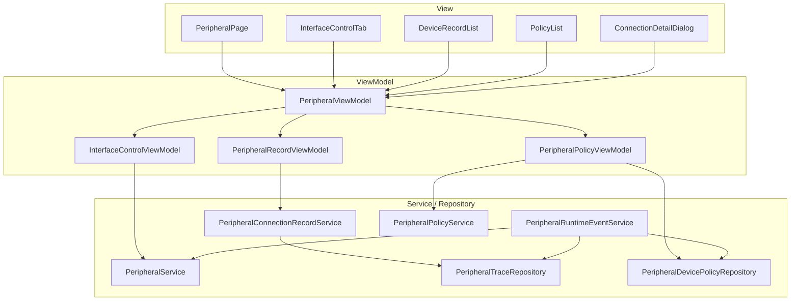

### 4.2 页面与子 ViewModel 关系

[`PeripheralPage.ets`](/C:/Users/mu/Desktop/code/security_tool/entry/src/main/ets/views/PeripheralPage.ets) 是编排层页面，主要职责：

- 页面初始化
- Tab 切换
- 触发 ViewModel 操作
- 弹出 loading / confirm / failure / success 对话框
- 打开连接详情弹窗

[`PeripheralViewModel.ets`](/C:/Users/mu/Desktop/code/security_tool/entry/src/main/ets/viewmodels/PeripheralViewModel.ets) 是页面总协调层，负责：

- 管理管理员激活状态
- 协调接口管控、连接记录、设备策略三个子 ViewModel
- 监听 trace 仓库与 device policy 仓库变化并刷新页面数据

---

## 5. 关键文件职责

### 5.1 页面层

[`PeripheralPage.ets`](/C:/Users/mu/Desktop/code/security_tool/entry/src/main/ets/views/PeripheralPage.ets)

职责：

- 页面初始化
- Tab 切换
- 调用 ViewModel
- 触发 USB loading dialog
- 打开连接详情弹窗

### 5.2 主 ViewModel

[`PeripheralViewModel.ets`](/C:/Users/mu/Desktop/code/security_tool/entry/src/main/ets/viewmodels/PeripheralViewModel.ets)

职责：

- 协调整个外设页三块数据
- 管理管理员激活状态
- 监听 trace 与 device policy 仓库变化
- 聚合导出、清理、策略修改等页面动作

### 5.3 接口管控 ViewModel

[`InterfaceControlViewModel.ets`](/C:/Users/mu/Desktop/code/security_tool/entry/src/main/ets/viewmodels/InterfaceControlViewModel.ets)

职责：

- 读取接口当前状态
- 切换接口启用 / 禁用
- 切换 USB 存储策略
- 输出 `processingKey` 供 UI 做局部反馈

### 5.4 连接记录 ViewModel

[`PeripheralRecordViewModel.ets`](/C:/Users/mu/Desktop/code/security_tool/entry/src/main/ets/viewmodels/PeripheralRecordViewModel.ets)

职责：

- 读取连接记录展示数据
- 打开/关闭详情
- 导出连接历史 CSV

### 5.5 设备策略 ViewModel

[`PeripheralPolicyViewModel.ets`](/C:/Users/mu/Desktop/code/security_tool/entry/src/main/ets/viewmodels/PeripheralPolicyViewModel.ets)

职责：

- 基于连接记录和设备策略仓库生成策略页列表
- 对单设备设置 allow / deny
- 清空所有设备策略
- 导出设备策略 CSV

### 5.6 Runtime 事件服务

[`PeripheralRuntimeEventService.ets`](/C:/Users/mu/Desktop/code/security_tool/entry/src/main/ets/services/PeripheralRuntimeEventService.ets)

职责：

- 订阅 USB 插拔 common event
- 订阅蓝牙状态变化、ACL 连接状态公共事件和配对状态变化
- 解析事件中的设备信息
- 按当前策略判定运行结果
- 将事件结果写入 trace
- 在蓝牙 ACL 事件订阅前检查并申请 `ACCESS_BLUETOOTH`
- 在命中权限拒绝时进入可恢复阻塞态，暂停 ACL 订阅并等待恢复条件

### 5.7 连接记录仓库

[`PeripheralTraceRepository.ets`](/C:/Users/mu/Desktop/code/security_tool/entry/src/main/ets/services/PeripheralTraceRepository.ets)

职责：

- 持久化外设运行记录
- 提供查询、清空和 change listener

### 5.8 单设备策略仓库

[`PeripheralDevicePolicyRepository.ets`](/C:/Users/mu/Desktop/code/security_tool/entry/src/main/ets/services/PeripheralDevicePolicyRepository.ets)

职责：

- 以 `deviceId -> allow / deny` 形式存储单设备策略
- 提供读写、清空和 change listener

### 5.9 策略组装服务

[`PeripheralPolicyService.ets`](/C:/Users/mu/Desktop/code/security_tool/entry/src/main/ets/services/PeripheralPolicyService.ets)

职责：

- 从连接记录中抽取候选设备
- 叠加单设备策略
- 生成策略页展示模型 `PeripheralPolicyRecord[]`

---

## 6. 数据模型

### 6.1 连接记录

核心模型定义于 [`DataModels.ets`](/C:/Users/mu/Desktop/code/security_tool/entry/src/main/ets/models/DataModels.ets)：

- `PeripheralConnectionRecord`
- `PeripheralTraceRecord`
- `PeripheralMatchedPolicyKind`

主要字段包括：

- `deviceName`
- `deviceType`
- `deviceId`
- `action`
- `result`
- `policyHit`
- `source`
- `summary`
- `detail`
- `effectivePolicyLabel`
- `matchedPolicyKind`

### 6.2 单设备策略

```text
deviceId -> allow / deny
```

主要模型：

- `PeripheralDevicePolicy`
- `PeripheralDevicePolicyRecord`

### 6.3 策略页记录

策略页展示模型：

- `PeripheralPolicyRecord`

主要字段：

- `deviceName`
- `deviceType`
- `deviceId`
- `lastSeenAt`
- `lastSeenLabel`
- `policyIndex`

---

## 7. 详细数据流图

这一节是组件维护的核心，描述“用户动作 / 系统事件”如何经过页面、ViewModel、Service、Repository 逐层流动。

### 7.1 接口管控数据流

#### 7.1.1 USB 接口启用/禁用

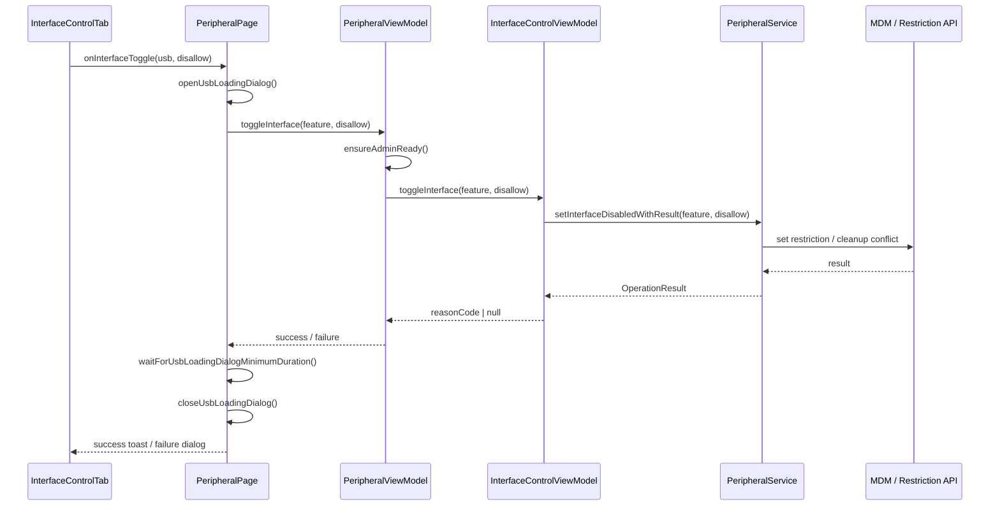

#### 7.1.2 USB 存储策略切换

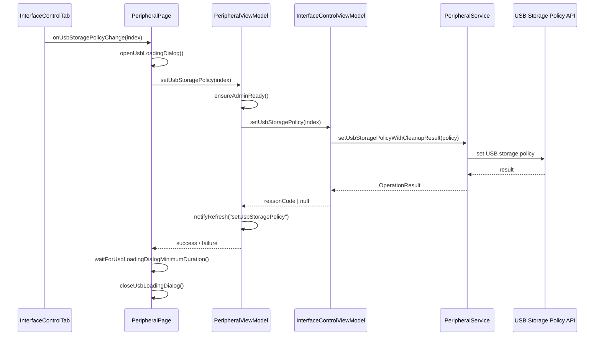

### 7.2 设备连接记录数据流

#### 7.2.1 USB 运行时事件写入记录

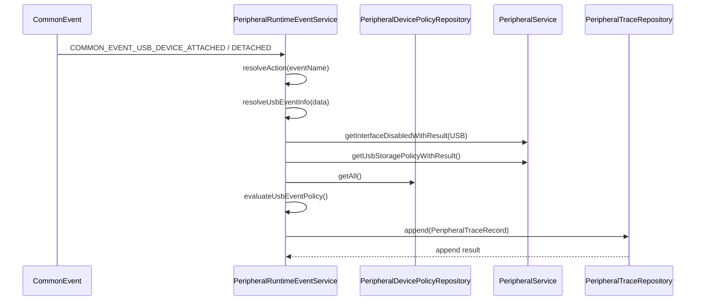

#### 7.2.2 蓝牙 ACL 事件写入记录

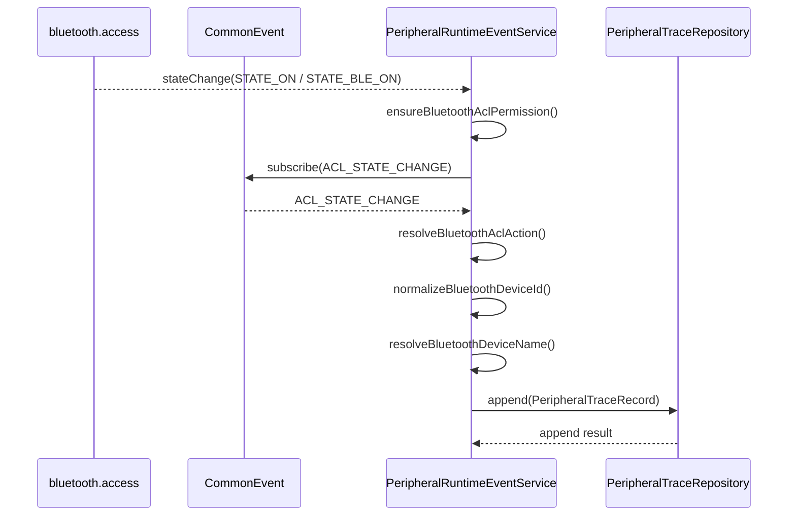

#### 7.2.3 权限授予 + 可恢复阻塞态

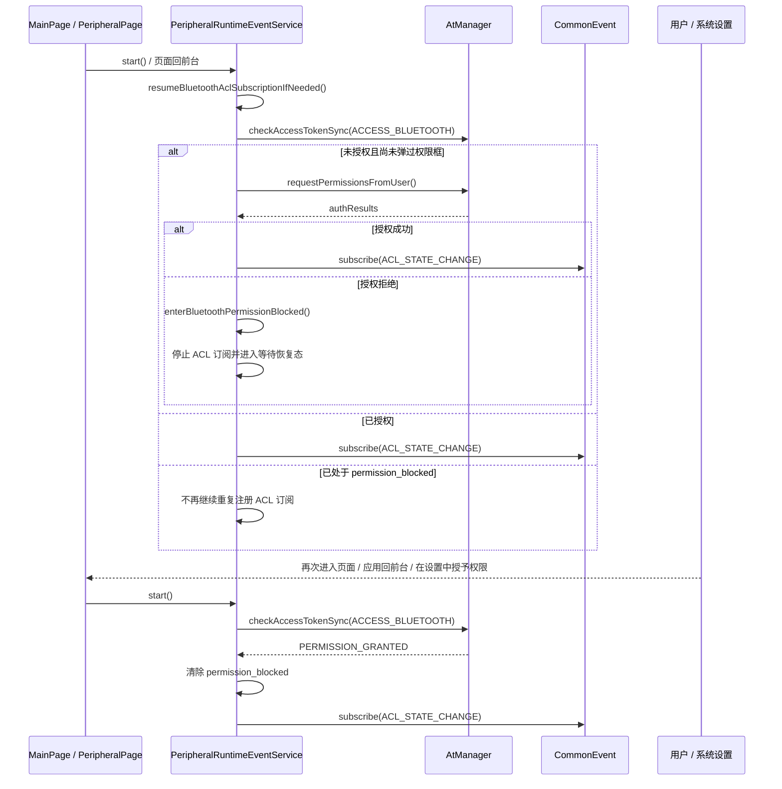

#### 7.2.4 连接记录页展示

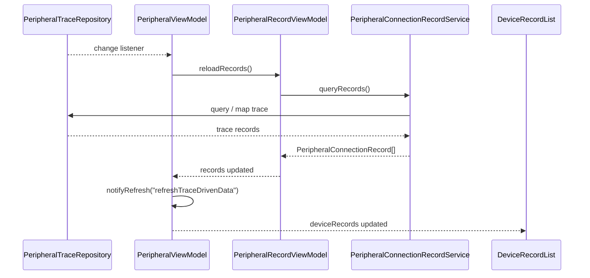

### 7.3 单设备策略数据流

#### 7.3.1 策略页组合生成

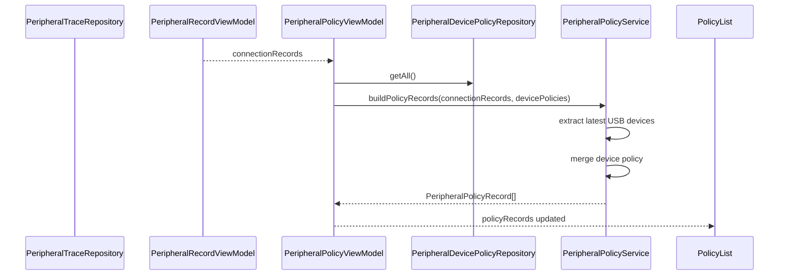

#### 7.3.2 单设备 allow / deny 设置

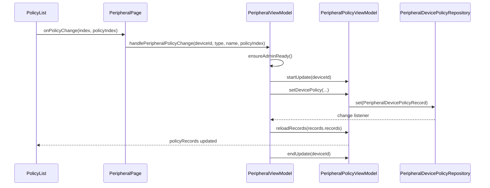

### 7.4 清理动作数据流

#### 7.4.1 清空设备策略

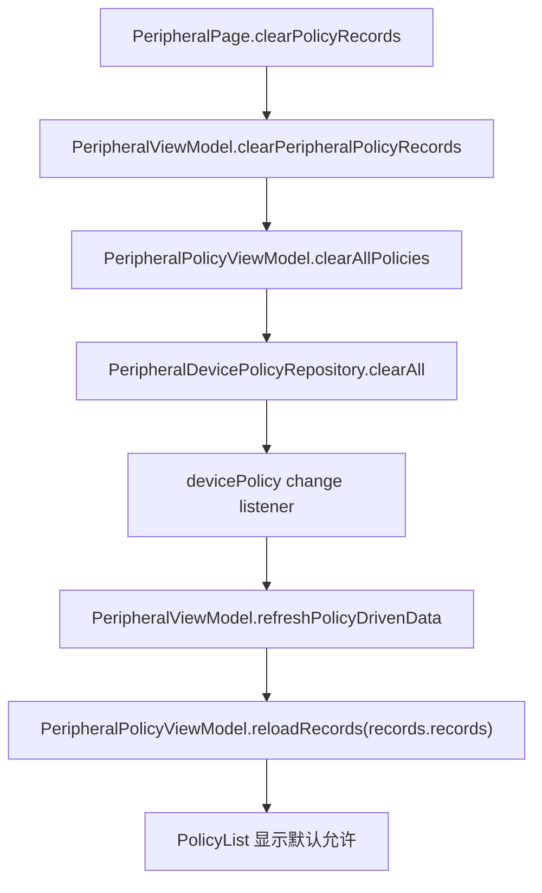

#### 7.4.2 清空连接记录

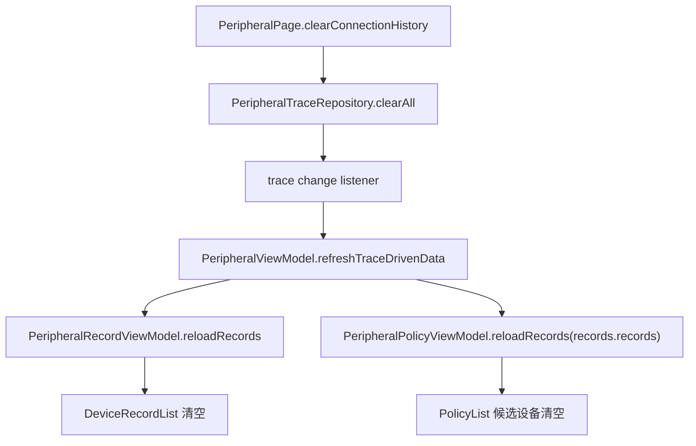

### 7.5 运行时判定详细决策流

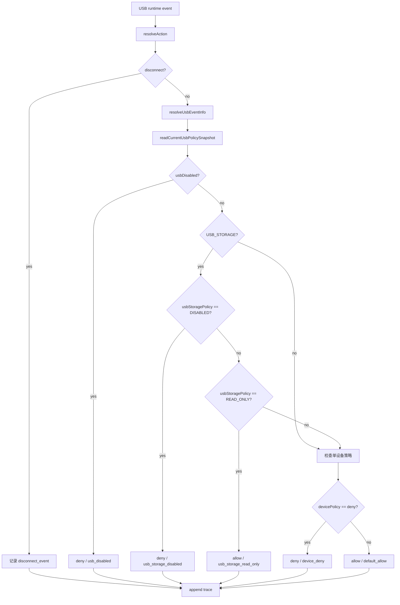

### 7.6 页面状态刷新流

当前页面已经去掉 `renderVersion / refreshVersion` 强制重建链路，刷新入口如下：

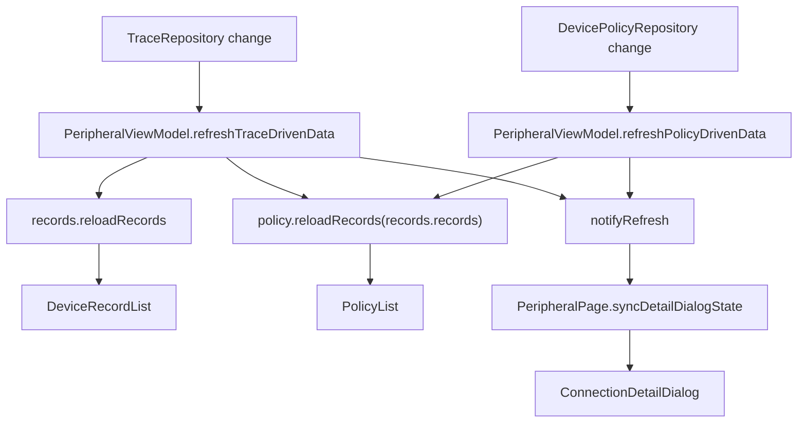

说明：

- 页面主体列表已经主要依赖 `@State viewModel` 和内部数据对象刷新
- `onRefresh` 当前只保留轻量同步职责，用于连接详情弹窗内容联动
- 蓝牙 ACL 连接记录与 USB 记录共用同一套连接记录列表、详情弹窗和导出链路

---

## 8. 关键交互说明

### 8.1 接口管控

页面允许用户对某一类接口整体执行启用 / 禁用操作。

USB 相关入口有两个：

- USB 接口启用 / 禁用
- USB 存储设备访问策略切换

当前交互设计：

- USB 相关操作使用 loading dialog
- 行项内部保留 processingKey
- 非 USB 接口切换保持轻量反馈
- 蓝牙 ACL 事件权限由系统运行时授权弹框承接，不新增项目内自定义页面或弹窗

### 8.2 连接详情

当用户点击连接记录中的“详情”时：

1. 页面调用 `PeripheralViewModel.openConnectionDetailDialog`
2. `PeripheralRecordViewModel` 基于当前 `records` 生成同设备历史
3. 页面打开 `ConnectionDetailDialog`

详情展示内容包括：

- 设备标识
- 最近时间
- 连接事件
- 事件来源
- 策略结论
- 执行策略
- 命中类型
- 结果状态
- 同设备历史记录

蓝牙 ACL 连接记录沿用相同详情布局，新增展示语义为：

- 连接事件：`连接` / `断开`
- 命中类型：`蓝牙连接事件`
- 设备名称兜底：`未命名蓝牙设备`
- detail 中可包含 ACL 状态摘要、事件来源摘要

### 8.3 清空连接记录

清空连接记录时：

- 只清 `PeripheralTraceRepository`
- 不清设备策略仓库

结果：

- 连接列表被清空
- 策略页候选设备列表也会随 trace 消失
- 设备再次插入后会重新出现

### 8.4 清空设备策略

清空设备策略时：

- 只清 `PeripheralDevicePolicyRepository`
- 不清连接记录

结果：

- 设备仍然出现在策略页
- 所有设备状态回到默认允许

---

## 9. 当前实现状态

### 9.1 已完成

- MVVM 主结构完成
- 单设备策略仓库完成
- 策略页组合式模型完成
- USB runtime 判定切换到新语义完成
- 蓝牙 ACL 公共事件运行期监听接入完成
- 蓝牙连接记录动作 `connect / disconnect` 和匹配类型 `bluetooth_connection_event` 接入完成
- 蓝牙运行时权限申请与可恢复阻塞态接入完成
- 连接记录与策略记录职责分离完成
- 外设页 `renderVersion / refreshVersion` 手动强刷链已清理
- 组件文案常量已收口到 `PeripheralStrings`

### 9.2 当前约束

- 当前单设备策略页仍然是 USB-only，蓝牙连接记录不会进入策略候选列表
- 蓝牙连接记录当前按 ACL 公共事件原始投递次数落库，不做去重
- 蓝牙地址日志按脱敏格式输出，不打印完整 MAC
- ACL payload 解析已按实机结果兼容 `connectionstate` 等字段，但不同系统版本仍需继续关注兼容性
- 自动化测试已补充，但仍建议以真机回归作为最终验证依据

---

## 10. 主要验收点

### 10.1 接口管控

- 禁用 USB 接口后，USB 设备整体不可接入
- 恢复 USB 接口后，设备重新按策略判定
- USB 存储策略切换后，运行时记录中的 `effectivePolicyLabel` 正确

### 10.2 连接记录

- 插入 USB 后出现连接记录
- 拔出 USB 后出现断开记录
- 蓝牙设备连接后出现 `连接` 类型连接记录
- 蓝牙设备断开后出现 `断开` 类型连接记录
- 详情页能看到该设备的连接历史
- 蓝牙连接记录详情中能看到 `蓝牙连接事件`

### 10.3 单设备策略

- 已连接设备可在策略页出现
- 可对同类不同设备设置不同策略
- 单设备 deny 不影响其他设备

### 10.4 清理语义

- 清空策略后，设备仍在策略页，但恢复默认允许
- 清空连接记录后，设备从候选列表消失
- 设备再次插入后重新出现

### 10.5 蓝牙权限与恢复

- 首次进入蓝牙 ACL 链路时，可触发系统运行时蓝牙权限授权
- 用户拒绝授权后，蓝牙 ACL 订阅会暂停，不继续重复注册并刷 `201 Permission denied`
- 用户后续授予权限并重新进入页面或回到前台后，蓝牙 ACL 订阅可自动恢复

---

## 11. 后续可扩展方向

### 11.1 设备类型扩展

当前策略链路主要围绕 USB 设备，蓝牙已接入连接记录链路；后续可继续扩展到：

- 蓝牙单设备黑白名单
- 更多 USB 设备细分类
- 其他可订阅的系统外设事件

### 11.2 策略能力扩展

后续如有需要，可扩展：

- 默认允许 / 显式允许 / 显式禁止三态区分
- 策略审计历史
- 策略批量导入导出
- 更细粒度的设备匹配规则

### 11.3 运行时能力扩展

后续可扩展：

- 更强的 payload 标准化
- 更稳定的设备指纹
- 更精细的重复事件去重策略
- 蓝牙权限拒绝后的设置页引导和显式恢复入口

### 11.4 后续蓝牙单设备管控前置条件

当前蓝牙连接记录链路已经可以基于 ACL 公共事件稳定识别“连接 / 断开”，但后续如果要做蓝牙单设备允许 / 禁止，还需要先解决设备标识一致性问题：

- 当前 ACL 事件中的 `deviceAddr` 已验证可用于连接记录展示和同设备历史串联
- 但 `deviceAddr` 不一定等于设备真实 MAC，存在映射地址 / 虚拟地址的可能
- 因此后续蓝牙单设备管控不能直接把当前连接记录中的 `deviceAddr` 视为策略下发用的真实设备标识
- 在进入蓝牙单设备允许 / 禁止方案前，需要先补一层“连接记录设备标识”与“系统真实蓝牙设备标识”的映射与回查设计
- 在该前置条件未解决前，当前蓝牙能力范围只定义为“连接记录可见”，不延伸到“单设备蓝牙策略可执行”

---

## 12. 维护建议

- 页面层只做交互编排，不直接触底层接口
- 设备策略真源始终保持在 `PeripheralDevicePolicyRepository`
- 连接记录真源始终保持在 `PeripheralTraceRepository`
- 页面策略展示必须继续走“组合式模型”，避免回退到旧的推导式黑白名单逻辑
- 若新增设备策略类型，应同步更新 runtime 判定与页面展示文案，保持一致

---

最后更新：2026-04-01  
适用版本：外设管理模块 MVVM 重构完成版（含蓝牙运行期监听）
