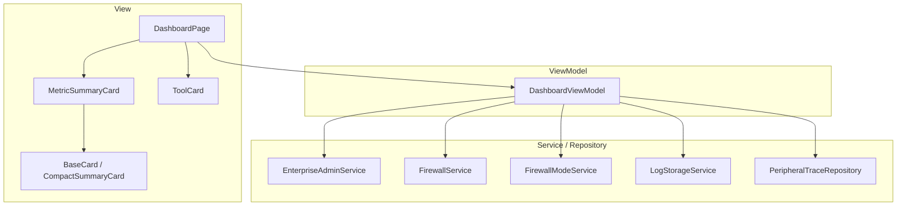
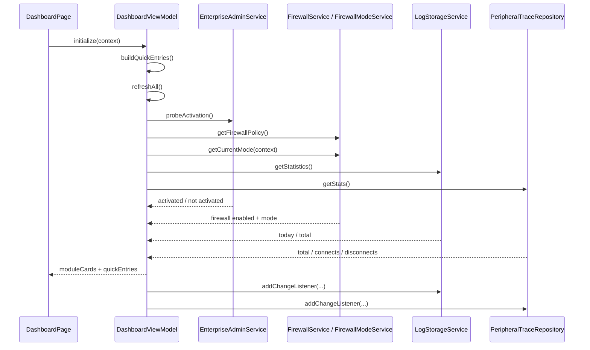
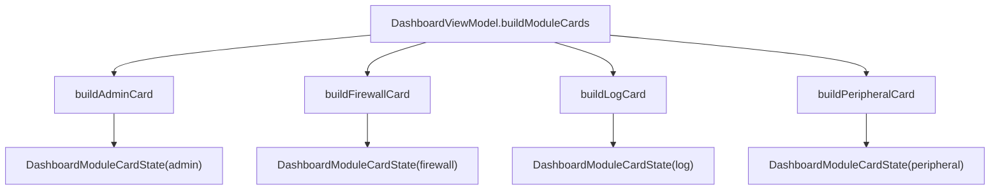
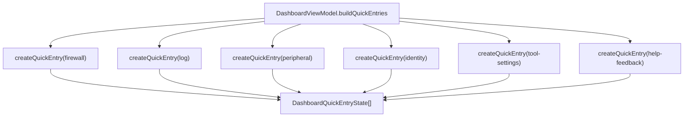
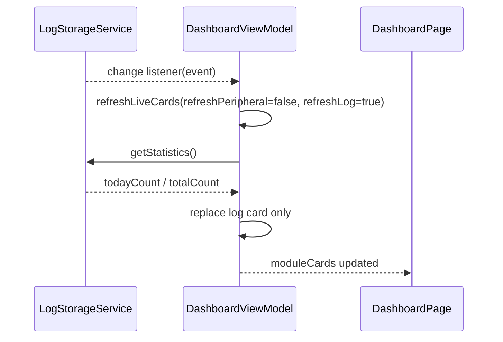
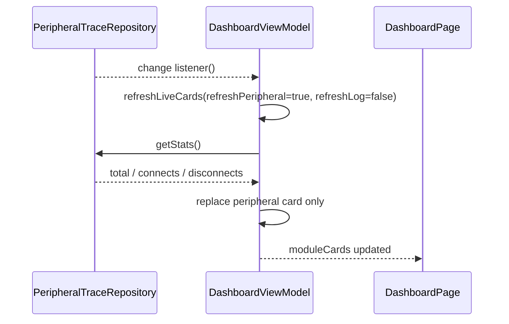
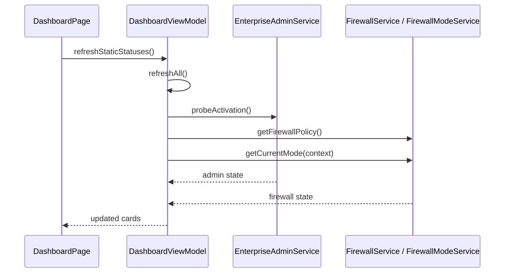
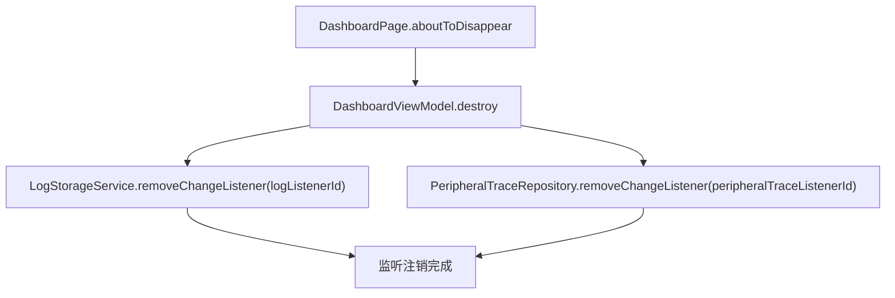
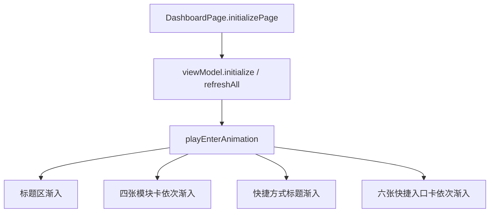

# 安全总览组件设计说明

## 1. 文档目的

本文档描述 SecurityTool 中“安全总览”组件在当前版本下的功能边界、MVVM 分层、核心数据模型、关键数据流和维护要点，作为后续维护、联调和扩展的基线文档。

当前版本中，安全总览模块已经完成首页重构，核心语义如下：

- 首页作为安全管理中心入口页，突出四类核心状态摘要
- 页面只负责展示与动画编排
- ViewModel 负责跨模块状态聚合
- 日志与外设摘要通过监听驱动刷新
- 次级入口区承接模块跳转，不再承担首页主状态表达

---

## 2. 功能范围

安全总览组件当前包含两类核心能力：

1. 模块状态摘要展示
2. 快捷入口导航

### 2.1 模块状态摘要展示

首页当前展示四张模块摘要卡：

- 管理员
- 防火墙
- 日志
- 外设

每张摘要卡承担的职责为：

- 展示模块名称
- 展示当前主状态或主指标
- 展示辅助说明
- 统一视觉风格

### 2.2 快捷入口导航

首页下半区保留快捷入口，当前包括：

- 防火墙
- 日志管理
- 外设管理
- 身份鉴别
- 工具设置
- 帮助反馈

当前实现中：

- 摘要卡主要用于状态展示
- 快捷入口卡用于路由跳转

---

## 3. 业务语义模型

### 3.1 首页信息层级

```text
第 1 层：模块状态摘要
- 管理员 / 防火墙 / 日志 / 外设

第 2 层：快捷入口
- 防火墙 / 日志管理 / 外设管理 / 身份鉴别 / 工具设置 / 帮助反馈
```

### 3.2 刷新语义

安全总览页当前将数据源分成两类：

- 静态或低频状态：
  - 管理员状态
  - 防火墙状态
- 运行时高频摘要：
  - 日志统计
  - 外设连接统计

刷新策略如下：

- 页面初始化时全量聚合一次
- 页面重新可见时校准静态状态
- 日志与外设变化通过监听触发局部刷新

---

## 4. 架构设计

组件整体采用 MVVM 组织方式。

### 4.1 分层结构图



### 4.2 页面与 ViewModel 关系

[`DashboardPage.ets`](/C:/Users/mu/Desktop/code/security_tool/entry/src/main/ets/views/DashboardPage.ets) 是页面编排层，主要职责：

- 页面初始化
- 页面显示时触发状态校准
- 管理入场动画
- 将 ViewModel 数据映射到摘要卡和快捷入口卡
- 处理快捷入口跳转

[`DashboardViewModel.ets`](/C:/Users/mu/Desktop/code/security_tool/entry/src/main/ets/viewmodels/DashboardViewModel.ets) 负责：

- 聚合四张模块摘要卡
- 聚合快捷入口数据
- 初始化时注册日志与外设变更监听
- 在监听回调中局部刷新首页卡片
- 页面销毁时注销监听

---

## 5. 关键文件职责

### 5.1 页面层

[`DashboardPage.ets`](/C:/Users/mu/Desktop/code/security_tool/entry/src/main/ets/views/DashboardPage.ets)

职责：

- 页面生命周期管理
- 触发 ViewModel 初始化和刷新
- 管理标题、摘要卡、快捷入口动画
- 渲染模块摘要卡和快捷入口卡

### 5.2 ViewModel

[`DashboardViewModel.ets`](/C:/Users/mu/Desktop/code/security_tool/entry/src/main/ets/viewmodels/DashboardViewModel.ets)

职责：

- 生成四张 `DashboardModuleCardState`
- 生成六个 `DashboardQuickEntryState`
- 注册日志与外设监听
- 局部更新日志卡和外设卡
- 在页面销毁时注销监听

### 5.3 模型层

[`DashboardModels.ets`](/C:/Users/mu/Desktop/code/security_tool/entry/src/main/ets/models/DashboardModels.ets)

职责：

- 定义首页摘要卡模型
- 定义快捷入口模型

### 5.4 组件层

[`MetricSummaryCard.ets`](/C:/Users/mu/Desktop/code/security_tool/entry/src/main/ets/components/MetricSummaryCard.ets)

职责：

- 承载首页模块摘要卡主样式
- 提供统一图标区、主值区、说明区布局

[`BaseCard.ets`](/C:/Users/mu/Desktop/code/security_tool/entry/src/main/ets/components/BaseCard.ets)

职责：

- 提供统一卡片容器样式
- 提供 hover、点击、阴影、位移动效

[`ToolCard.ets`](/C:/Users/mu/Desktop/code/security_tool/entry/src/main/ets/components/ToolCard.ets)

职责：

- 承载首页快捷入口区

[`CompactSummaryCard.ets`](/C:/Users/mu/Desktop/code/security_tool/entry/src/main/ets/components/CompactSummaryCard.ets)

职责：

- 提供紧凑摘要卡模板，供其他页面复用

---

## 6. 数据模型

核心模型定义于 [`DashboardModels.ets`](/C:/Users/mu/Desktop/code/security_tool/entry/src/main/ets/models/DashboardModels.ets)：

- `DashboardModuleCardId`
- `DashboardModuleCardState`
- `DashboardQuickEntryState`

### 6.1 模块摘要卡模型

```text
DashboardModuleCardState
- id
- title
- primaryText
- secondaryText
- accentStart
- accentEnd
- icon
```

当前四张卡的语义如下：

- `admin`
  - 主值：已激活 / 待激活
  - 副说明：企业管理能力状态说明
- `firewall`
  - 主值：已开启 / 已关闭
  - 副说明：当前模式名称
- `log`
  - 主值：今日日志数
  - 副说明：累计日志数
- `peripheral`
  - 主值：外设总事件数
  - 副说明：连接 / 断开计数摘要

### 6.2 快捷入口模型

```text
DashboardQuickEntryState
- id
- title
- icon
- accentStart
- accentEnd
- route
```

---

## 7. 详细数据流图

### 7.1 页面初始化数据流



### 7.2 模块卡生成流



### 7.3 快捷入口生成流



### 7.4 日志监听刷新流



### 7.5 外设监听刷新流



### 7.6 页面显示与静态状态校准流



### 7.7 页面销毁流



### 7.8 视图渲染与动画流



---

## 8. 关键交互说明

### 8.1 首页摘要卡

当前首页摘要卡以状态展示为主，配置为：

- `clickable: false`
- `hoverable: true`

也就是说：

- 保留卡片 hover 视觉反馈
- 但不通过摘要卡本身承担跳转

### 8.2 快捷入口卡

真正的模块跳转由快捷入口区承接：

- 点击 `ToolCard`
- 页面通过 `onNavigate(route)` 执行路由跳转

### 8.3 页面入场动画

安全总览页保留了一套轻量级分段动画：

- 标题区先进入
- 四张摘要卡分批进入
- 快捷方式标题进入
- 快捷入口卡分批进入

动画状态完全保留在页面层，不进入 ViewModel。

---

## 9. 当前实现状态

### 9.1 已完成

- 安全总览首页重构已完成
- 四张摘要卡模型已落地
- 首页 ViewModel 聚合层已落地
- 日志与外设监听驱动刷新已接入
- 摘要卡组件与快捷入口组件已接入首页
- 页面动画与状态数据已经解耦

### 9.2 当前约束

- 摘要卡当前不承担跳转，只展示状态
- 日志卡当前主值是“今日数量”，副文案是“累计数量”
- 外设卡当前主值是“总事件数”，而不是“监听状态”
- 管理员和防火墙仍采用页面显示时的主动刷新，不是持续监听

---

## 10. 主要验收点

- 页面进入后能正确展示四张模块摘要卡
- 页面进入后能正确展示六张快捷入口
- 管理员状态变化后重新进入页面能正确回显
- 防火墙状态变化后重新进入页面能正确回显
- 日志新增后首页日志卡可自动刷新
- 外设连接记录变化后首页外设卡可自动刷新
- 页面离开后监听被正确注销

---

## 11. 测试建议

当前安全总览模块最值得覆盖的测试层级是：

- `DashboardViewModel` 单元测试
- `DashboardModels` 纯模型约束测试

优先覆盖点：

- 初始化能生成 4 张模块卡和 6 个快捷入口
- 日志监听只刷新日志卡
- 外设监听只刷新外设卡
- `destroy()` 能正确注销监听
- 快捷入口顺序和 route 正确

UI 动画本身不建议在单元测试里强行覆盖，更适合作为真机冒烟验证项。

---

## 12. 后续可扩展方向

- 让摘要卡本身支持点击跳转
- 为日志卡和外设卡增加更明确的运行状态标签
- 抽离 DashboardSummaryService，进一步减轻 ViewModel 聚合压力
- 为首页增加空态或异常态兜底表达

---

## 13. 维护建议

- 页面层不要直接读取各模块 Service / Repository
- 首页聚合逻辑统一收口到 `DashboardViewModel`
- 日志和外设的首页联动统一基于监听，不要回退到轮询
- 未来若新增首页摘要项，应优先扩展 `DashboardModels.ets`
- 页面动画状态继续留在 `DashboardPage`，不要混入 ViewModel

---

最后更新：2026-03-30  
适用版本：安全总览模块重构完成版
