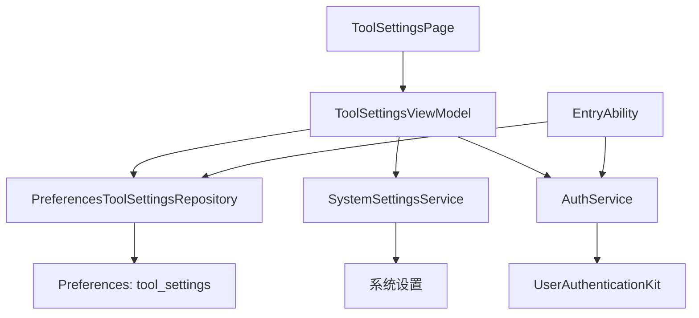
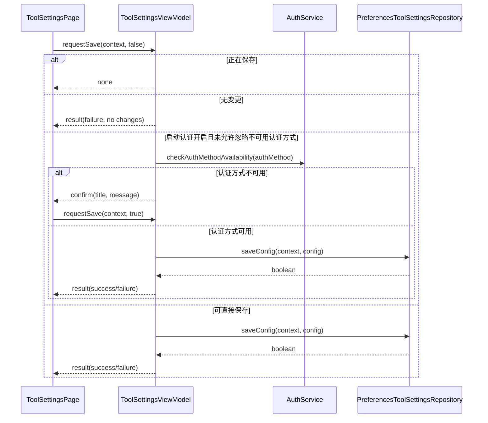
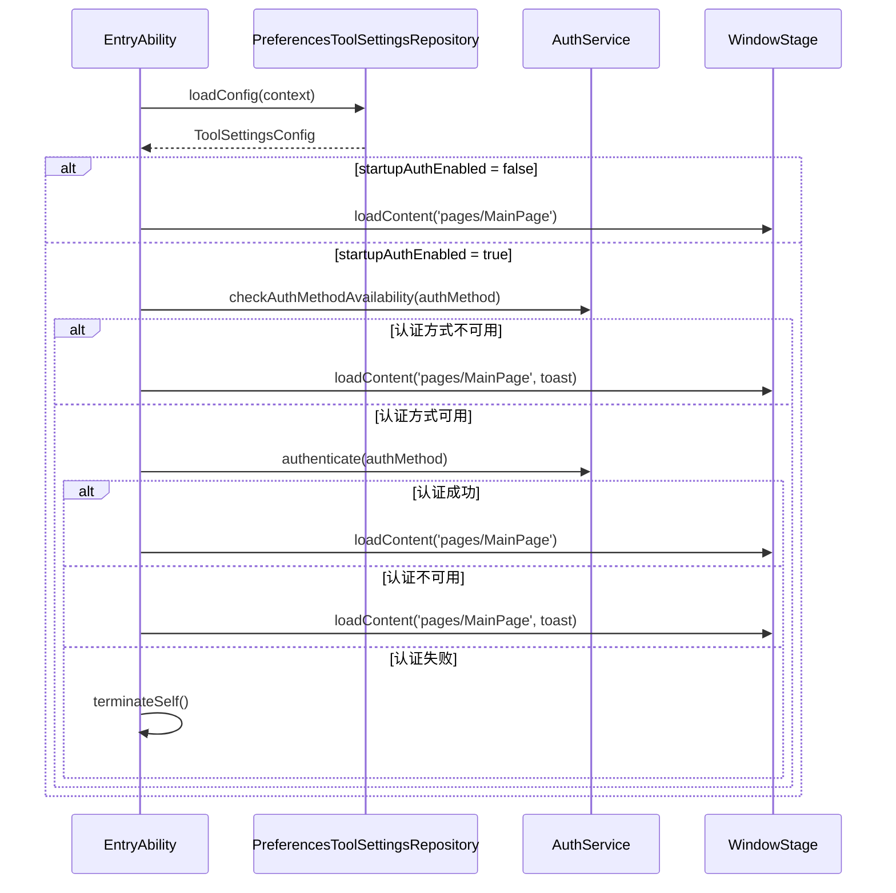

# 工具设置组件设计说明

## 1. 文档定位

本文档是工具设置模块唯一模块设计文档，用于描述当前代码已经落地的功能边界、分层结构、核心数据模型、关键流程和维护约束。

本模块设计以实际代码为唯一真相源。其他文档与当前代码不一致时，以当前代码为准。

## 2. 模块定位

工具设置模块负责 SecurityTool 自身的工具级安全设置。当前实现聚焦两类能力：

- 启动时身份校验配置
- 系统密码设置入口跳转

工具设置模块不负责防火墙、外设、日志等业务模块的策略配置，也不负责企业管理员激活、账户安全策略、全局主题或帮助反馈。

启动认证配置不是纯页面配置。当前代码中，配置保存后会被 `entry/src/main/ets/entryability/EntryAbility.ets` 在应用启动阶段读取并消费，用于决定是否执行启动认证。

## 3. 代码事实源

| 文件 | 设计含义 |
|------|----------|
| `entry/src/main/ets/views/tool-settings/system-settings/ToolSettingsPage.ets` | 页面展示、用户交互和弹窗编排 |
| `entry/src/main/ets/viewmodels/tool-settings/system-settings/ToolSettingsViewModel.ets` | 工具设置业务入口，负责初始化、编辑态、保存和动作请求 |
| `entry/src/main/ets/services/tool-settings/system-settings/ToolSettingsRepository.ets` | 工具设置持久化仓储，负责 Preferences 读写、默认值回退和认证方式归一化 |
| `entry/src/main/ets/services/tool-settings/system-settings/SystemSettingsService.ets` | 系统设置跳转服务，负责打开系统“生物识别和密码”设置页 |
| `entry/src/main/ets/models/DataModels.ets` | 工具设置数据模型、默认值、认证方式选项和存储键 |
| `entry/src/main/ets/entryability/EntryAbility.ets` | 启动阶段消费工具设置配置并执行启动认证 |
| `entry/src/main/ets/services/identity/auth/AuthService.ets` | 认证能力检查和认证执行 |
| `entry/src/main/ets/constants/modules/ToolSettingsStrings.ets` | 工具设置模块文案 |
| `entry/src/main/ets/pages/MainPage.ets` | 工具设置页面路由挂载 |
| `entry/src/main/ets/constants/RouteIds.ets` | `tool-settings` 路由 ID |
| `entry/src/main/ets/constants/AppConstants.ets` | 侧边栏工具设置入口 |
| `entry/src/main/ets/viewmodels/dashboard/overview/DashboardViewModel.ets` | 首页工具设置快捷入口 |

## 4. 功能范围

当前工具设置页面包含一个设置分组：启动认证设置。

| 交互项 | 当前实现 |
|--------|----------|
| 启动时身份校验 | 通过 `startupAuthEnabled` 控制应用启动时是否执行认证 |
| 认证方式 | 通过 `authMethod` 保存启动认证方式，当前支持 PIN 和指纹 |
| 修改密码 | 调用系统设置，打开“生物识别和密码”页面 |

页面头部提供“保存设置”按钮。按钮只有在页面已初始化、存在未保存变更且未处于保存中时可用。

## 5. 数据模型

工具设置核心模型定义在 `entry/src/main/ets/models/DataModels.ets`。

| 模型或常量 | 含义 |
|------------|------|
| `ToolSettingsConfig` | 工具设置配置对象 |
| `startupAuthEnabled` | 是否启用启动时身份校验 |
| `authMethod` | 启动认证方式 |
| `AuthMethod.PIN = 1` | PIN 认证 |
| `AuthMethod.FINGERPRINT = 4` | 指纹认证 |
| `DEFAULT_TOOL_SETTINGS` | 默认工具设置 |
| `AUTH_METHOD_OPTIONS` | 页面认证方式下拉选项 |
| `PREF_STORE_NAME_TOOL = 'tool_settings'` | 工具设置 Preferences store 名 |
| `PREF_KEY_STARTUP_AUTH = 'startup_auth_enabled'` | 启动认证开关存储键 |
| `PREF_KEY_AUTH_METHOD = 'auth_method'` | 认证方式存储键 |

默认配置为：

```text
startupAuthEnabled = false
authMethod = PIN
```

## 6. 分层设计

模块采用 View + ViewModel + Repository + Service 的分层结构。

| 层级 | 文件 | 职责 |
|------|------|------|
| View | `entry/src/main/ets/views/tool-settings/system-settings/ToolSettingsPage.ets` | 页面结构、用户操作、弹窗编排 |
| ViewModel | `entry/src/main/ets/viewmodels/tool-settings/system-settings/ToolSettingsViewModel.ets` | 初始化、编辑态、差异检测、保存流程、动作请求 |
| Repository | `entry/src/main/ets/services/tool-settings/system-settings/ToolSettingsRepository.ets` | Preferences 读写、默认值回退、认证方式归一化 |
| System Service | `entry/src/main/ets/services/tool-settings/system-settings/SystemSettingsService.ets` | 打开系统密码设置页面 |
| Auth Service | `entry/src/main/ets/services/identity/auth/AuthService.ets` | 检查认证方式可用性并执行认证 |
| Startup Consumer | `entry/src/main/ets/entryability/EntryAbility.ets` | 启动阶段读取并消费工具设置配置 |



## 7. 页面行为

`ToolSettingsPage.ets` 是页面编排层，负责：

- `aboutToAppear` 时初始化 ViewModel。
- 页面未初始化时不展示设置内容。
- 页面初始化后展示“启动认证设置”卡片。
- 用户切换启动认证开关时调用 `setStartupAuthEnabled`。
- 用户选择认证方式时调用 `setAuthMethod`。
- 用户点击保存时调用 `requestSave`。
- ViewModel 返回 `result` 时展示结果弹窗。
- ViewModel 返回 `confirm` 时展示确认弹窗，用户确认后以 `allowUnsupportedAuthMethod = true` 重试保存。
- 用户点击“修改密码”时调用 `openPasswordSettings`，失败时展示结果弹窗。

页面只负责交互编排，不直接读写 Preferences，也不直接执行认证。

## 8. ViewModel 状态设计

`ToolSettingsViewModel` 内部维护页面编辑态和保存基线。

| 状态 | 含义 |
|------|------|
| `config` | 当前页面编辑态 |
| `initialConfig` | 最近一次加载或保存成功后的基线态 |
| `hasChanges` | 当前编辑态是否与基线态不同 |
| `saving` | 是否正在保存 |
| `initialized` | 页面是否完成初始化 |

`hasChanges` 只比较两个字段：

- `startupAuthEnabled`
- `authMethod`

设置同值不会触发变更。

`ToolSettingsActionRequest` 是 ViewModel 返回给页面的动作模型：

| `kind` | 页面动作 |
|--------|----------|
| `none` | 页面无需额外处理 |
| `result` | 页面展示成功或失败结果 |
| `confirm` | 页面展示确认弹窗，确认后重试保存 |

## 9. 保存流程

保存入口为 `ToolSettingsViewModel.requestSave`。



保存成功后，ViewModel 会：

- 将当前配置写入 `config`
- 将当前配置写入 `initialConfig`
- 将 `hasChanges` 置为 `false`
- 返回保存成功结果

保存失败时返回保存失败结果。若认证方式不可用，ViewModel 不直接保存，而是先返回确认请求；用户确认后才允许继续保存。

## 10. 持久化设计

`PreferencesToolSettingsRepository` 使用 `PreferencesAccessor` 访问 `tool_settings` store。

读取配置时：

- 从 `startup_auth_enabled` 读取启动认证开关，默认值为 `false`。
- 从 `auth_method` 读取认证方式，默认值为 `PIN`。
- 对认证方式做归一化，只接受 `PIN` 和 `FINGERPRINT`。
- 读取失败或异常时返回 `DEFAULT_TOOL_SETTINGS`。

保存配置时：

- 通过 `setMany` 同时写入 `startup_auth_enabled` 和 `auth_method`。
- 写入成功返回 `true`。
- 写入失败或异常返回 `false`。

## 11. 系统密码入口

“修改密码”不是本模块内部密码修改能力，而是系统设置入口。

`SystemSettingsService.openPasswordSettings` 构造 Want 并调用 `context.startAbility(want)`。

```text
bundleName = com.huawei.hmos.settings
abilityName = com.huawei.hmos.settings.MainAbility
uri = biometrics_and_password_settings
parameters.pushParams = 当前应用 bundle 名
```

打开成功返回 `true`。发生异常时记录日志并返回 `false`，页面展示“无法打开系统密码设置，请手动前往系统设置修改”。

## 12. 启动认证消费链路

启动认证配置由 `EntryAbility.ets` 在应用启动阶段消费。



当前启动阶段行为：

1. `onWindowStageCreate` 绑定运行时上下文后调用 `checkStartupAuth`。
2. `checkStartupAuth` 读取工具设置配置。
3. 未启用启动认证时直接加载 `pages/MainPage`。
4. 启用启动认证时调用 `performStartupAuth`。
5. 认证方式不可用时降级加载主页面，并展示启动提示。
6. 认证成功时加载主页面。
7. 认证结果为不可用时降级加载主页面。
8. 认证失败且不是不可用原因时调用 `terminateSelf`。

## 13. 防火墙认证边界

防火墙敏感操作认证不属于工具设置模块职责。

当前防火墙模块直接复用身份鉴别模块的认证能力：

```text
AuthService.authenticate(AuthMethod.PIN)
```

调用点位于 `entry/src/main/ets/services/firewall/FirewallService.ets`：

| 方法 | 用途 |
|------|------|
| `setFirewallEnabledForAllUsers` | 开关防火墙前执行 PIN 认证 |
| `applyUserPolicyMode` | 修改用户防火墙策略模式前执行 PIN 认证 |

这条链路固定使用 `AuthMethod.PIN`，不读取工具设置保存的 `authMethod`，也不通过 `ToolSettingsViewModel` 或 `ToolSettingsRepository`。

## 14. 路由与入口

工具设置路由 ID 定义在 `entry/src/main/ets/constants/RouteIds.ets`：

```text
RouteIds.TOOL_SETTINGS = 'tool-settings'
```

| 入口 | 文件 | 说明 |
|------|------|------|
| 侧边栏入口 | `entry/src/main/ets/constants/AppConstants.ets` | `NAV_ITEMS` 中注册工具设置 |
| 主页面路由 | `entry/src/main/ets/pages/MainPage.ets` | 当 `currentPage === RouteIds.TOOL_SETTINGS` 时渲染 `ToolSettingsPage` |
| 首页快捷入口 | `entry/src/main/ets/viewmodels/dashboard/overview/DashboardViewModel.ets` | `quickEntries` 中注册工具设置快捷入口 |

## 15. 模块边界约束

工具设置模块当前只管理 SecurityTool 自身的工具级安全偏好。

明确属于本模块：

- 启动认证是否启用
- 启动认证方式选择
- 工具设置读取、编辑、保存和恢复
- 系统密码设置入口跳转

明确不属于本模块：

- 防火墙敏感操作认证
- 防火墙策略配置
- 外设、日志、身份鉴别等业务模块设置
- 企业管理员激活
- 账户安全策略
- 全局主题、关于、帮助反馈

## 16. 维护规则

- 新增工具设置项时，应先确认它是否属于 SecurityTool 自身工具级偏好。
- 页面层只消费 `ToolSettingsActionRequest`，不要直接读写 Preferences。
- 持久化键值统一维护在 `DataModels.ets`。
- 认证方式可用性和认证执行统一收口到 `AuthService.ets`。
- 新增认证方式时需同步更新：
  - `AuthMethod`
  - `AUTH_METHOD_OPTIONS`
  - `PreferencesToolSettingsRepository.normalizeAuthMethod`
  - `AuthService.convertAuthMethod`
  - 工具设置页面文案和下拉显示

## 17. 腐败内容清理要求

本设计文档不得保留本机绝对路径、旧开发环境路径、迁移前路径或与当前代码冲突的旧结论。

文档内引用代码文件时统一使用仓库相对路径，例如：

```text
entry/src/main/ets/views/tool-settings/system-settings/ToolSettingsPage.ets
```

不得写入任何本机绝对路径、旧开发环境路径或迁移前扁平目录路径。涉及工具设置页面、ViewModel、Repository、系统设置服务时，必须使用当前模块化目录路径。

## 18. 当前文档清理结论

工具设置模块设计文档只保留本文档：

```text
docs/03-模块设计/工具设置组件设计说明.md
```

`docs/refac/tool-settings/tool-settings-module-rfc.md` 属于冗余工具设置设计文档，本文档生成后应删除，避免工具设置模块设计文档并存。

最后更新：2026-04-28
