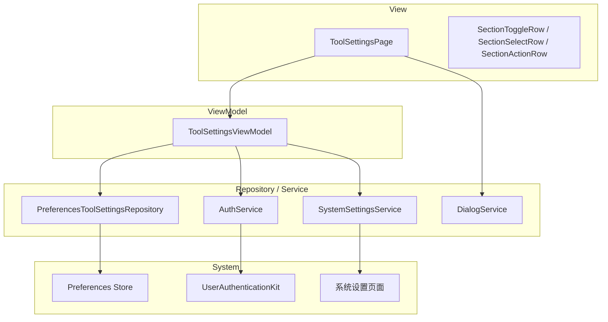
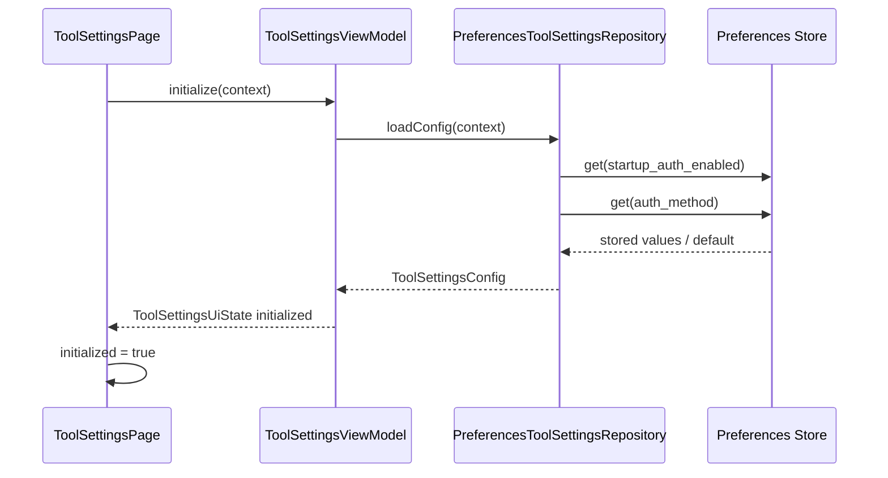
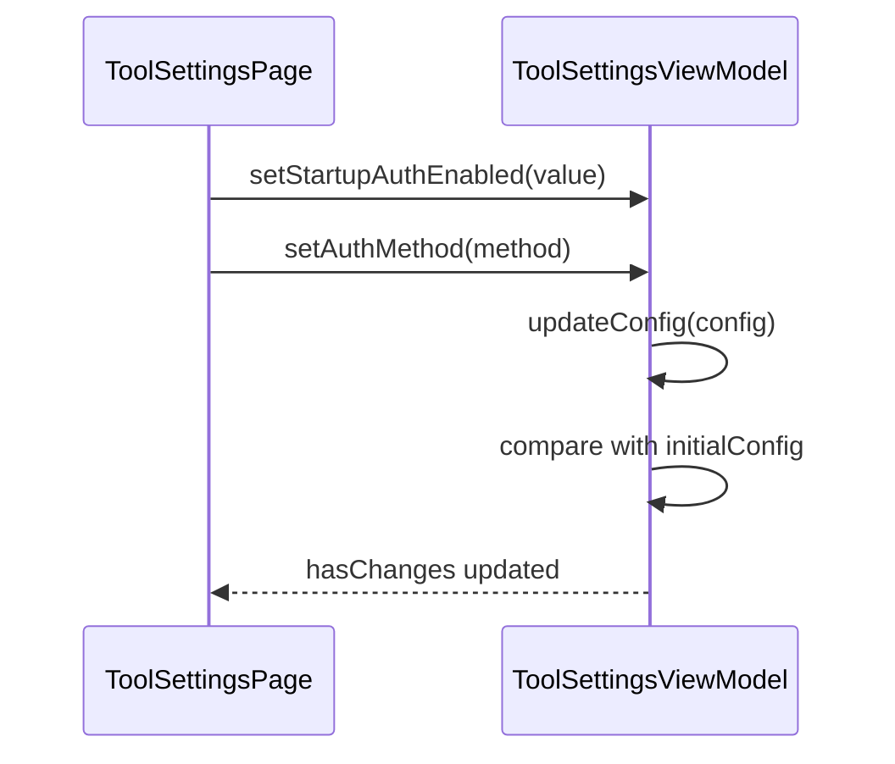
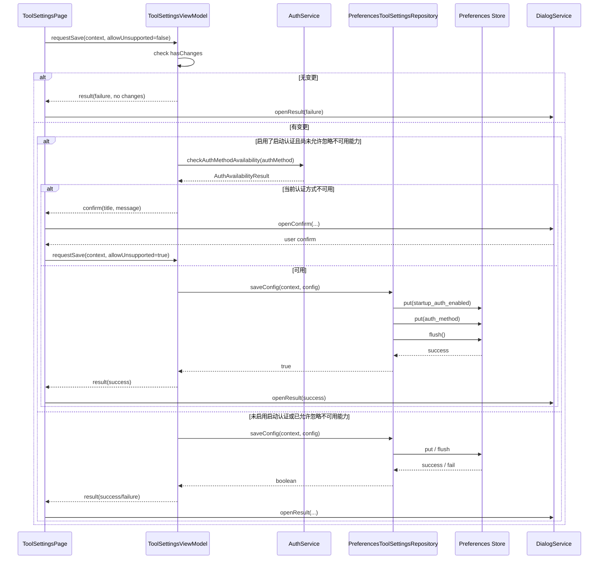
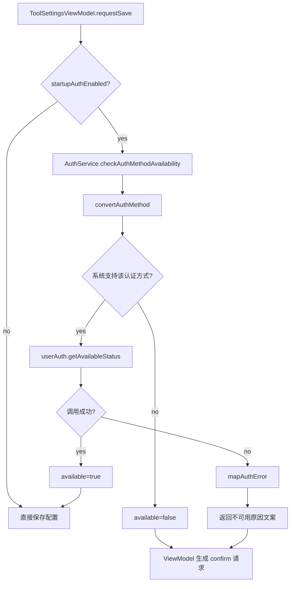
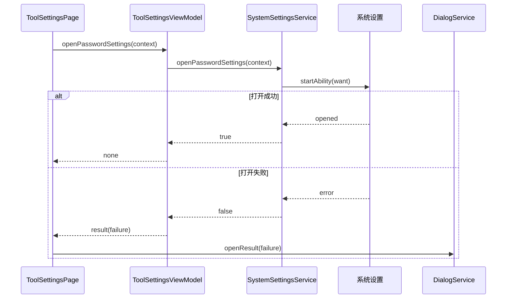
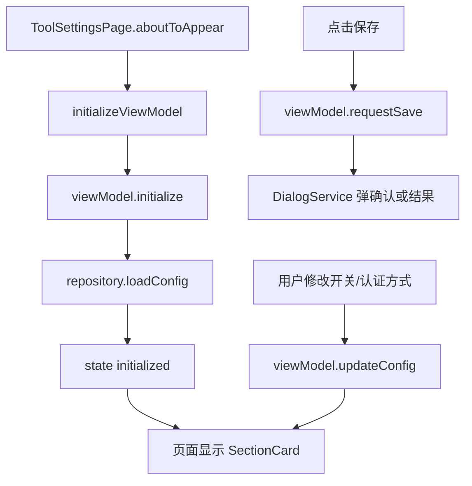

# 工具设置组件设计说明

## 1. 文档目的

本文档描述 SecurityTool 中“工具设置”组件的功能边界、MVVM 分层、核心状态模型、关键数据流和维护要点，作为后续维护、联调和扩展的基线文档。

当前版本中，工具设置模块聚焦于工具级安全偏好配置，核心语义如下：

- 页面负责展示和交互编排
- ViewModel 负责设置编辑态、差异检测和保存流程
- Repository 负责首选项持久化
- AuthService 负责启动认证方式可用性检查
- SystemSettingsService 负责打开系统密码设置页面

---

## 2. 功能范围

工具设置组件当前包含两类核心能力：

1. 启动认证设置
2. 系统密码入口跳转

### 2.1 启动认证设置

当前支持配置的项目包括：

- 是否开启“启动时身份校验”
- 启动认证方式

当前可选认证方式定义于 [`DataModels.ets`](/C:/Users/mu/Desktop/code/security_tool/entry/src/main/ets/models/DataModels.ets)：

- `PIN`
- `指纹`

### 2.2 系统密码入口跳转

页面提供“修改密码”入口，点击后会拉起系统设置中的“生物识别和密码”页面，供用户修改系统 PIN / 密码。

---

## 3. 业务语义模型

### 3.1 状态分层

```text
第 1 层：持久化配置
- 保存在 preferences 中的真实工具设置

第 2 层：页面编辑态
- 当前用户在页面上调整但尚未保存的配置

第 3 层：系统能力校验
- 启动认证方式在当前设备上是否可用
- 系统密码设置页面是否可打开
```

### 3.2 默认语义

默认工具设置定义于 [`DataModels.ets`](/C:/Users/mu/Desktop/code/security_tool/entry/src/main/ets/models/DataModels.ets)：

```text
DEFAULT_TOOL_SETTINGS
- startupAuthEnabled = false
- authMethod = PIN
```

页面的 `hasChanges` 基于“当前编辑态”和“最近一次加载/保存成功的基线态”比较得出。

---

## 4. 架构设计

组件整体采用轻量 MVVM + Repository 组织方式。

### 4.1 分层结构图



### 4.2 页面与 ViewModel 关系

[`ToolSettingsPage.ets`](/C:/Users/mu/Desktop/code/security_tool/entry/src/main/ets/views/ToolSettingsPage.ets) 是页面编排层，主要职责：

- 页面进入时初始化 ViewModel
- 承接用户对开关、认证方式和修改密码入口的点击
- 根据 ViewModel 返回的动作请求弹出结果框或确认框

[`ToolSettingsViewModel.ets`](/C:/Users/mu/Desktop/code/security_tool/entry/src/main/ets/viewmodels/ToolSettingsViewModel.ets) 负责：

- 维护工具设置编辑态
- 读取和保存工具设置
- 做启动认证方式可用性判断
- 生成页面动作请求

---

## 5. 关键文件职责

### 5.1 页面层

[`ToolSettingsPage.ets`](/C:/Users/mu/Desktop/code/security_tool/entry/src/main/ets/views/ToolSettingsPage.ets)

职责：

- 页面初始化
- 将 UI 事件转发给 ViewModel
- 打开确认弹窗与结果弹窗
- 打开系统密码设置页面

### 5.2 ViewModel

[`ToolSettingsViewModel.ets`](/C:/Users/mu/Desktop/code/security_tool/entry/src/main/ets/viewmodels/ToolSettingsViewModel.ets)

职责：

- 初始化 `ToolSettingsUiState`
- 切换 `startupAuthEnabled`
- 切换 `authMethod`
- 判断是否存在未保存变更
- 保存配置
- 在保存前校验认证方式是否可用
- 生成 `ToolSettingsActionRequest`

### 5.3 配置仓库

[`ToolSettingsRepository.ets`](/C:/Users/mu/Desktop/code/security_tool/entry/src/main/ets/services/ToolSettingsRepository.ets)

职责：

- 从 preferences 读取工具设置
- 将工具设置写回 preferences
- 处理异常时回退到默认配置

### 5.4 认证能力服务

[`AuthService.ets`](/C:/Users/mu/Desktop/code/security_tool/entry/src/main/ets/services/AuthService.ets)

职责：

- 检查指定认证方式在当前设备上是否可用
- 将系统错误码映射为用户可理解文案
- 提供认证方式名称文本

### 5.5 系统设置服务

[`SystemSettingsService.ets`](/C:/Users/mu/Desktop/code/security_tool/entry/src/main/ets/services/SystemSettingsService.ets)

职责：

- 构造系统设置跳转 Want
- 拉起系统“生物识别和密码”页面
- 返回是否打开成功

---

## 6. 数据模型

核心模型定义于 [`DataModels.ets`](/C:/Users/mu/Desktop/code/security_tool/entry/src/main/ets/models/DataModels.ets)：

- `ToolSettingsConfig`
- `AuthMethod`
- `AuthMethodOption`
- `DEFAULT_TOOL_SETTINGS`
- `AUTH_METHOD_OPTIONS`

ViewModel 专用模型包括：

- `ToolSettingsUiState`
- `ToolSettingsActionRequest`

### 6.1 页面编辑态

```text
ToolSettingsUiState
- config
- initialConfig
- hasChanges
```

其中：

- `config`：当前编辑配置
- `initialConfig`：最近一次加载或保存成功后的配置
- `hasChanges`：两者是否不同

### 6.2 保存动作模型

`ToolSettingsActionRequest` 用于把 ViewModel 的判断结果结构化返回给页面：

- `none`：页面无需额外动作
- `result`：页面弹成功 / 失败结果框
- `confirm`：页面弹确认框，等待用户确认后重试保存

---

## 7. 详细数据流图

### 7.1 页面初始化数据流



### 7.2 用户编辑数据流



### 7.3 保存数据流



### 7.4 认证方式可用性检查流



### 7.5 修改密码入口流



### 7.6 页面刷新流



---

## 8. 关键交互说明

### 8.1 启动认证开关

当用户开启“启动时身份校验”后：

- 页面会允许继续选择认证方式
- 保存时会额外校验当前设备是否具备该认证能力

### 8.2 认证方式不可用确认

当用户开启启动认证，但所选认证方式在当前设备不可用时：

- ViewModel 不会直接拒绝保存
- 而是生成 `confirm` 请求
- 页面弹确认框，让用户自行决定是否仍要保存

这样既保留风险提示，也不强行阻断配置流程。

### 8.3 修改密码入口

“修改密码”不是本模块内嵌表单，而是系统跳转入口：

- 模块只负责拉起系统设置
- 真正密码修改在系统设置内完成

---

## 9. 当前实现状态

### 9.1 已完成

- 启动认证设置页面已完成
- 设置读写已接入 preferences
- 认证方式可用性检查已接入 UserAuthenticationKit
- 不可用场景确认流程已完成
- 系统密码修改入口已接入

### 9.2 当前约束

- 当前配置只作用于本工具自身，不直接下发系统级安全策略
- 认证方式可用性检查只在保存时做，不在切换选项时实时阻断
- 当前可选认证方式仅包括 PIN 和指纹
- 启动认证是否在首页或路由守卫中真正执行，属于消费该配置的上层模块职责，不在本页面内实现

---

## 10. 主要验收点

- 进入页面时能正确回显上次保存的工具设置
- 修改开关或认证方式后，`hasChanges` 正确更新
- 无变更保存会提示失败原因
- 开启启动认证且认证方式不可用时，会弹确认框
- 确认继续保存后，配置能成功持久化
- 点击“修改密码”能成功拉起系统设置；失败时能看到错误提示

---

## 11. 后续可扩展方向

- 增加更多认证方式，例如人脸
- 增加“进入敏感页面再次认证”等更细粒度策略
- 增加启动认证失败次数、冷却时间等保护机制
- 增加设置导入导出或恢复默认值入口

---

## 12. 维护建议

- 页面层只消费 `ToolSettingsActionRequest`，不要把确认逻辑散落到页面外
- 所有持久化键值统一维护在 [`DataModels.ets`](/C:/Users/mu/Desktop/code/security_tool/entry/src/main/ets/models/DataModels.ets)
- 所有认证方式可用性判断统一收口到 `AuthService`
- 若未来新增认证方式，需同步更新：
  - `AuthMethod`
  - `AUTH_METHOD_OPTIONS`
  - `PreferencesToolSettingsRepository.normalizeAuthMethod`
  - `AuthService.convertAuthMethod`
  - 页面下拉选项与显示文案

---

最后更新：2026-03-30  
适用版本：工具设置模块当前实现版
