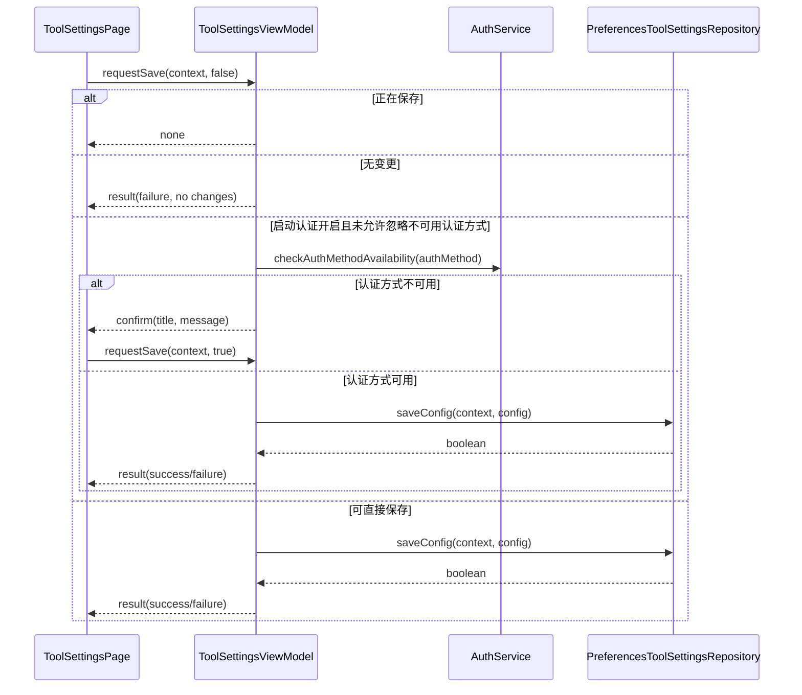
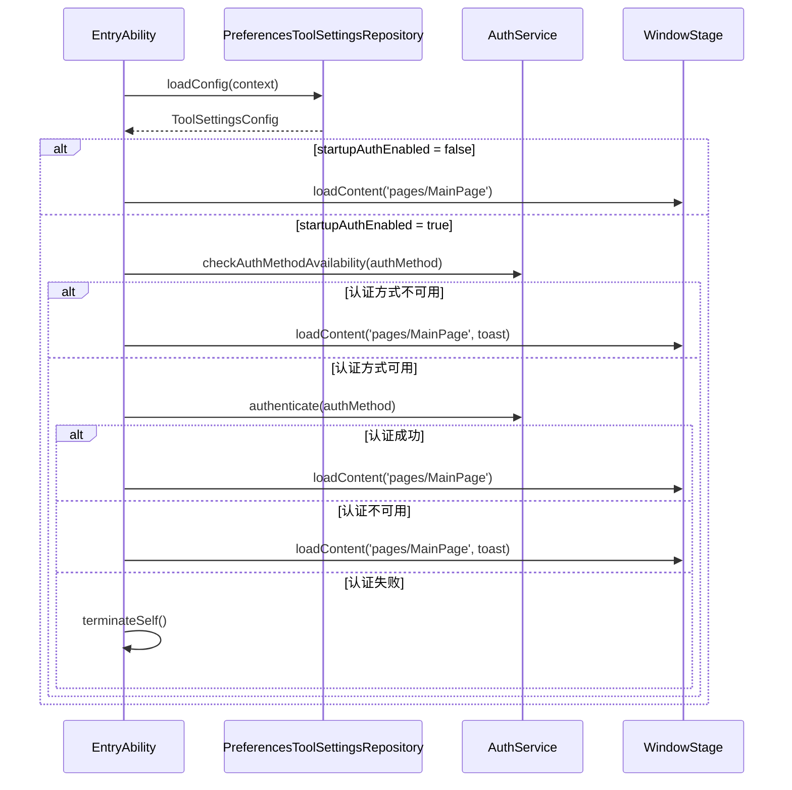

# 工具设置设计说明

## 0. 文档契约与状态 (Document Contract)
- **描述对象**:
  - [x] 当前已落地代码 (As-Is)
  - [ ] 目标架构设计 (To-Be)
  - [ ] 重构中过渡方案 (WIP)
- **维护规则**: 本文档为工具设置模块的核心契约。修改启动认证配置、保存流程、公开调用边界、持久化结构、启动阶段消费链路或关键异常策略时，必须同步更新本文档。
- **一致性原则**: 本模块设计以实际代码为唯一真相源。其他文档与当前代码不一致时，以当前代码为准；文档内路径必须使用仓库相对路径。

## 1. 业务概述与对外接口 (Overview & Public Interfaces)
- **核心目标**: 管理 SecurityTool 自身的工具级安全设置，包括启动时身份校验配置和系统密码设置入口。
- **入口路由 (Route Entry)**: `tool-settings`，由 `entry/src/main/ets/pages/MainPage.ets` 渲染 `ToolSettingsPage`。
- **对外暴露能力 (Public APIs)**:
  - `PreferencesToolSettingsRepository.loadConfig(context)`: 供页面初始化和 `EntryAbility` 启动阶段读取工具设置配置。
  - `PreferencesToolSettingsRepository.saveConfig(context, config)`: 供工具设置保存流程写入配置。
  - `SystemSettingsService.openPasswordSettings(context)`: 供工具设置页面打开系统“生物识别和密码”设置页。
- **业务边界**:
  - ✅ **包含**:
    - 启动认证是否启用
    - 启动认证方式选择
    - 工具设置读取、编辑、保存和恢复
    - 系统密码设置入口跳转
    - 启动阶段对工具设置配置的消费说明
  - ❌ **不包含**:
    - 防火墙敏感操作认证
    - 防火墙策略配置
    - 外设、日志、身份鉴别等业务模块设置
    - 企业管理员激活
    - 账户安全策略
    - 全局主题、关于、帮助与反馈

工具设置模块不负责防火墙敏感操作认证。当前防火墙模块直接复用身份鉴别模块的 `AuthService.authenticate(AuthMethod.PIN)`，不读取工具设置保存的 `authMethod`，也不通过 `ToolSettingsViewModel` 或 `ToolSettingsRepository`。

## 2. 状态与数据流 (Data Flow & State)
> **设计原则**: 单向数据流 (View -> ViewModel -> Service -> Repository/Storage)

- **核心业务状态 (Core Business State)**:
  - `ToolSettingsConfig.startupAuthEnabled: boolean`: 是否启用启动时身份校验，默认值为 `false`。
  - `ToolSettingsConfig.authMethod: AuthMethod`: 启动认证方式，默认值为 `AuthMethod.PIN`。
  - `ToolSettingsUiState.config`: 当前页面编辑态。
  - `ToolSettingsUiState.initialConfig`: 最近一次加载或保存成功后的基线态。
  - `ToolSettingsUiState.hasChanges: boolean`: 当前编辑态是否与基线态不同，仅比较 `startupAuthEnabled` 与 `authMethod`。
  - `ToolSettingsUiState.saving: boolean`: 是否正在保存，用于避免重复保存。
  - `ToolSettingsUiState.initialized: boolean`: 页面是否完成初始化。

- **关键流转路径**:
- `首次进入页面` -> `MainPage` 注入共享 `ToolSettingsViewModel` -> `ToolSettingsPage.initializeViewModel()` -> `ToolSettingsViewModel.initialize(context)` -> `PreferencesToolSettingsRepository.loadConfig(context)` -> `config/initialConfig 同步` -> `initialized = true`。
- `已初始化后从其它路由返回工具设置页面` -> 复用共享 `ToolSettingsViewModel.state` -> 保留上次退出页面时的当前编辑态与 `hasChanges / saving`，不重复读取 Preferences 覆盖未保存变更。
  - `切换启动认证开关` -> `setStartupAuthEnabled(value)` -> `updateConfig` -> `hasChanges` 按基线态重新计算 -> `保存按钮可用状态同步`。
  - `切换认证方式` -> `setAuthMethod(authMethod)` -> `updateConfig` -> `hasChanges` 按基线态重新计算 -> `下拉选中态同步`。
  - `点击保存且无变更` -> `requestSave` -> 返回 `result(failure)` -> 页面展示无变更提示。
  - `点击保存且启动认证开启` -> `AuthService.checkAuthMethodAvailability(authMethod)` -> 不可用时返回 `confirm` -> 用户确认后以 `allowUnsupportedAuthMethod = true` 重试保存。
  - `保存成功` -> `PreferencesToolSettingsRepository.saveConfig(context, config)` -> `config/initialConfig 同步` -> `hasChanges = false` -> 页面展示保存成功。
  - `点击修改密码` -> `openPasswordSettings(context)` -> `SystemSettingsService.openPasswordSettings(context)` -> 成功无页面状态变更，失败返回 `result(failure)`。
  - `应用启动` -> `EntryAbility.checkStartupAuth(windowStage)` -> `loadConfig(context)` -> 根据 `startupAuthEnabled` 和 `authMethod` 决定是否调用 `AuthService.authenticate(authMethod)`。

## 3. 模块结构与组件设计 (Module Components)

### 【核心层】(Core MVVM & Domain Layers)

#### 3.1 Model & Types (核心数据模型与类型)
* **核心实体与依赖路径**:
  * `ToolSettingsConfig`
    * **所在文件**: `entry/src/main/ets/models/DataModels.ets`
    * **业务作用**: 描述工具设置当前可持久化的配置。
    * **关键字段**: `startupAuthEnabled` (控制应用启动时是否认证), `authMethod` (启动认证方式)。
  * `AuthMethod`
    * **所在文件**: `entry/src/main/ets/models/DataModels.ets`
    * **业务作用**: 表示可选择的认证方式。
    * **关键枚举**: `PIN = 1`, `FINGERPRINT = 4`。
    * **展示职责**: 认证方式下拉选项由工具设置展示层维护，`DataModels.ets` 不保存带 label 的 `AUTH_METHOD_OPTIONS`。
  * `DEFAULT_TOOL_SETTINGS`
    * **所在文件**: `entry/src/main/ets/models/DataModels.ets`
    * **业务作用**: 读取失败或无持久化配置时的默认值。
    * **关键字段**: `startupAuthEnabled = false`, `authMethod = AuthMethod.PIN`。
  * `ToolSettingsActionRequest`
    * **所在文件**: `entry/src/main/ets/viewmodels/tool-settings/system-settings/ToolSettingsViewModel.ets`
    * **业务作用**: ViewModel 返回给页面的动作模型。
    * **关键字段**: `kind` (`none` / `result` / `confirm`), `status`, `title`, `message`。

#### 3.2 Service / Domain (领域业务层)
* **真实文件路径**:
  - `entry/src/main/ets/services/tool-settings/system-settings/ToolSettingsRepository.ets`
  - `entry/src/main/ets/services/tool-settings/system-settings/SystemSettingsService.ets`
  - `entry/src/main/ets/services/identity/auth/AuthService.ets`
* **核心业务用例 (Use Cases)**:
  * `PreferencesToolSettingsRepository.loadConfig(context)`: 读取工具设置配置。
    * **副作用**: 无写入；读取 Preferences store `tool_settings`。
    * **失败策略**: 记录错误日志并返回 `DEFAULT_TOOL_SETTINGS`。
  * `PreferencesToolSettingsRepository.saveConfig(context, config)`: 保存启动认证开关和认证方式。
    * **副作用**: 写入 Preferences key `startup_auth_enabled` 与 `auth_method`。
    * **失败策略**: 写入失败或异常时返回 `false`。
  * `SystemSettingsService.openPasswordSettings(context)`: 打开系统“生物识别和密码”设置页。
    * **副作用**: 调用 `context.startAbility(want)` 拉起系统设置。
    * **失败策略**: 捕获异常、记录日志并返回 `false`。
  * `AuthService.checkAuthMethodAvailability(authMethod)`: 检查启动认证方式是否可用。
    * **副作用**: 调用 UserAuthenticationKit 可用性查询。
    * **失败策略**: 将系统错误码映射为用户可理解文案，返回 `available = false`。
  * `AuthService.authenticate(authMethod)`: 执行认证。
    * **副作用**: 调用 UserAuthenticationKit 展示认证控件。
    * **失败策略**: 返回 `failed` 或 `unavailable`，由调用方决定降级或终止。
* **内部架构设计**:
  * **Repository**: `entry/src/main/ets/services/tool-settings/system-settings/ToolSettingsRepository.ets` - 工具设置配置读写边界。
  * **Storage Port**: `entry/src/main/ets/storage/preferences/PreferencesAccessor.ets` - Preferences 访问封装。
  * **Auth Dependency**: `entry/src/main/ets/services/identity/auth/AuthService.ets` - 工具设置保存校验和启动认证复用的认证能力。
  * **Presentation Options**: `entry/src/main/ets/viewmodels/tool-settings/system-settings/ToolSettingsPresentationOptions.ets` - 工具设置认证方式下拉展示配置。

#### 3.3 ViewModel (视图模型层)
* **真实文件路径**: `entry/src/main/ets/viewmodels/tool-settings/system-settings/ToolSettingsViewModel.ets`
* **状态分发逻辑**:
  * `initialize(context)`: 从仓储加载配置，同步 `config` 与 `initialConfig`，清空 `hasChanges` 并标记初始化完成。
    * 调用边界: 页面仅在共享 ViewModel 未初始化时调用；路由返回时复用当前编辑态。
  * `setStartupAuthEnabled(enabled)`: 更新启动认证开关，并重新计算 `hasChanges`。
  * `setAuthMethod(authMethod)`: 更新启动认证方式，并重新计算 `hasChanges`。
  * `requestSave(context, allowUnsupportedAuthMethod)`: 统一处理保存中跳过、无变更提示、认证方式可用性确认和最终保存。
  * `openPasswordSettings(context)`: 调用系统设置服务，失败时返回页面结果动作。

#### 3.4 View / Page (页面视图层)
* **真实文件路径**: `entry/src/main/ets/views/tool-settings/system-settings/ToolSettingsPage.ets`
* **结构说明**:
* `ToolSettingsPage`: 工具设置页面入口。接收 `MainPage` 持有的共享 `ToolSettingsViewModel`；页面首次进入时初始化 ViewModel，已初始化后从其它路由返回时直接复用上次退出页面时的编辑态。初始化完成后展示“启动认证设置”卡片；页面头部保存按钮根据 `initialized`、`hasChanges`、`saving` 控制可用状态。
  * 页面只负责交互编排，不直接读写 Preferences，也不直接执行认证。
  * ViewModel 返回 `result` 时打开结果弹窗，返回 `confirm` 时打开确认弹窗并在确认后重试保存。

#### 3.5 Components (可复用组件层)
* **真实文件路径**:
  - `entry/src/main/ets/components/SettingsSectionCard.ets`
  - `entry/src/main/ets/components/SectionRows.ets`
  - `entry/src/main/ets/components/IconTextActionButton.ets`
  - `entry/src/main/ets/components/SubPageHeader.ets`
* **结构说明**:
  * `SectionCard`: 承载“启动认证设置”分组内容。
  * `SectionToggleRow`: 展示并回传启动认证开关变化。
  * `SectionSelectRow`: 展示并回传认证方式选择变化。
  * `SectionActionRow`: 展示“修改密码”动作入口。
  * `IconTextActionButton`: 页面头部“保存设置”按钮。
  * `SubPageHeader`: 工具设置子页面标题、返回与头部操作容器。

---

### 【基础设施与扩展层】(Infrastructure & Extensions)

#### 3.6 Storage / Database (持久化)
* **涉及修改**:
  - `entry/src/main/ets/models/DataModels.ets`
    - `PREF_STORE_NAME_TOOL = 'tool_settings'`
    - `PREF_KEY_STARTUP_AUTH = 'startup_auth_enabled'`
    - `PREF_KEY_AUTH_METHOD = 'auth_method'`
  - `entry/src/main/ets/services/tool-settings/system-settings/ToolSettingsRepository.ets`
    - 使用 `PreferencesAccessor.setMany` 同时写入启动认证开关和认证方式。
    - 读取时对认证方式做归一化，只接受 `PIN` 和 `FINGERPRINT`。

#### 3.7 Contracts / IPC (通信契约)
* **真实文件路径**: 无（None）
* **说明**: 工具设置模块当前不定义跨进程通信契约。

#### 3.8 Constants & Utils (业务常量与工具)
* **说明**:
  - `entry/src/main/ets/constants/modules/ToolSettingsStrings.ets` - 工具设置页面、启动认证、修改密码和确认弹窗文案。
  - `entry/src/main/ets/constants/RouteIds.ets` - 定义 `RouteIds.TOOL_SETTINGS = 'tool-settings'`。
  - `entry/src/main/ets/constants/AppConstants.ets` - 在 `NAV_ITEMS` 中注册侧边栏工具设置入口。
  - `entry/src/main/ets/viewmodels/dashboard/overview/DashboardViewModel.ets` - 在 `quickEntries` 中注册首页工具设置快捷入口。

#### 3.9 Ability / Runtime (系统入口)
* **说明**:
  - `entry/src/main/ets/entryability/EntryAbility.ets` 在 `onWindowStageCreate` 中调用 `checkStartupAuth(windowStage)`。
  - 未启用启动认证时直接加载 `pages/MainPage`。
  - 启用启动认证时先检查认证方式可用性，再调用 `AuthService.authenticate(authMethod)`。
  - 认证方式不可用或认证结果为 `unavailable` 时降级加载主页面并展示提示。
  - 认证失败且不是不可用原因时调用 `terminateSelf`。

## 4. 异常处理与系统依赖 (Dependencies & Errors)
- **关键系统 API**:
  - `@kit.AbilityKit`: `common.UIAbilityContext`, `Want`, `bundleManager`, `startAbility`。
  - `@kit.UserAuthenticationKit`: 启动认证方式可用性检查和认证执行。
  - `@kit.CryptoArchitectureKit`: 认证 challenge 生成。
  - `@kit.ArkData`: Preferences 持久化，间接由 `PreferencesAccessor` 使用。
- **系统权限**: 工具设置模块自身不新增独立系统权限；认证与系统设置跳转依赖系统能力可用性。
- **异常兜底策略**:
  - **配置读取失败**: `PreferencesToolSettingsRepository.loadConfig` 返回 `DEFAULT_TOOL_SETTINGS`。
  - **配置保存失败**: `saveConfig` 返回 `false`，ViewModel 返回保存失败结果。
  - **无变更保存**: ViewModel 返回失败结果，页面提示当前没有需要保存的更改。
  - **认证方式不可用**: 保存阶段返回确认请求；启动阶段降级加载主页面并展示提示。
  - **认证失败**: 启动阶段认证失败且不是不可用原因时终止应用。
  - **系统密码设置打开失败**: `SystemSettingsService.openPasswordSettings` 返回 `false`，页面展示“无法打开系统密码设置，请手动前往系统设置修改”。
  - **防火墙敏感操作认证**: 由 `entry/src/main/ets/services/firewall/FirewallService.ets` 直接调用 `AuthService.authenticate(AuthMethod.PIN)`，不消费工具设置配置。

### 4.1 实施步骤与测试验收 (Implementation & Acceptance)

- **实施步骤**:
  - 涉及启动认证、认证方式、工具配置、系统密码设置入口或启动消费链路变化时，先更新本文档的目标范围、状态模型、职责边界、异常兜底和验收口径。
  - 配置默认值和枚举先同步 `ToolSettingsModels.ets`、`ToolSettingsStrings.ets`，再调整 `PreferencesToolSettingsRepository.ets` 和 `ToolSettingsViewModel.ets`。
  - 启动认证消费链路只允许在 `EntryAbility.ets` 与 `AuthService.ets` 边界内变更；防火墙敏感操作继续固定 PIN 认证，不读取工具设置配置。
  - 系统设置跳转能力统一经 `SystemSettingsService.ets`，页面只消费成功/失败结果和用户确认态。
- **测试覆盖**:
  - UT: `entry/src/test/tool-settings/viewmodel.test.ets`、`repository.test.ets`、`system-settings-service.test.ets`、`entry/src/test/views/SettingsPagesState.test.ets`、`entry/src/test/entryability/entryability.test.ets` 覆盖配置读写、脏状态、系统入口和启动认证。
  - ohosTest: `entry/src/ohosTest/ets/test/simple/RouteAction.test.ets` 通过 `route_action` 场景覆盖工具设置入口和页面可达性。
  - E2E: `scripts/e2e/cases/tool_settings/startup_auth.json`、`auth_method.json`、`password_entry_visible.json`、`password_flow.json` 覆盖认证方式、系统密码入口和启动链路。
- **验收口径**:
  - 配置读取失败回退默认值，保存失败保持脏状态并允许重试；无变更保存给出明确提示。
  - 不可用认证方式在保存阶段需要二次确认，启动阶段则降级进入主页面并提示，不应造成白屏。
  - 系统密码设置入口失败时展示手动前往系统设置的提示；本模块不新增独立系统权限。

## 5. 变更日志 (Changelog)
> *注：仅记录设计级变更，普通 Bugfix 或格式修正请查阅 Git Log。*

| 版本 | 日期 | 修改人 | 核心设计变更内容 (重构/新增表/用例增删) |
|---|---|---|---|
| 1.0.4 | 2026-05-11 | Codex | 将启动认证方式展示 option 从 `DataModels.ets` 迁入工具设置展示层，数据模型只保留 `AuthMethod` 与持久化配置。 |
| 1.0.3 | 2026-05-11 | Codex | 收敛 ohosTest 验收口径到当前 dispatcher 场景，移除未接入历史页面测试引用。 |
| 1.0.2 | 2026-05-09 | Codex | 移除简化流程摘要，模块设计继续聚焦启动认证边界、配置持久化、测试和验收口径；RFC 层级对照回归总体 RFC。 |
| 1.0.1 | 2026-05-09 | Codex | 补充工具设置模块实施步骤、测试覆盖和验收口径，明确启动认证、配置持久化和系统设置入口的落地闭环。 |
| 1.0.0 | 2026-04-28 | Codex | 按模块设计模板重建工具设置模块设计文档；明确代码为唯一真相源、启动认证消费链路、防火墙认证边界和工具设置 RFC 删除结论。 |
