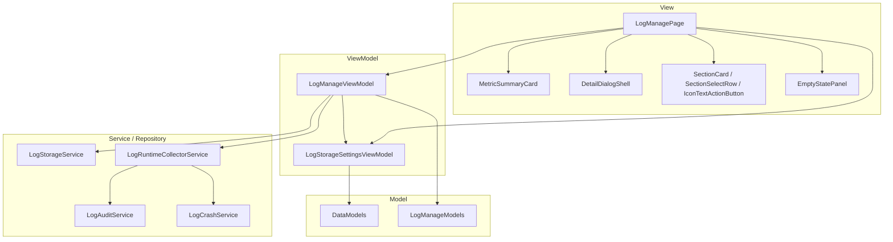
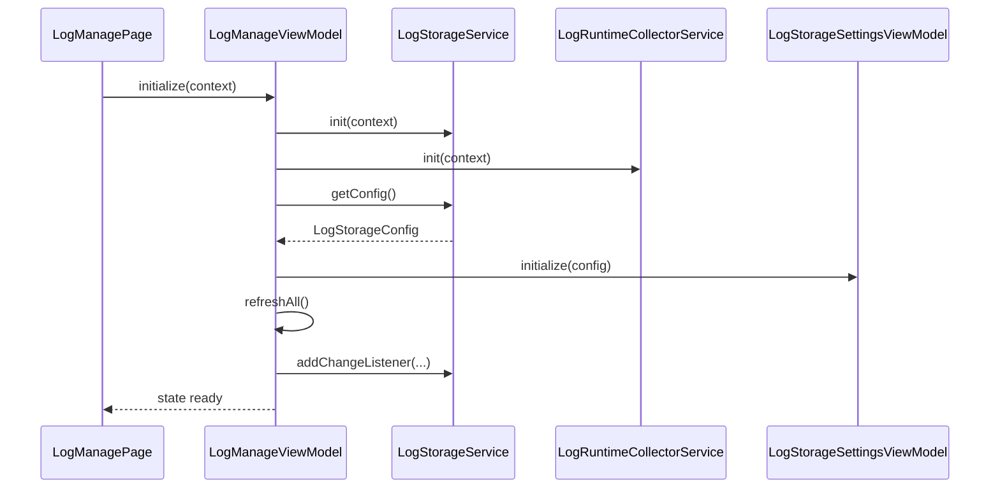
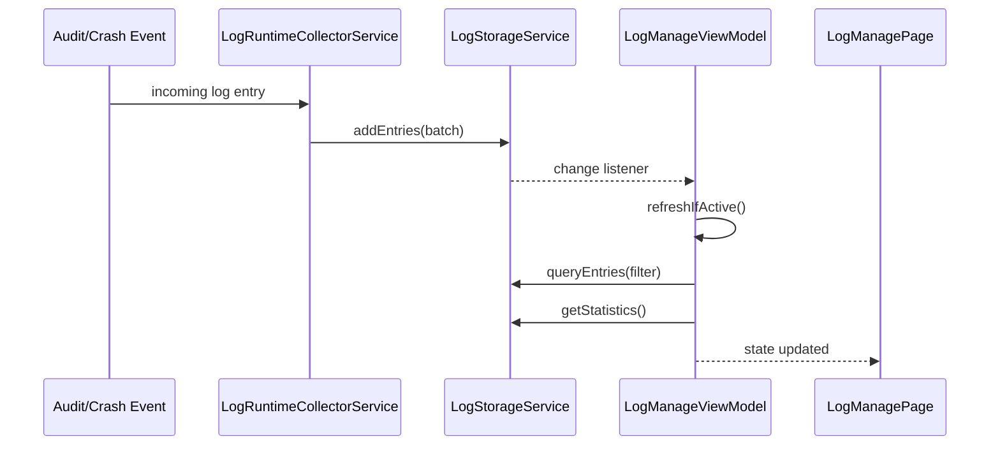
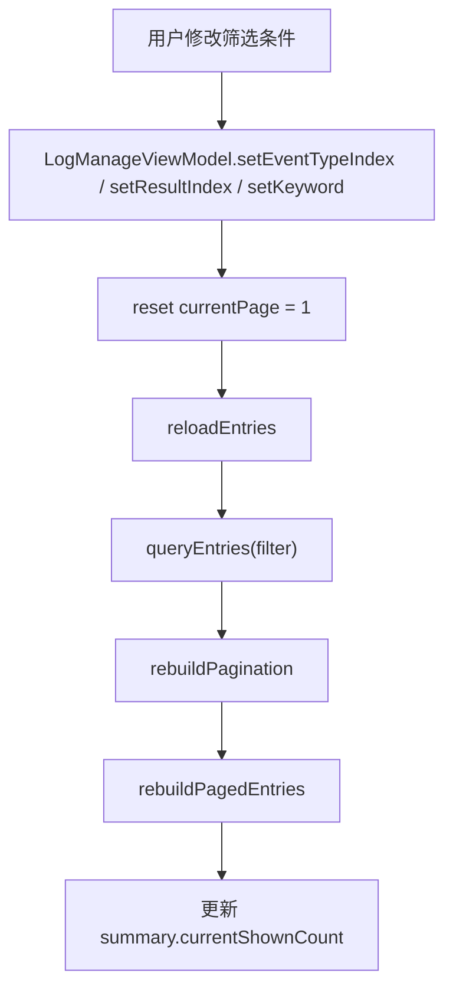
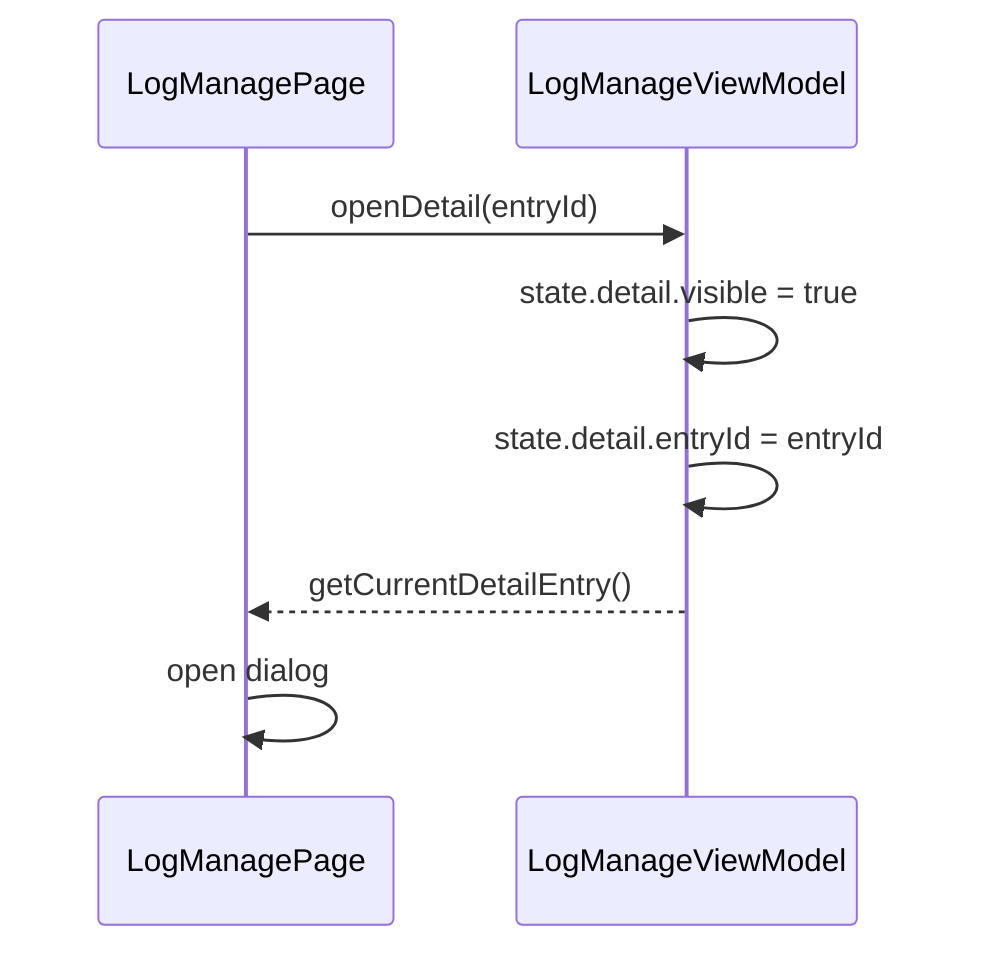
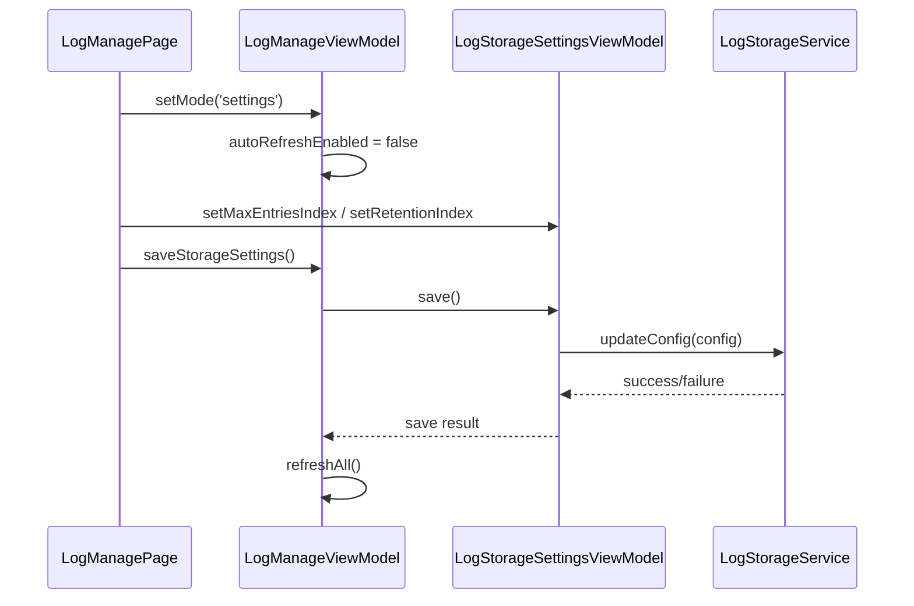

# 日志管理模块重构方案

## 1. 文档目的

本文档用于指导 SecurityTool 中“日志管理”模块从当前实现迁移到新的 MVVM 结构，重点解决以下问题：

- 页面承担了过多业务职责，结构臃肿
- 查询、刷新、筛选、分页、详情、设置等逻辑混杂在页面层
- 日志刷新缺少统一的激活态控制，看起来像“一直在查询”
- 状态字段分散，部分变量混合了多种语义
- 当前代码量偏大，存在明显冗余逻辑

本次重构明确约束如下：

- 不兼容旧页面内部逻辑组织方式
- 尽量少新增组件，优先复用现有组件
- 强调“每个变量只承载一种类型和一种语义”
- 目标是降低维护复杂度，并尽量减少总代码量

---

## 2. 当前问题总结

从当前 [`LogManagePage.ets`](/C:/Users/mu/Desktop/code/security_tool/entry/src/main/ets/views/LogManagePage.ets) 来看，页面同时承担了以下职责：

- 日志服务初始化
- 日志仓库监听注册与注销
- 日志查询
- 统计卡数据计算
- 筛选条件维护
- 分页逻辑
- 详情弹窗状态维护
- 日志导出与清空
- 存储设置子页面切换
- 存储设置保存

这导致页面已经不再是纯 View，而变成了：

```text
View + ViewModel + Coordinator + 部分查询逻辑
```

这种结构的问题主要有：

1. 页面文件过大，阅读和修改成本高
2. 页面中存在大量派生状态，易失同步
3. 监听与刷新控制散落，难以引入“暂停刷新/停止查询”能力
4. 业务测试难以集中覆盖，只能测底层 Service

---

## 3. 重构目标

本次重构的目标如下：

1. 将日志管理页面切换为明确的 MVVM 结构
2. 页面层只负责渲染和事件转发
3. 引入统一的 `LogManageViewModel`
4. 引入统一的页面状态模型，避免状态散落
5. 增加“激活态 + 自动刷新开关”机制，避免页面离开后仍持续刷新
6. 保留并复用现有组件，不再新增大量 UI 组件
7. 删除页面中重复和冗余的派生逻辑，压缩代码量

---

## 4. 非目标

本次重构不包含以下内容：

- 不新增复杂图表和趋势分析
- 不重做日志底层采集能力模型
- 不引入新的日志事件源
- 不强制将当前所有日志服务继续拆成更多 Service
- 不新增一整套日志专属 UI 组件库

---

## 5. 重构后的总体结构

### 5.1 目标分层

```text
View
  - LogManagePage

ViewModel
  - LogManageViewModel
  - LogStorageSettingsViewModel（保留，作为子能力）

Service / Repository
  - LogStorageService
  - LogRuntimeCollectorService
  - LogAuditService
  - LogCrashService

Model
  - DataModels
  - LogManageModels（新增）
```

### 5.2 目标结构图



---

## 6. 设计原则

### 6.1 每个变量只承载一种类型

本次重构强制遵循以下原则：

- 一个字段只承载一种明确类型
- 一个字段只承载一种业务语义
- 不把“索引”和“真实业务值”混用
- 不把“显示模式”和“布尔状态”混用
- 不在页面同时维护原始数据和重复派生数据

### 6.2 状态收口到 ViewModel

页面层不再直接维护：

- 日志数据
- 分页数据
- 筛选数据
- 详情数据
- 设置模式
- 刷新监听状态

这些全部收口到 `LogManageViewModel.state`。

### 6.3 尽量少新增组件

本次优先复用现有组件：

- [`MetricSummaryCard.ets`](/C:/Users/mu/Desktop/code/security_tool/entry/src/main/ets/components/MetricSummaryCard.ets)
- [`DetailDialogShell.ets`](/C:/Users/mu/Desktop/code/security_tool/entry/src/main/ets/components/DetailDialogShell.ets)
- [`EmptyStatePanel.ets`](/C:/Users/mu/Desktop/code/security_tool/entry/src/main/ets/components/EmptyStatePanel.ets)
- `SectionCard / SectionSelectRow / IconTextActionButton`

原则上不新增一组新的日志页面组件。若必须新增，最多只建议独立 `LogDetailDialog.ets`。

---

## 7. 推荐新增文件

### 7.1 必新增

- [`LogManageModels.ets`](/C:/Users/mu/Desktop/code/security_tool/entry/src/main/ets/models/LogManageModels.ets)
- [`LogManageViewModel.ets`](/C:/Users/mu/Desktop/code/security_tool/entry/src/main/ets/viewmodels/LogManageViewModel.ets)

### 7.2 可选新增

- [`LogDetailDialog.ets`](/C:/Users/mu/Desktop/code/security_tool/entry/src/main/ets/components/LogDetailDialog.ets)

说明：

- 如果你希望进一步压缩 [`LogManagePage.ets`](/C:/Users/mu/Desktop/code/security_tool/entry/src/main/ets/views/LogManagePage.ets)，可以把当前内联的 `LogDetailDialogPanel` 独立出去
- 如果你希望先最小化改动，也可以暂时不新增该组件

---

## 8. 推荐保留与复用的文件

- [`LogManagePage.ets`](/C:/Users/mu/Desktop/code/security_tool/entry/src/main/ets/views/LogManagePage.ets)
- [`LogStorageSettingsViewModel.ets`](/C:/Users/mu/Desktop/code/security_tool/entry/src/main/ets/viewmodels/LogStorageSettingsViewModel.ets)
- [`LogStorageService.ets`](/C:/Users/mu/Desktop/code/security_tool/entry/src/main/ets/services/LogStorageService.ets)
- [`LogRuntimeCollectorService.ets`](/C:/Users/mu/Desktop/code/security_tool/entry/src/main/ets/services/LogRuntimeCollectorService.ets)
- [`LogAuditService.ets`](/C:/Users/mu/Desktop/code/security_tool/entry/src/main/ets/services/LogAuditService.ets)
- [`LogCrashService.ets`](/C:/Users/mu/Desktop/code/security_tool/entry/src/main/ets/services/LogCrashService.ets)

---

## 9. 状态模型设计

建议新增 [`LogManageModels.ets`](/C:/Users/mu/Desktop/code/security_tool/entry/src/main/ets/models/LogManageModels.ets)，定义以下状态：

### 9.1 页面模式

```ts
export type LogManageMode = 'list' | 'settings'
```

说明：

- 不再使用 `showSettings: boolean`
- 页面模式始终由明确枚举表达

### 9.2 日志看板状态

```ts
export interface LogSummaryState {
  totalCount: number
  todayCount: number
  blockedCount: number
  currentShownCount: number
}
```

说明：

- 只承载顶部四张统计卡
- 不混入筛选或 Collector 状态

### 9.3 采集状态

```ts
export interface LogCollectorState {
  running: boolean
  crashSubscribed: boolean
  fileSubscribed: boolean
  accountSubscribed: boolean
  permissionSubscribed: boolean
}
```

说明：

- 解决“4 个逻辑订阅”的状态表达问题
- 如果第一阶段暂时拿不到 4 类精细状态，也可先保留字段并默认映射

### 9.4 筛选状态

```ts
export interface LogFilterState {
  eventTypeIndex: number
  resultIndex: number
  keyword: string
  hintMessage: string
}
```

说明：

- `eventTypeIndex` 只表达 UI 选项索引
- `resultIndex` 只表达 UI 选项索引
- `keyword` 只表达搜索文本
- `hintMessage` 只表达筛选提示文案

### 9.5 分页状态

```ts
export interface LogPaginationState {
  currentPage: number
  pageSizeIndex: number
  pageInputText: string
  totalPages: number
}
```

说明：

- `pageInputText` 只承载输入框文本
- 不再混用 `string` 与 `number`

### 9.6 详情状态

```ts
export interface LogDetailState {
  visible: boolean
  entryId: string
}
```

说明：

- 详情状态只表达“是否显示 + 当前详情对应哪条日志”
- 具体 `LogEntry` 可由 ViewModel 在当前列表中解析

### 9.7 列表状态

```ts
export interface LogListState {
  pagedEntries: LogEntry[]
}
```

说明：

- `pagedEntries` 是当前页结果
- 总数统一来自 `summary.totalCount`
- 当前页显示数量统一来自 `summary.currentShownCount`

### 9.8 页面总状态

```ts
export interface LogManageState {
  loading: boolean
  active: boolean
  autoRefreshEnabled: boolean
  mode: LogManageMode
  summary: LogSummaryState
  collector: LogCollectorState
  filter: LogFilterState
  pagination: LogPaginationState
  list: LogListState
  detail: LogDetailState
}
```

说明：

- `active` 用于控制页面是否处于活跃态
- `autoRefreshEnabled` 用于控制是否允许仓库变化自动刷新 UI

---

## 10. ViewModel 设计

建议新增 [`LogManageViewModel.ets`](/C:/Users/mu/Desktop/code/security_tool/entry/src/main/ets/viewmodels/LogManageViewModel.ets)。

### 10.1 核心职责

`LogManageViewModel` 负责：

- 页面初始化
- 激活 / 失活控制
- 日志仓库监听注册与注销
- 数据刷新
- 筛选条件维护
- 分页维护
- 详情状态维护
- 页面模式切换
- 导出日志
- 清空日志
- 调用 `LogStorageSettingsViewModel.save()`

### 10.2 建议方法

```ts
initialize(context: common.UIAbilityContext): Promise<void>
activate(): void
deactivate(): void
destroy(): void

refreshAll(): void
refreshIfActive(): void

setMode(mode: LogManageMode): void

setEventTypeIndex(index: number): void
setResultIndex(index: number): void
setKeyword(keyword: string): void

setPageSizeIndex(index: number): void
setPageInputText(text: string): void
goToPreviousPage(): void
goToNextPage(): void
jumpToInputPage(): void

openDetail(entryId: string): void
closeDetail(): void
getCurrentDetailEntry(): LogEntry | null

exportLogs(): Promise<ExportActionResult>
clearLogs(): Promise<boolean>
saveStorageSettings(): Promise<LogStorageSettingsSaveResult>
```

### 10.3 重要内部方法

```ts
registerStorageListener(): void
unregisterStorageListener(): void
reloadEntries(): void
rebuildSummary(): void
rebuildPagination(): void
rebuildPagedEntries(): void
rebuildFilterHint(): void
syncDetailState(): void
```

---

## 11. 停止查询 / 停止刷新方案

这是本次重构必须解决的问题。

### 11.1 当前问题

当前页面看起来像“一直在查询”，主要原因不是某个查询 API 停不下来，而是：

- 页面注册了仓库监听
- 页面没有统一的激活态控制
- 监听一触发就刷新页面数据

### 11.2 目标机制

重构后采用：

```text
listener + active + autoRefreshEnabled
```

### 11.3 规则

#### 页面进入

```text
aboutToAppear
-> viewModel.initialize(context)
-> viewModel.activate()
```

#### 页面离开

```text
aboutToDisappear
-> viewModel.deactivate()
-> viewModel.destroy()
```

#### 仓库监听回调

```text
if (!state.active) return
if (!state.autoRefreshEnabled) return
refreshAll()
```

#### 进入设置模式

```text
setMode('settings')
-> autoRefreshEnabled = false
```

#### 返回列表模式

```text
setMode('list')
-> autoRefreshEnabled = true
-> refreshAll()
```

### 11.4 收益

- 页面离开后不再继续刷新 UI
- 打开设置页时不会因为日志入库持续打断列表状态
- 逻辑简单，不需要继续引入轮询

---

## 12. 数据流设计

### 12.1 初始化流



### 12.2 日志入库刷新流



### 12.3 筛选与分页流



### 12.4 详情流



### 12.5 存储设置流



---

## 13. 页面改造策略

### 13.1 页面层保留职责

[`LogManagePage.ets`](/C:/Users/mu/Desktop/code/security_tool/entry/src/main/ets/views/LogManagePage.ets) 改造后只保留：

- 生命周期调用
- 持有 `@State viewModel`
- Builder 渲染
- 调用 `viewModel` 方法
- 打开/关闭详情弹窗
- 弹出导出/清空/保存结果提示

### 13.2 页面层应删除的状态

建议从页面中移除以下字段：

- `logEntries`
- `pagedLogEntries`
- `currentPage`
- `pageInputValue`
- `pageSizeIndex`
- `statistics`
- `filterEventType`
- `filterResult`
- `filterKeyword`
- `detailEntry`
- `showSettings`
- `isLoading`
- `logStorageListenerId`

这些全部应迁入 `LogManageViewModel.state`。

### 13.3 页面层应删除的方法

建议从页面中移除以下逻辑方法：

- `refreshAll`
- `refreshData`
- `buildFilter`
- `updatePagedEntries`
- `resetToFirstPageAndRefresh`
- `applyManualFilterChange`
- `goToPreviousPage`
- `goToNextPage`
- `jumpToInputPage`
- `getCurrentRangeText`
- `syncDetailEntry`
- `registerLogStorageListener`

这些全部应转移到 ViewModel。

---

## 14. 服务层调整建议

### 14.1 `LogStorageService`

该文件当前已经具备 Repository 化基础，本次建议保留，不做大拆。

建议继续保留职责：

- 初始化
- 存储
- 查询
- 统计
- 导出
- 清空
- 存储配置
- 变更监听

页面不再直接调用它，而是统一通过 `LogManageViewModel`。

### 14.2 `LogRuntimeCollectorService`

当前该文件主要职责是正确的，本次建议只做轻量调整：

1. 保留批量刷入逻辑
2. 保留内部日志过滤逻辑
3. 增加更明确的 collector 状态输出

建议增加一个细粒度状态接口：

```ts
export interface LogCollectorState {
  running: boolean
  crashSubscribed: boolean
  fileSubscribed: boolean
  accountSubscribed: boolean
  permissionSubscribed: boolean
}
```

如果第一阶段改动受限，也可以先用 `running + subscribed` 映射到所有字段。

### 14.3 `LogAuditService`

当前该文件较重，但本次不建议先继续拆。

原因：

- 当前核心问题在页面层
- 先收页面和 ViewModel 的收益更大
- 过早拆 `LogAuditService` 会扩大重构面

建议后续单独做第二阶段清理。

---

## 15. 组件复用策略

本次重构不建议新增大量 UI 组件，优先复用：

- [`MetricSummaryCard.ets`](/C:/Users/mu/Desktop/code/security_tool/entry/src/main/ets/components/MetricSummaryCard.ets)
- [`DetailDialogShell.ets`](/C:/Users/mu/Desktop/code/security_tool/entry/src/main/ets/components/DetailDialogShell.ets)
- [`EmptyStatePanel.ets`](/C:/Users/mu/Desktop/code/security_tool/entry/src/main/ets/components/EmptyStatePanel.ets)
- `SectionCard`
- `SectionSelectRow`
- `IconTextActionButton`

### 15.1 可选唯一新增组件

如果后续你希望继续压缩页面文件，唯一推荐新增的组件是：

- `LogDetailDialog.ets`

作用：

- 承接当前页面内联的 `LogDetailDialogPanel`
- 让详情 UI 从页面文件中移出

除此之外，不建议继续新建：

- `LogSummaryPanel`
- `LogFilterBar`
- `LogEntryList`
- `LogPaginationBar`

因为你已经有足够多的基础组件可复用，这样做反而可能造成组件数量继续膨胀。

---

## 16. 代码量变化预估

### 16.1 当前情况

[`LogManagePage.ets`](/C:/Users/mu/Desktop/code/security_tool/entry/src/main/ets/views/LogManagePage.ets) 当前体量很大，且页面中包含了大量非 View 逻辑。

这些逻辑中存在明显冗余：

- 页面自己维护原始数据和派生数据
- 页面自己拼 filter 并反复刷新
- 页面自己做分页切片
- 页面自己做详情同步
- 页面自己管理模式切换与刷新耦合

### 16.2 重构后代码量预估

#### 页面文件

- [`LogManagePage.ets`](/C:/Users/mu/Desktop/code/security_tool/entry/src/main/ets/views/LogManagePage.ets)
  - 预计减少 **35% 到 45%**

#### 新增文件

- `LogManageViewModel.ets`
  - 预计新增 **250 到 400 行**
- `LogManageModels.ets`
  - 预计新增 **80 到 140 行**
- `LogDetailDialog.ets`（如新增）
  - 预计新增 **120 到 180 行**

### 16.3 总量评估

综合来看：

- 如果不独立 `LogDetailDialog`，总代码量预计下降 **10% 到 20%**
- 如果独立 `LogDetailDialog`，总代码量预计基本持平或小幅下降

但无论哪种方案，都会显著减少：

- 页面复杂度
- 状态同步成本
- 后续修改风险

也就是说，本次重构的主要收益不是文件数减少，而是**无效复杂度减少**。

---

## 17. 测试建议

### 17.1 必补测试

建议新增：

- [`LogManageViewModel.test.ets`](/C:/Users/mu/Desktop/code/security_tool/entry/src/test/log-manage/LogManageViewModel.test.ets)

建议覆盖：

- 初始化后状态正确
- `activate/deactivate` 生效
- listener 触发时仅在 active + autoRefreshEnabled 下刷新
- 筛选变化后 currentPage 重置
- 分页切换正确
- 详情打开/关闭正确
- 模式切换到 `settings` 后自动刷新暂停
- 保存存储设置后恢复刷新

### 17.2 可继续保留的现有测试

当前这些底层测试可继续保留：

- [`storage-service.test.ets`](/C:/Users/mu/Desktop/code/security_tool/entry/src/test/log-manage/storage-service.test.ets)
- [`runtime-collector.test.ets`](/C:/Users/mu/Desktop/code/security_tool/entry/src/test/log-manage/runtime-collector.test.ets)
- [`audit-service.test.ets`](/C:/Users/mu/Desktop/code/security_tool/entry/src/test/log-manage/audit-service.test.ets)
- [`storage-settings-viewmodel.test.ets`](/C:/Users/mu/Desktop/code/security_tool/entry/src/test/log-manage/storage-settings-viewmodel.test.ets)

本次重点是补“页面总状态编排”这一层。

---

## 18. 实施顺序

建议按以下顺序推进：

### 第一步：立模型

- 新增 `LogManageModels.ets`

完成信号：

- 页面总状态结构稳定
- 各字段语义单一

### 第二步：新增总 ViewModel

- 新增 `LogManageViewModel.ets`
- 先把页面状态和逻辑迁进去

完成信号：

- 页面不再直接拼 filter / pagination / refresh

### 第三步：页面瘦身

- 修改 `LogManagePage.ets`
- 将页面改为纯渲染 + 事件转发

完成信号：

- 页面状态字段显著减少
- listener 注册注销不再出现在页面层

### 第四步：补 active / autoRefresh 机制

- 完成 `activate/deactivate/destroy`
- 设置页模式暂停自动刷新

完成信号：

- 不再出现“页面离开还在持续刷新”的现象

### 第五步：补测试

- 新增 `LogManageViewModel.test.ets`
- 接入 `List.test.ets`

完成信号：

- 日志模块的页面级主逻辑得到基本覆盖

---

## 19. 结论

本次日志管理模块重构建议采用：

```text
少新增组件
+ 强收状态
+ 单总 ViewModel
+ listener + active 控制刷新
+ 变量类型与语义单一
```

这是当前最适合你诉求的方案，因为它同时满足：

- 改成 MVVM
- 不兼容旧页面内部逻辑
- 不继续引入大量组件
- 解决“没有停止查询能力”的问题
- 控制代码量，减少冗余

一句话总结：

**这次不是继续拆 UI，而是把页面里的业务和状态全收回 ViewModel，让日志管理真正变成一个可控、可停、可维护的 MVVM 模块。**

---

最后更新：2026-03-31  
适用范围：日志管理模块 MVVM 重构前实施方案
