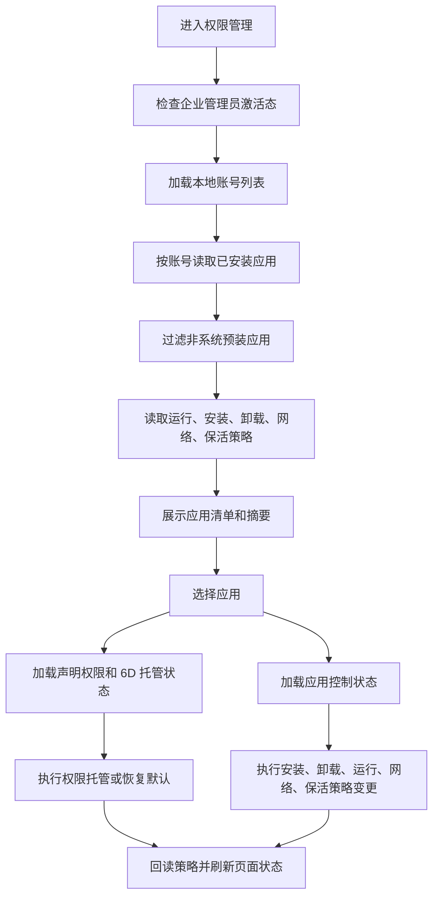

# 权限管理设计说明

## 0. 文档契约与状态 (Document Contract)

> 本文档是 `permission-manage` 权限管理模块的设计与实施契约。当前首版已落地模块登记、路由入口、首页快捷入口、账号选择、真实 MDM 应用清单读取、非系统应用过滤/搜索/选择、安装/卸载/运行/保活/自启动策略只读回读、只读清单页、文案常量、模型和 ViewModel 初始状态；高风险写操作仍未开放。

- **文档状态**: 首版接入中，已进入路由和页面骨架实现。
- **目标路由**: `permission-manage`。
- **目标页面**: `entry/src/main/ets/views/permission-manage/overview/PermissionPage.ets`。
- **目标 ViewModel**: `entry/src/main/ets/viewmodels/permission-manage/PermissionViewModel.ets`。
- **目标 Service / Repository**: `entry/src/main/ets/services/permission-manage/PermissionService.ets`、`ApplicationInventoryRepository.ets`、`ApplicationControlRepository.ets`、`PermissionAccountProvider.ets`；后续写操作再按能力拆分仓储实现。
- **目标模型**: `entry/src/main/ets/models/PermissionModels.ets`。
- **目标文案常量**: `entry/src/main/ets/constants/modules/PermissionStrings.ets`，所有新增可见文案和字符串键必须定义常量，复用 `StringCatalog` 的公共文案。
- **当前约束**: 本轮接入真实应用清单读取、账号选择、非系统应用过滤/搜索/选择、安装/卸载/运行/保活/自启动策略只读回读；同步新增 `ohos.permission.ENTERPRISE_GET_ALL_BUNDLE_INFO` 和 `ohos.permission.ENTERPRISE_SET_BUNDLE_INSTALL_POLICY` 权限及签名模板；不暴露安装、卸载、运行、6D 权限、网络、保活和自启动写操作。

### 设计结论

权限管理模块建议首期只做四类应用级管控：

1. **应用清单与安装、卸载、执行控制**: 获取所有账号下非系统预装应用，按账号维度管理安装白名单/黑名单、卸载保护和运行黑名单，允许白名单作为二期高风险增强。
2. **6D 公共目录权限托管**: 可通过企业管理员托管目标应用已声明的用户授权权限，覆盖桌面、下载、文档、图库、音乐等 6D 权限组；不能给目标应用注入未声明权限，也不能绕过系统权限模型直接访问目录。
3. **应用网络访问策略**: 基于应用 `uid` 生成防火墙或域名过滤规则，按账号和应用实例展示策略状态；业务上独立于防火墙管理模块，但复用其网络规则 API 适配思路和列表 UI。
4. **应用保活与自启动**: 对目标账号内应用配置保活、自启动和禁止用户修改开关；需要处理与运行黑名单、卸载保护之间的冲突。

`applicationAuthControl` 暂不纳入首期设计。若后续需要，应先完成独立接口验证，再更新本文档。

## 1. 业务概述与对外接口 (Overview & Public Interfaces)

### 1.1 模块目标

权限管理模块面向企业管理员，提供应用级别的安全管控入口。模块不是系统设置页的镜像，而是围绕“非系统预装应用”的可管控状态，把应用清单、安装卸载、运行、目录权限、网络和保活策略收敛到同一个账号上下文内。

核心目标：

- 获取所有本地账号下已安装应用信息，并过滤出非系统预装应用。
- 以账号为第一作用域，避免同一 `bundleName` 在不同账号、不同分身或重新安装后策略错配。
- 对应用安装、卸载、运行、网络、保活、自启动和 6D 权限进行只读展示与可控写入。
- 对所有高风险写操作提供明确确认、失败反馈、管理员激活态检查和最小日志。
- 不影响已有防火墙、外设、身份鉴别和工具设置模块的职责边界。

### 1.2 目标入口与导航

首版按现有模块镜像落位：

| 层 | 文件 | 目标改动 |
|---|---|---|
| 路由 ID | `entry/src/main/ets/constants/RouteIds.ets` | 新增 `PERMISSION_MANAGE = 'permission-manage'` |
| 导航 | `entry/src/main/ets/constants/AppConstants.ets` | `NAV_ITEMS` 新增权限管理入口，名称来自 `ModuleText.PERMISSION_MANAGE`，图标来自 `AppResources.PERMISSION_ICON` 或新增资源 |
| 页面入口 | `entry/src/main/ets/pages/MainPage.ets` | 注册 `PermissionPage`；当前仍由 `pages/MainPage` 单页容器承载，不新增 `main_pages.json` 页面 |
| 页面 | `entry/src/main/ets/views/permission-manage/overview/PermissionPage.ets` | 权限管理主页面 |
| ViewModel | `entry/src/main/ets/viewmodels/permission-manage/PermissionViewModel.ets` | 页面状态、筛选、动作调度 |
| Service | `entry/src/main/ets/services/permission-manage/` | 首版提供账号、真实应用清单和应用控制策略只读初始态；6D 权限、网络策略、写操作后续分阶段接入 |
| 模型 | `entry/src/main/ets/models/PermissionModels.ets` | 权限项、应用实例、账号、策略状态 |
| 文案 | `entry/src/main/ets/constants/modules/PermissionStrings.ets` | 模块文案、选项、失败原因、空态文案 |

### 1.3 对外接口边界

模块对页面只暴露 `PermissionViewModel`，页面不直接调用 MDM API。

目标公开方法：

| 接口 | 说明 |
|---|---|
| `loadInitialState()` | 初始化管理员状态、账号列表、默认账号应用清单、应用控制策略和策略摘要 |
| `switchAccount(accountId)` | 切换账号并重新加载应用、安装/卸载/运行策略和保活状态 |
| `refreshApplications()` | 按当前账号刷新非系统预装应用清单；读取失败时返回权限或管理员激活态失败说明 |
| `selectApplication(appKey)` | 选中应用并展示详情占位；后续加载 6D 权限状态和策略状态 |
| `setInstallPolicy(appKey, policy)` | 设置安装白名单/黑名单或恢复默认 |
| `setUninstallProtected(appKey, enabled)` | 设置或取消卸载保护 |
| `setRunningPolicy(appKey, policy)` | 设置运行允许、禁止或默认策略 |
| `setSixDPermissionState(appKey, groupKey, state)` | 设置 6D 权限托管状态，目标应用未声明权限时禁用 |
| `setNetworkPolicy(appKey, policy)` | 设置应用网络允许、禁止或域名级策略 |
| `setKeepAlivePolicy(appKey, policy)` | 设置保活、自启动和禁止用户修改 |

## 2. 状态与数据流 (Data Flow & State)

### 2.1 账号维度

本模块必须区分用户。所有策略读取和写入都绑定 `accountId`，页面顶部固定提供账号选择器。

原因：

- 企业应用管理 API 多数支持 `accountId` 或 `userId` 参数。
- 同一应用可能安装在多个账号，应用分身存在 `appIndex`。
- 网络规则使用 `appUid`，`uid` 会随账号、安装状态或重装变化，不能作为唯一持久化主键。
- 6D 权限托管使用 `ApplicationInstance`，需要 `appIdentifier`、`accountId`、`appIndex`。

目标主键：

```text
PermissionAppKey = accountId + bundleName + appIdentifier + appIndex
```

`uid` 只作为网络规则下发和展示字段，每次刷新应用清单时重新解析。

### 2.2 数据模型

目标模型统一放在 `models/PermissionModels.ets`。

| 模型 | 字段要点 | 说明 |
|---|---|---|
| `PermissionManagedAccount` | `accountId`、`displayName`、`isForeground`、`isAvailable` | 页面账号选择与策略作用域 |
| `ManagedApplicationInfo` | `key`、`accountId`、`bundleName`、`appIdentifier`、`appIndex`、`uid`、`label`、`versionName`、`systemApp`、`removable`、`installSource`、`appDistributionType` | 应用清单主模型 |
| `ApplicationPermissionProfile` | `requestedPermissions`、`sixDGroups`、`sensitivePermissionCount` | 目标应用声明权限和 6D 分组结果 |
| `SixDPermissionItem` | `groupKey`、`title`、`permissionNames`、`declaredPermissions`、`managedState`、`canManage`、`disabledReason` | 6D 权限托管行 |
| `ApplicationControlState` | `installPolicy`、`uninstallProtected`、`runningPolicy`、`networkPolicy`、`keepAliveEnabled`、`autoStartEnabled`、`disallowModify`、`conflicts` | 应用控制聚合状态 |
| `PermissionSummary` | `appCount`、`managedCount`、`sixDSensitiveCount`、`networkRestrictedCount`、`keepAliveCount` | 页面摘要卡数据 |
| `PermissionPageState` | `adminReady`、`accounts`、`selectedAccountId`、`apps`、`filteredApps`、`selectedAppKey`、`searchKeyword`、`filters`、`summary`、`loading`、`processingAction`、`error`、`inventoryMessage` | ViewModel 页面状态 |

### 2.3 6D 权限组映射

6D 权限不是目录 ACL 自由配置。首期设计按目标应用的 `requestedPermissions` 做权限组识别，再通过企业管理员托管已声明的用户授权权限。

| 6D 分组 | 权限名候选 | 管控方式 |
|---|---|---|
| 下载 | `ohos.permission.READ_WRITE_DOWNLOAD_DIRECTORY` | 目标应用已声明时，可设置 `DEFAULT`、`GRANTED`、`DENIED` |
| 桌面 | `ohos.permission.READ_WRITE_DESKTOP_DIRECTORY` | 同上 |
| 文档目录 | `ohos.permission.READ_WRITE_DOCUMENTS_DIRECTORY` | 同上 |
| 图库 | `ohos.permission.READ_IMAGEVIDEO`、`ohos.permission.WRITE_IMAGEVIDEO` | 同上 |
| 音乐 | `ohos.permission.READ_AUDIO`、`ohos.permission.WRITE_AUDIO` | 同上 |
| 文档文件 | `ohos.permission.READ_DOCUMENT`、`ohos.permission.WRITE_DOCUMENT` | 同上 |

实现前必须做设备 POC：

- 准备一个测试应用，显式声明下载或图库权限。
- 由 SecurityTool 使用 `securityManager.setPermissionManagedState` 设置 `GRANTED`、`DENIED`、`DEFAULT`。
- 用测试应用验证授权弹窗、访问结果和 `getPermissionManagedState` 回读。
- 验证未声明权限时接口返回参数错误还是无效状态，并把错误映射写入 `PermissionStrings`。

### 2.4 状态流



### 2.5 数据来源与持久化

系统策略状态以 MDM API 和系统查询结果为唯一真相源。模块本地只允许缓存 UI 偏好和补充展示信息。

| 数据 | 真相源 | 本地缓存策略 |
|---|---|---|
| 已安装应用清单 | `ApplicationInventoryRepository` 调用 `enterprise.bundleManager.getInstalledBundleList(admin, accountId, WITH_APPLICATION_INFO | WITH_SIGNATURE_INFO)` | 不长期缓存，页面刷新重新读取 |
| 应用声明权限 | 系统包管理查询结果 | 不长期缓存，可在一次页面会话内缓存 |
| 安装/卸载策略 | `ApplicationControlRepository` 调用 `enterprise.bundleManager` 安装、禁止安装、禁止卸载列表回读 API | 不作为真相源持久化 |
| 运行策略 | `ApplicationControlRepository` 调用 `enterprise.applicationManager` 运行黑白名单回读 API | 不作为真相源持久化 |
| 6D 托管状态 | `enterprise.securityManager.getPermissionManagedState` | 不作为真相源持久化 |
| 网络策略 | `enterprise.networkManager.getFirewallRules`、`getDomainFilterRules` | 不作为真相源持久化 |
| 保活/自启动 | `ApplicationControlRepository` 调用 `enterprise.applicationManager.getKeepAliveApps`、`getAutoStartApps` | 不作为真相源持久化 |
| 筛选条件 | Preferences 或内存 | 可选，非关键状态 |

## 3. 核心功能场景 (Core Functional Scenarios)

### 3.1 应用清单加载与非系统预装过滤

| 项目 | 设计 |
|---|---|
| 前置条件 | SecurityTool 已安装并激活企业管理员；具备获取全部应用信息权限 |
| 输入 | 当前 `accountId`、搜索关键字、过滤条件 |
| 处理 | 读取账号内应用清单，过滤 `systemApp === false` 且 `removable !== false` 的可管理应用；排除 SecurityTool 自身的高风险操作 |
| 输出 | 合并策略状态后的应用列表、摘要卡、空态或失败态 |
| 风险 | `bundleName` 不足以区分账号和分身；必须使用组合主键 |
| 验收 | 多账号切换时应用列表不同步串号；系统预装应用不显示在可管控清单里 |

### 3.2 应用安装、卸载和执行控制

| 项目 | 设计 |
|---|---|
| 前置条件 | 当前账号已选中目标应用；管理员激活态有效 |
| 安装控制 | 当前先只读回读安装允许列表、禁止列表；写入作为后续高风险动作 |
| 卸载控制 | 当前先只读回读禁止卸载列表；直接卸载作为高风险操作，首期不默认暴露 |
| 执行控制 | 当前先只读回读运行黑名单和运行白名单；写入作为后续高风险动作 |
| 交互 | 每次写入前弹确认；写入后回读策略；失败时回滚 UI |
| 冲突 | 运行禁止与保活、自启动互斥，页面必须提示并阻止明显冲突组合 |
| 验收 | 当前策略回读后详情区显示 `allowed`、`denied`、`default` 和卸载保护状态；后续写入验收再覆盖启动阻断和恢复 |

### 3.3 6D 权限识别与管理员托管

| 项目 | 设计 |
|---|---|
| 前置条件 | 已读取目标应用声明权限，目标权限属于用户授权类并在 6D 白名单内 |
| 可做 | 管理员设置 `DEFAULT`、`GRANTED`、`DENIED` 托管状态 |
| 不做 | 不给目标应用添加未声明权限；不直接访问用户目录；不绕过媒体库、文件管理或系统授权模型 |
| 交互 | 6D 卡片按目录组展示，未声明显示“未申请”，控件禁用；已声明显示当前托管态 |
| 验收 | 已声明权限可设置并回读；未声明权限不可操作；失败码映射到明确错误提示 |

### 3.4 应用网络访问策略

| 项目 | 设计 |
|---|---|
| 前置条件 | 当前应用存在有效 `uid`；管理员具备网络管理权限 |
| 控制方式 | 使用 `FirewallRule.appUid` 或 `DomainFilterRule.appUid` 做应用级网络管控 |
| 策略粒度 | 首期提供全部网络允许/禁止；域名级规则作为应用详情内的增强入口 |
| 依赖边界 | 可复用防火墙模块的规则解析和 UI 模式，但权限管理模块不读写防火墙页面状态 |
| 风险 | 应用重装或账号切换后 `uid` 变化；规则刷新必须基于最新清单重新绑定 |
| 验收 | 禁用后目标应用网络被拦截；恢复后规则移除；重装后提示重新校准 |

### 3.5 应用保活与自启动

| 项目 | 设计 |
|---|---|
| 前置条件 | 目标设备支持相关能力；当前账号和目标应用有效 |
| 保活 | 当前先只读回读保活应用列表；后续写入使用保活应用列表管理目标 `bundleName` |
| 自启动 | 当前先只读回读自启动 `Want` 列表；后续写入使用自启动 `Want` 列表管理目标应用入口 Ability |
| 禁止用户修改 | 对支持的接口使用 `disallowModify`，页面展示锁定态 |
| 降级 | 设备不支持时展示能力不可用，不伪装成功 |
| 验收 | 设置保活、自启动后回读状态一致；与运行禁止冲突时阻止或二次确认 |

## 4. 模块结构与组件设计 (Module Components)

### 【核心层】(Core MVVM & Domain Layers)

#### 4.1 Model & Types (核心数据模型与类型)

建议新增 `entry/src/main/ets/models/PermissionModels.ets`，只放业务模型、枚举和转换结果，不放 MDM 调用。

目标枚举：

- `PermissionInstallPolicy`: `DEFAULT`、`ALLOW`、`DENY`。
- `PermissionRunningPolicy`: `DEFAULT`、`DISALLOW`、`ALLOW_ONLY`。
- `SixDManagedState`: `DEFAULT`、`GRANTED`、`DENIED`、`UNDECLARED`、`UNSUPPORTED`。
- `ApplicationNetworkPolicy`: `DEFAULT_ALLOW`、`BLOCK_ALL`、`DOMAIN_RULES`。
- `ApplicationKeepAlivePolicy`: `DEFAULT`、`KEEP_ALIVE`、`AUTO_START`、`KEEP_ALIVE_AND_AUTO_START`。

#### 4.2 Service / Domain (领域业务层)

目标结构：

| 类 | 职责 |
|---|---|
| `PermissionService` | ViewModel 唯一门面，编排账号、应用、权限和策略 |
| `PermissionAccountProvider` | 获取本地账号，可复用已有系统用户 Provider 模式 |
| `ApplicationInventoryRepository` | 封装 `getInstalledBundleList`、包权限详情查询、非系统应用过滤 |
| `ApplicationControlRepository` | 封装安装、卸载、运行黑白名单、保活、自启动策略只读回读；写操作后续再开放 |
| `SixDPermissionRepository` | 封装 `setPermissionManagedState`、`getPermissionManagedState` |
| `ApplicationNetworkPolicyRepository` | 封装 `FirewallRule.appUid` 和 `DomainFilterRule.appUid` 规则读写 |
| `ApplicationKeepAliveRepository` | 封装保活、自启动、禁止用户修改策略 |
| `PermissionLocalRepository` | 可选，只保存 UI 筛选和最近选中账号，不保存系统策略真相 |

Service 规则：

- 所有写操作先做管理员态、账号、应用主键和自应用保护校验。
- 所有写操作完成后必须回读系统状态。
- 业务代码统一用 `LogUtils`，每个文件只定义一个 `TAG`。
- 用户可见文案来自 `PermissionStrings` 或公共 `StringCatalog`，不得散落字符串。

#### 4.3 ViewModel (视图模型层)

`PermissionViewModel` 负责：

- 管理 `PermissionPageState`。
- 合并应用清单、策略状态和摘要数据。
- 控制账号切换、搜索、过滤、排序。
- 管控处理中状态，避免重复点击。
- 把仓储错误转换为模块失败原因，不在页面层解析错误码。

ViewModel 不直接持有 ArkUI 组件状态，不直接依赖弹窗服务。页面通过回调触发动作，ViewModel 返回结果，页面负责确认弹窗和 Toast。

#### 4.4 View / Page (页面视图层)

`PermissionPage.ets` 建议采用双栏运维控制台布局：

- 顶部复用 `SubPageHeader`，标题为权限管理，右侧提供刷新按钮和可选导出按钮。
- 页头下方放账号选择器、搜索框和过滤器。
- 主区域左侧为应用列表，右侧为选中应用详情。
- 宽屏下使用左右分栏；窄屏下应用详情通过 `DetailDialogShell` 或单列折叠展示。

页面结构：

```text
SubPageHeader
SummaryCards
Toolbar: AccountSelect + Search + Filters
Content:
  Left: AppList
  Right:
    AppOverview
    SixDPermissionPanel
    ApplicationControlPanel
    NetworkPolicyPanel
    KeepAlivePanel
```

不建议做四个完全割裂的大 Tab。权限管理的主对象是“应用实例”，按应用选中后在详情区展示四类能力更符合操作路径，也能避免用户在不同 Tab 间反复重新选择同一个应用。

#### 4.5 Components (可复用组件层)

优先复用现有公共组件：

| 组件 | 复用方式 |
|---|---|
| `SubPageHeader` | 页面标题、返回、刷新和导出动作 |
| `MetricSummaryCard` / `CompactSummaryCard` | 应用总数、已管控、6D 敏感、网络限制、保活数量 |
| `LoadingStatePanel` | 初始加载和局部刷新加载态 |
| `EmptyStatePanel` | 无非系统应用、无 6D 权限、无网络策略 |
| `SettingsSectionCard` | 应用详情里的控制分组 |
| `SectionToggleRow` | 卸载保护、保活、自启动、禁止用户修改 |
| `SectionSelectRow` / `AsyncSelectRow` | 安装策略、运行策略、6D 托管态选择 |
| `StyledSelect` | 账号、应用类型、策略过滤 |
| `StyledTextInput` | 应用搜索和域名规则输入 |
| `MultiCheckSelect` | 批量选择 6D 权限组或批量应用策略 |
| `DetailDialogShell` | 应用详情、策略确认、失败详情 |
| `IconTextActionButton` | 刷新、应用策略、恢复默认等动作 |
| `PolicyList` 模式 | 应用策略记录行，可参考外设黑白名单列表形态 |
| `FirewallRuleList` 模式 | 应用网络规则列表，可参考防火墙规则列表形态 |

建议新增权限管理专属组件：

| 组件 | 职责 |
|---|---|
| `PermissionAppList` | 应用列表、搜索结果和状态标签 |
| `PermissionAppDetailPanel` | 选中应用详情容器 |
| `SixDPermissionPanel` | 6D 权限组展示和托管态选择 |
| `ApplicationControlPanel` | 安装、卸载、运行控制 |
| `ApplicationNetworkPanel` | 应用网络策略摘要和规则入口 |
| `ApplicationKeepAlivePanel` | 保活、自启动和锁定配置 |

UI 设计原则：

- 使用密集、可扫描的管理台布局，不做营销式 Hero。
- 卡片只用于摘要和重复项目，页面区域不再套大卡片。
- 高风险动作使用明确按钮和确认弹窗，不通过隐晦开关完成。
- 运行禁止、卸载保护、网络禁止等状态使用标签颜色区分，不能只靠文本。
- 被禁用控件必须显示原因，例如“目标应用未声明该权限”或“设备不支持保活能力”。

### 【基础设施与扩展层】(Infrastructure & Extensions)

#### 4.6 Storage / Database (持久化)

首期不新增 RDB 表。系统策略以系统接口回读为准。

可以使用轻量 Preferences 保存：

- 最近选中账号。
- 最近选中应用。
- 搜索和过滤条件。
- UI 折叠状态。

不得保存：

- 安装、卸载、运行、网络、保活、6D 权限的最终策略真相。
- `uid` 到应用的长期映射。

#### 4.7 Contracts / IPC (通信契约)

首期不新增 IPC。若后续需要把权限管理结果同步到后台常驻能力，必须新增明确契约：

- 后台只接收策略变更事件，不自行推断策略。
- 事件包含 `accountId`、`bundleName`、`appIdentifier`、`appIndex` 和动作结果。
- 后台处理失败不得覆盖页面回读结果。

#### 4.8 Constants & Utils (业务常量与工具)

目标常量文件：

| 文件 | 内容 |
|---|---|
| `constants/modules/PermissionStrings.ets` | 页面标题、分组标题、状态文案、失败原因、确认文案 |
| `constants/RouteIds.ets` | `PERMISSION_MANAGE` 路由 ID |
| `constants/AppResources.ets` | 权限管理图标资源 |
| `models/PermissionModels.ets` | 6D 权限组常量、策略枚举、状态模型 |

新增字符串必须定义常量。实现阶段不得在页面和 Service 中直接写用户可见字符串。

#### 4.9 Ability / Runtime (系统入口)

后续实现需依赖企业管理员和受限权限。已具备或计划新增权限必须同步 `module.json5`、`hapsigner/UnsgnedDebugProfileTemplate.json`、`AGENTS.md` 权限列表，并在修改签名模板后重新生成 p7b。

| 能力 | 目标接口 | 权限 |
|---|---|---|
| 获取全部应用信息 | `enterprise.bundleManager.getInstalledBundleList` | `ohos.permission.ENTERPRISE_GET_ALL_BUNDLE_INFO` |
| 安装/卸载策略 | `addAllowedInstallBundlesSync`、`addDisallowedInstallBundlesSync`、`addDisallowedUninstallBundlesSync` | `ohos.permission.ENTERPRISE_SET_BUNDLE_INSTALL_POLICY` |
| 直接安装/卸载 | `install`、`uninstall` | `ohos.permission.ENTERPRISE_INSTALL_BUNDLE`，首期谨慎启用 |
| 运行控制 | `addDisallowedRunningBundlesSync`、`addAllowedRunningBundles` | `ohos.permission.ENTERPRISE_MANAGE_APPLICATION` |
| 网络策略 | `addFirewallRule`、`addDomainFilterRule` | `ohos.permission.ENTERPRISE_MANAGE_NETWORK` |
| 保活/自启动 | `addKeepAliveApps`、`addAutoStartApps` | `ohos.permission.ENTERPRISE_MANAGE_APPLICATION` |
| 6D 权限托管 | `setPermissionManagedState`、`getPermissionManagedState` | `ohos.permission.ENTERPRISE_MANAGE_USER_GRANT_PERMISSION` |
| 账号枚举 | 本地账号管理 API | 现有 `ohos.permission.GET_LOCAL_ACCOUNTS` |

`ohos.permission.ENTERPRISE_MANAGE_LOCAL_PUBLICSPACES` 只作为二期研究项。当前 SDK 中该权限关联 HMS 企业空间公共数据访问限制，适合企业空间或后台数据访问限制场景，不作为首期“按应用托管 6D 权限”的主路径。

## 5. 异常处理与系统依赖 (Dependencies & Errors)

### 5.1 系统依赖

| 依赖 | 风险 | 处理 |
|---|---|---|
| 企业管理员未激活 | MDM API 返回 9200001 | 页面进入只读态，显示管理员激活提示 |
| 权限未声明或签名模板未同步 | API 返回 201 | 禁用写操作，提示重新签名安装 |
| 设备能力不支持 | API 返回 801 或能力缺失 | 对应卡片显示不可用，不降级为成功 |
| 多管理员策略冲突 | API 返回 9200010 | 保留当前状态，提示存在冲突策略 |
| 参数校验失败 | API 返回 401、9200012 | 记录错误，提示应用信息已变化并建议刷新 |
| 目标应用重装 | `uid`、`appIndex` 或权限声明变化 | 刷新清单并重新绑定策略 |
| 账号切换中操作 | 状态串扰 | 切换账号时禁止写操作并取消当前选中应用 |

### 5.2 失败提示

`PermissionStrings` 至少定义以下失败原因：

- 管理员未激活。
- 权限声明不足。
- 目标应用未声明该 6D 权限。
- 目标应用为系统预装应用，不支持此操作。
- 目标应用为 SecurityTool 自身，不允许高风险操作。
- 设备不支持该能力。
- 策略冲突。
- 应用信息已变化，请刷新。
- 操作失败，请稍后重试。

### 5.3 实施步骤与测试验收 (Implementation & Acceptance)

实施顺序：

1. 同步 PRD、总体 RFC、README、AGENTS 和 `scripts/check_docs_consistency.py`，正式登记 `permission-manage` 模块。
2. 新增路由、导航、首页快捷入口、图标、页面骨架、文案常量和模型文件。
3. 首版页面只展示模块范围、账号/应用摘要空态、账号选择和管理员依赖提示，不执行任何 MDM 写操作。
4. 已接入账号选择、真实应用清单读取、非系统预装过滤、搜索、选择、安装/卸载/运行/保活/自启动策略只读回读和详情展示；读取失败时提示企业管理员激活态或应用清单权限检查。
5. 实现安装、卸载保护和运行黑名单，先不暴露直接卸载。
6. 实现 6D 权限声明识别和托管态回读，完成设备 POC 后再开放写入。
7. 实现应用网络策略，先做全部网络禁止/恢复，域名规则作为增强。
8. 实现保活和自启动，处理与运行策略冲突。
9. 补齐单元测试、ohosTest 路由测试、设备冒烟测试和签名权限闭环。

测试建议：

| 层级 | 目标路径 | 覆盖 |
|---|---|---|
| UT | `entry/src/test/permission-manage/` | 过滤非系统应用、账号切换、策略合并、6D 映射、冲突判断 |
| ViewModel UT | `entry/src/test/viewmodels/PermissionViewModel.test.ets` | 加载、刷新、失败回滚、处理中状态 |
| Repository UT | `entry/src/test/permission-manage/repository.test.ets` | MDM API mock、错误码映射 |
| ohosTest | `entry/src/ohosTest/ets/test/simple/RouteAction.test.ets` | 路由可达和主页面基础渲染 |
| 设备 POC | 新增专项用例 | 6D 托管、运行禁止、网络禁止、保活自启动 |

验收口径：

- 首版入口可从侧边栏和首页快捷入口进入，帮助与反馈仅保留在顶部菜单。
- 未激活管理员时，页面可读但所有写操作禁用。
- 应用清单只展示非系统、非不可卸载的可管理应用，且不允许对 SecurityTool 自身执行高风险操作。
- 切换账号后，应用、策略和摘要全部按账号刷新。
- 运行禁止、卸载保护、网络禁止、保活和自启动写入后能回读一致。
- 6D 权限仅对目标应用已声明的权限启用托管操作，未声明权限禁用且说明原因。
- 所有新增字符串均在 `PermissionStrings` 或公共字符串常量中定义。
- 权限新增后完成构建、签名、安装和企业管理员激活验证。

## 6. 变更日志 (Changelog)

| 版本 | 日期 | 作者 | 变更 |
|---|---|---|---|
| 0.6.0 | 2026-06-25 | Codex | 接入应用控制策略只读回读：安装允许/禁止、禁止卸载、运行允许/禁止、保活、自启动状态合并到应用详情与摘要；新增安装策略权限声明。 |
| 0.5.0 | 2026-06-25 | Codex | 接入真实 MDM 应用清单读取，新增 `ohos.permission.ENTERPRISE_GET_ALL_BUNDLE_INFO` 权限和签名模板声明，保留只读详情占位和失败态提示。 |
| 0.4.0 | 2026-06-25 | Codex | 补齐应用清单可扩展框架：Repository 支持非系统应用过滤、搜索和主键构造，ViewModel 支持搜索与选中应用，页面提供搜索和详情占位。 |
| 0.3.0 | 2026-06-25 | Codex | 权限管理首版继续推进：接入账号选择、应用清单 Repository 壳和可解释空态；真实应用清单查询仍等待企业应用清单权限和签名模板同步。 |
| 0.2.0 | 2026-06-25 | Codex | 接入权限管理首版实施边界：新增侧边导航与首页快捷入口、路由和只读页面骨架；明确本阶段不新增签名权限、不开放 MDM 写操作。 |
| 0.1.0 | 2026-06-25 | Codex | 新增权限管理模块目标设计，明确四类首期能力、用户维度、6D 权限托管边界、系统 API 依赖、UI 复用和分阶段验收。 |
