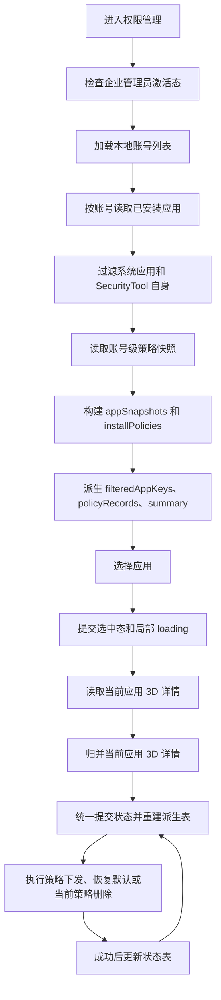

# 权限管理设计说明

## 0. 文档契约与状态 (Document Contract)

> 本文档是 `permission-manage` 权限管理模块的设计与实施契约。当前版本已落地模块登记、路由入口、首页快捷入口、账号选择、真实 MDM 应用清单读取、非系统应用过滤/选择、按 `appId` / `appIdentifier` 禁止安装、当前策略表格、策略删除、卸载/运行/网络策略回读与写入、3D 权限声明识别和托管态设置、失败反馈、文案常量、模型和 ViewModel 状态闭环；页面采用“策略摘要置顶、先选账号再选应用、按身份鉴别样式逐条配置、选择即下发”的管控工具布局，当前策略表格参考外设管理“设备连接记录”列表样式并提供删除动作，3D 目录行在详情读取中或读取失败时仍保留占位展示，不允许整块消失；未声明或不可用的 3D 目录不允许展开选择。目标应用保活和自启动不在权限管理页面开放。

- **文档状态**: 可设置版本已接入。
- **目标路由**: `permission-manage`。
- **目标页面**: `entry/src/main/ets/views/permission-manage/overview/PermissionPage.ets`。
- **目标 ViewModel**: `entry/src/main/ets/viewmodels/permission-manage/PermissionViewModel.ets`。
- **目标 ViewModel 辅助层**: `entry/src/main/ets/viewmodels/permission-manage/PermissionStateReducer.ets`、`PermissionAccountRefreshUseCase.ets`、`PermissionPolicyActionUseCase.ets`、`PermissionPolicyRecordMapper.ets`。
- **目标 Service / Repository**: `entry/src/main/ets/services/permission-manage/PermissionService.ets`、`ApplicationInventoryRepository.ets`、`ApplicationControlRepository.ets`、`ApplicationNetworkPolicyRepository.ets`、`ThreeDPermissionRepository.ets`、`PermissionAccountProvider.ets`。
- **目标模型**: `entry/src/main/ets/models/PermissionModels.ets`。
- **目标文案常量**: `entry/src/main/ets/constants/modules/PermissionStrings.ets`，所有新增可见文案和字符串键必须定义常量，复用 `StringCatalog` 的公共文案。
- **当前约束**: 本轮开放应用管控设置能力：禁止安装走账号维度输入框，只面向未安装应用身份值下发；输入只接受真实 `appId` 或 `appIdentifier`，用户同时掌握两类身份值时优先输入 `appId`；页面和 Service 不读取已安装应用清单做包名解析，不把 `bundleName` 当禁止安装目标。禁止安装不再做应用名模糊映射，也不再在当前已安装应用策略行里切换安装策略；当前账号、目标应用、卸载保护、运行策略、网络策略和 3D 权限托管均使用外设接口管控同款 `AsyncSelectRow`，下拉过程中左侧显示 loading、控件置灰并在失败时回滚；当前账号切换成功后按新账号刷新应用清单、清空目标应用和当前策略表，失败时保持旧账号。目标应用默认不自动选择，下拉框第一项固定为“请选择应用”；用户选择具体应用后控件显示目标应用名称，不再显示“请选择应用”占位文本，下拉框宽度与禁止安装输入框一致；页面重新进入只刷新当前账号的应用清单与账号级策略快照；账号变化事件或手动刷新必须重新读取账号列表，保留仍然存在的当前账号；若当前账号已不存在，则回退到账号 Provider 返回的前台账号或首个账号，再按有效当前账号重新读取一次应用清单和账号级策略快照，确保新增用户、新安装、卸载、重装或已下发的禁止安装策略能进入对应状态表；目标应用列表必须过滤 `systemApp === true` 的系统应用和 SecurityTool 自身，FormRenderService、ArkWeb、长时任务通知资源等系统框架或资源包也必须强制隐藏；不得再用 `removable === false` 隐藏目标应用，避免企业包或调试包被误伤；目标应用以包名和应用 key 做唯一映射，label 只作为展示字段，不允许用 label 查找、写入或删除策略；下拉选项必须带包名以区分同名应用。用户选择具体应用后必须先同步提交选中态并显示局部读取转圈，目标应用行按外设管理下拉框样式在下拉框左侧显示局部读取转圈，读取期间下拉框置灰；目标应用切换不得套全局 loading dialog，只读取当前应用 3D 权限详情并由旧请求序号丢弃过期结果，账号级安装、卸载、运行、网络和本地 3D 记录不再依赖目标应用切换读取，避免同步 MDM 接口阻塞下拉收起和页面重绘。“当前策略”表格按当前账号展示所有应用和安装策略，不按目标应用过滤。权限管理应用清单必须请求应用基础信息和签名信息并保留 `SignatureInfo.appId`、`SignatureInfo.appIdentifier`、`bundleName`、`uid`，不请求应用图标。卸载保护默认“未启用”且不再弹二次确认；运行策略和网络策略下拉只展示“允许/禁止”，其中“允许”对应系统默认放行/恢复默认，不额外展示“默认”选项；3D 未声明、不可用或读取中的目录行不得显示“默认”，必须显示“未声明”或“不可用”等真实不可下发状态。切换目标应用时必须先同步更新 `selectedAppKey` 和局部 loading 并立即刷新“应用策略”区域，详情读取后台补齐完成后只合并当前应用 3D 权限详情；应用策略区域必须按目标应用 key 强制重建，避免 ArkUI 复用旧应用的 Select/状态行内部状态。页面必须在“应用策略”卡片下方提供“当前策略”表格，展示从系统策略列表、当前账号下所有应用状态和本地 3D 托管记录合并出的有效策略；系统枚举仍用于目标应用选择和后续校准，安装、卸载、运行和网络等系统可枚举策略不得用本地记录补回，避免恢复默认后陈旧记录残留；本地记录只用于删除映射和补充 3D 等无法全局枚举的策略。本地 3D 非默认记录必须存入 RDB 表，不再使用或迁移旧 Preferences 数据。每条可管理策略必须提供固定操作列宽度的删除按钮，点击删除先弹确认框，用户确认后才调用对应 MDM API 清除系统策略；删除处理中在按钮文字左侧展示 loading，不替换“删除”文字，成功后根据对应策略记录更新 ViewModel 状态区并清理必要本地记录。3D 权限行副标题必须说明目录/资源授权用途，不使用“未声明”作为副标题；未声明仅通过禁用态和状态值表达。目标应用保活和自启动能力暂不在权限管理页面开放，不读取、不展示、不下发、不在当前策略表生成条目。所有策略写入必须等待 MDM API 返回；恢复默认、关闭卸载保护或删除当前策略成功后，必须根据本次成功动作更新 ViewModel 状态区，并同步重建上方应用策略行、摘要和当前策略表；失败时不得提交新状态。写入期间必须按动作粒度设置 `processingActionKey`，仅当前行、当前按钮或当前策略删除项展示 loading，不再叠加全局 loading dialog；失败时不得提交新 UI 状态，必须保留或恢复原状态并展示失败原因；成功后普通策略只按本次成功动作更新当前选中应用的策略状态、摘要和当前策略表格，不刷新应用管控对象区；3D 写入后只回读当前应用的 3D 托管状态。成功不弹二次结果框，失败时才展示失败提示并记录底层错误码。卸载保护和运行策略下发与回读必须只使用 `SignatureInfo.appId`；无 `appId` 时视为不可下发，失败并保留原状态，不回退 `appIdentifier` 或 `bundleName`，恢复默认只清理当前 `appId`。3D 权限托管下发与回读必须只使用系统返回的真实 `SignatureInfo.appIdentifier` 作为 `ApplicationInstance.appIdentifier`；若为空则按空值传入并由系统返回失败，不使用 `bundleName` 或 `appId` 兜底。网络策略系统侧仍按最新 `uid` 下发和清理，写入时必须复用初始规则快照，只补齐缺失的 IPv4/IPv6 拒绝规则，写入后必须回读当前 UID 下 DENY/REJECT 规则确认；恢复默认必须清理当前 UID 下所有 DENY/REJECT 规则，不能只删除一个模板规则。安装/卸载策略清理互斥列表时必须先读取现有策略并只移除已存在项，避免参数校验或不存在项清理导致整次失败。当前 SDK 中安装、卸载、运行、网络等企业管理策略读取接口没有 Promise/callback 异步重载，部分 API 直接以 `*Sync` 暴露；因此权限管理 ViewModel 由 `ApplicationRuntimeManager` 统一持有，允许在应用第一次启动且首页入场动画完整结束后随全局 runtime warmup 只预加载账号、应用清单和账号级策略快照；不得在预热阶段自动选择应用或读取 3D 详情，也不得用固定延迟伪装异步刷新；同步接口读取前必须先提交局部 loading/置灰状态，避免点击下拉框后无反馈。`IconTextActionButton` 不承载 loading 状态，按钮左侧 loading 由业务页面自行组合。同步新增 `ohos.permission.GET_BUNDLE_INFO` 和 `ohos.permission.ENTERPRISE_MANAGE_USER_GRANT_PERMISSION` 权限及签名模板。直接安装/直接卸载 HAP 文件不作为本模块当前目标，避免把管控工具扩大为应用分发工具。

### 设计结论

#### 本轮状态源收敛

为解决目标应用切换、策略下发、恢复默认和当前策略删除之间的状态撕裂，本轮设计将权限管理收敛为 ViewModel 维护的一张应用策略状态表。状态表主键固定为 `appKey = accountId + ':' + bundleName`，页面上方“应用策略”和下方“当前策略”都只能从这张表及账号级安装策略表派生。`selectedAppKey` 只保存当前选中应用 key，不再维护独立 `selectedApplication` 或 `selectedPermissionProfile` 副本。

ViewModel 只允许通过统一提交入口更新权限管理状态：更新 `appSnapshots` 或 `installPolicies` 后，必须同步重建 `filteredAppKeys`、`policyRecords` 和 `summary`。禁止继续保留 `upsertPolicyRecord`、`removePolicyRecord`、`rebuildApplicationPolicyRecords`、`applyDeletedPolicyRecord` 等平行更新路径，避免当前策略表和应用策略行各自维护状态。

`AsyncSelectRow` 只负责本次异步选择的 pending、loading 和失败回退，不承载 `appKey`、策略类型或跨渲染业务状态，也不缓存成功后的显示值。下发成功后，ViewModel 更新状态表，页面重新读取父级 `selectedIndex`；失败时状态表不变，组件保持旧值。权限管理“应用策略”区域由模块内专用 `ComponentV2` 面板承接状态联动，页面只向面板传入当前应用的基础状态字段和动作回调；面板不得保存策略副本，必须由 `uninstallProtected`、`runningBlocked`、`networkBlocked`、`threeDGroups` 等 `@Param` 推导下拉选中值。目标应用切换或策略字段变化时，应用策略面板按当前 `appKey` 和策略摘要重建，避免复用旧应用或旧策略的 Select 内部显示状态；共享 `AsyncSelectRow` 不为权限管理引入业务状态逻辑，避免影响外设管理。

账号级安装策略不属于某个已安装应用，单独维护在 `installPolicies` 中。卸载保护、运行禁止、网络禁止属于应用状态表字段；运行和网络 UI 中的“允许”表示恢复默认，不写入 allowed running whitelist。3D 权限托管状态迁入当前应用行的 `threeDGroups` 和 `threeDPolicies`，本地记录只保存 3D 非默认状态，用于展示补充和删除映射，不替代系统真相源。

权限管理初始化必须是一次性动作。`loadInitialState()` 只允许在未初始化时构建账号、应用清单和账号级策略快照基础状态；页面重新进入、全局 runtime 预热或 `ensurePermissionRuntimeServices()` 不能再次调用初始化覆盖已读状态。已初始化后的清单刷新必须走 `refreshAccountsAndApplicationList()` / `refreshApplicationList()`，账号级安装、卸载、运行和网络策略以新快照为准，仅保留同一 `appKey` 的已读 3D 详情；目标应用策略读取必须通过用户选择目标应用或显式详情读取链路完成。

权限管理刷新边界分为五类：首次初始化、页面入场校准、账号变化事件刷新、手动完整校准、操作前上下文校验和写后精确同步。首次初始化读取账号列表、默认账号应用清单和账号级策略快照；页面重新进入时只通过 `refreshApplicationList()` 刷新当前账号应用清单和账号级策略快照，不重复读取已由 `AccountRuntimeService` 实时维护的账号列表；账号变化事件由 UI 进程 `AccountRuntimeService` 订阅账号 CommonEvent 后记录最新账号 payload，已初始化的 `PermissionViewModel` 调用 `refreshForAccountChange()` 刷新账号列表、当前有效账号应用清单和账号级策略快照；手动刷新继续通过 `refreshAccountsAndApplicationList()` 完整校准账号列表和当前有效账号数据，作为账号事件遗漏或延迟时的人工兜底。页面入场刷新与账号事件碰撞时不得因 `state.loading` 直接丢弃账号事件，ViewModel 必须通过非响应式单任务协调器等待当前刷新后继续执行账号级完整刷新；普通连续刷新允许复用在途 Promise，但账号变化事件不得把事件发生前已启动的完整刷新直接视为本事件已处理。账号刷新期间再次收到账号事件时必须记录非响应式 pending 标记；当前刷新结束后至少再完整校准一次，补刷开始前收到的多个事件合并为一次，补刷开始后新到达的事件继续触发下一轮补刷，避免最新账号事件被旧快照错误确认。策略写入成功后仍按本次成功动作精确更新 ViewModel 状态表、摘要和当前策略表；策略写入或当前策略删除发起前必须执行最小上下文校验，确认当前账号、目标应用或目标策略记录仍存在且仍指向同一应用实例。若账号已删除，ViewModel 先同步最新账号和有效账号应用清单、清空旧目标应用，再拒绝本次旧账号操作并提示重新选择账号。若目标应用已卸载，或同 `selectedAppKey` 的 `appId`、`appIdentifier`、`appIndex` 等身份字段已变化，ViewModel 先同步最新应用清单、清空旧目标应用，再拒绝本次旧应用操作并提示重新选择应用。若当前策略删除前刷新后已找不到目标记录，或目标记录已不再指向同一应用实例，ViewModel 同步最新状态并提示策略已变化，不再使用旧记录调用系统删除。禁止安装是账号级操作，仅校验当前账号仍存在，不读取目标应用清单。

目标应用没有可靠的 MDM 安装/卸载实时回调，不承诺后台自动实时刷新目标应用列表。权限管理页面必须在“应用管控对象”区域提供手动刷新入口，用户新增、卸载或重装应用后可显式完整校准账号列表、当前有效账号应用清单和账号级策略快照。手动刷新复用 `refreshAccountsAndApplicationList()` 的账号校准逻辑：当前账号仍存在时保持当前账号，新增应用进入目标应用下拉但不自动选中；目标应用已卸载或身份变化时清空目标应用，应用策略区回到未选择状态，并重建当前策略表和摘要。页面入场的当前账号应用刷新不得让账号选择行显示 loading 动效，刷新期间仅禁用账号选择和相关操作；手动刷新仍只在刷新按钮区域显示局部 loading，不弹全局 loading。

应用清单刷新后，当前账号下不再存在于最新 `appSnapshots` 的本地 3D active 记录必须从本地记录集中删除或标记为非 active；同 `appKey` 但 `bundleName`、`appIdentifier` 或 `appIndex` 与最新应用快照不一致的本地 3D active 记录也必须清理或忽略，避免应用卸载、重装或实例变化后旧 3D 记录继续出现在当前策略表。3D 本地记录合并到应用状态表时必须至少校验 `accountId`、`appKey`、`bundleName`、`appIdentifier` 和 `appIndex` 与最新应用快照一致；ViewModel 复用已读 3D 详情时还必须校验 `appId` 一致。系统未回填 `appIdentifier` 的旧记录不得跨应用实例兜底复用。

底层 MDM 调用仍按接口要求传入 `accountId` 参数；卸载保护和运行策略只使用系统 `SignatureInfo.appId` 作为策略 ID，不能把 `accountId:bundleName`、纯 `bundleName` 或 `appIdentifier` 当作 `appIds` 下发；缺少 `appId` 时必须下发失败并保留原状态。网络策略系统侧使用最新 `uid` 下发和清理，但 ViewModel 侧的状态归属仍按 `appKey`。`label` 仅展示，不作为页面业务主键；3D 应用实例中的应用身份值只使用系统真实 `SignatureInfo.appIdentifier`，为空时不回退 `bundleName` 或 `appId`。

权限管理模块建议首期只做四类应用级管控：

1. **应用清单与安装、卸载、执行控制**: 获取当前账号下非系统且非 SecurityTool 自身的已安装应用，按账号维度管理安装白名单/黑名单、卸载保护和运行黑名单，允许白名单作为二期高风险增强。
2. **3D 公共目录权限托管**: 可通过企业管理员托管目标应用已声明的用户授权权限，首期仅覆盖下载目录、桌面目录、文档目录 3 类 3D 权限组；不能给目标应用注入未声明权限，也不能绕过系统权限模型直接访问目录。
3. **应用网络访问策略**: 基于应用 `uid` 生成防火墙或域名过滤规则，按账号和应用实例展示策略状态；业务上独立于防火墙管理模块，但复用其网络规则 API 适配思路和列表 UI。
4. **3D 权限托管**: 对目标应用已声明的 3D 目录权限进行托管态设置和回读。

`applicationAuthControl` 暂不纳入首期设计。若后续需要，应先完成独立接口验证，再更新本文档。

## 1. 业务概述与对外接口 (Overview & Public Interfaces)

### 1.1 模块目标

权限管理模块面向企业管理员，提供应用级别的安全管控入口。模块不是系统设置页的镜像，而是围绕“非系统预装应用”的可管控状态，把应用清单、安装卸载、运行、目录权限和网络策略收敛到同一个账号上下文内。

核心目标：

- 获取当前账号下已安装应用信息，并过滤掉系统应用和 SecurityTool 自身。
- 以账号为第一作用域，避免同一 `bundleName` 在不同账号、不同分身或重新安装后策略错配。
- 对应用安装、卸载、运行、网络和 3D 权限进行只读展示与可控写入。
- 对所有高风险写操作提供明确确认、失败反馈、管理员激活态检查和最小日志。
- 不影响已有防火墙、外设、身份鉴别和工具设置模块的职责边界。

### 1.2 目标入口与导航

首版按现有模块镜像落位：

| 层 | 文件 | 目标改动 |
|---|---|---|
| 路由 ID | `entry/src/main/ets/constants/RouteIds.ets` | 新增 `PERMISSION_MANAGE = 'permission-manage'` |
| 导航 | `entry/src/main/ets/constants/AppConstants.ets` | `NAV_ITEMS` 新增权限管理入口，名称来自 `ModuleText.PERMISSION_MANAGE`，图标来自 `AppResources.PERMISSION_ICON` 或新增资源 |
| 页面入口 | `entry/src/main/ets/pages/MainPage.ets` | 注册 `PermissionPage`；当前仍由 `pages/MainPage` 单页容器承载，不新增 `main_pages.json` 页面 |
| 页面 | `entry/src/main/ets/views/permission-manage/overview/PermissionPage.ets` | 权限管理主页面 |
| ViewModel | `entry/src/main/ets/viewmodels/permission-manage/PermissionViewModel.ets` | 页面状态、动作入口、loading/请求序号和页面回调调度 |
| ViewModel 辅助层 | `entry/src/main/ets/viewmodels/permission-manage/PermissionStateReducer.ets`、`PermissionAccountRefreshUseCase.ets`、`PermissionPolicyActionUseCase.ets`、`PermissionPolicyRecordMapper.ets` | 状态归并与派生、账号/应用刷新校准、策略动作前上下文校验和策略记录格式化 |
| Service | `entry/src/main/ets/services/permission-manage/` | 提供账号、真实应用清单、应用控制策略、网络策略和 3D 权限托管读写门面 |
| 模型 | `entry/src/main/ets/models/PermissionModels.ets` | 权限项、应用实例、账号、策略状态 |
| 文案 | `entry/src/main/ets/constants/modules/PermissionStrings.ets` | 模块文案、选项、失败原因、空态文案 |

### 1.3 对外接口边界

模块对页面只暴露 `PermissionViewModel`，页面不直接调用 MDM API。

目标公开方法：

| 接口 | 说明 |
|---|---|
| `loadInitialState()` | 初始化管理员状态、账号列表、默认账号应用清单和账号级策略快照；不自动选择目标应用，不读取当前应用 3D 详情 |
| `refreshForAccountChange()` | 账号变化事件触发的页面态刷新入口；未初始化时走初始化，已初始化时等待在途数据刷新后执行完整账号校准；刷新期间新到达的账号事件通过 pending 标记合并为后续一次补刷，不新增策略清理或系统策略写入 |
| `switchAccount(accountId)` | 切换账号并重新加载应用清单和账号级策略快照，清空当前选中应用；当前策略表按新账号快照重建 |
| `refreshApplications()` | 按当前账号刷新非系统应用清单和账号级策略快照；账号切换等主动刷新使用，不读取当前选中应用 3D 详情 |
| `refreshApplicationList()` | 页面每次重新进入时调用，按当前账号刷新应用清单和账号级策略快照，不重新读取账号列表；目标应用仍存在且身份一致时保留已读 3D 详情，目标应用消失或身份变化时清空目标应用 |
| `prepareAccountContextForAction()` | 账号级写操作前刷新账号列表，确认当前账号仍存在；账号消失时同步最新账号/应用状态并拒绝旧账号操作 |
| `prepareSelectedAppContextForAction()` | 应用级写操作前刷新账号和当前账号应用清单，确认目标应用仍存在且仍为同一应用实例；存在时返回最新 `PermissionAppSnapshot`，不存在或身份变化时清空目标应用并拒绝旧应用操作 |
| `preparePolicyRecordForDelete(record)` | 当前策略删除前刷新最新应用/策略状态并重新定位记录；记录消失或目标应用身份变化时不再使用旧记录删除 |
| `selectApplication(appKey)` | 同步更新 `selectedAppKey` 并清空旧 3D 详情；应用策略区域通过 `selectedAppKey` 从 `applications` 派生当前应用并立即显示局部读取态，当前策略表保持账号维度展示 |
| `selectApplicationAndLoadDetails(appKey)` | 先调用 `selectApplication` 并提交局部 loading，页面侧不等待详情读取完成即可关闭本次下拉选择；随后只读取当前应用 3D 权限详情并归并到对应 `appSnapshots` 行，旧应用详情返回时必须丢弃 |
| `setDisallowedInstallPolicyId(accountId, policyId)` | 按账号写入禁止安装策略；`policyId` 必须是未安装应用的真实 `appId` 或 `appIdentifier`，优先使用 `appId`，不接受 `bundleName` |
| `setUninstallProtected(appKey, enabled)` | 设置或取消卸载保护 |
| `setRunningPolicy(appKey, policy)` | 设置运行允许（恢复默认放行）或禁止策略 |
| `setThreeDPermissionState(appKey, groupKey, state)` | 设置 3D 权限托管状态，目标应用未声明权限时不可下发并返回明确失败 |
| `setNetworkPolicy(appKey, policy)` | 设置应用网络允许（恢复默认放行）或禁止策略 |

## 2. 状态与数据流 (Data Flow & State)

### 2.1 账号维度

本模块必须区分用户。所有策略读取和写入都绑定 `accountId`，页面顶部固定提供账号选择器。

原因：

- 企业应用管理 API 多数支持 `accountId` 或 `userId` 参数。
- 同一应用可能安装在多个账号，应用分身存在 `appIndex`。
- 网络规则使用 `appUid`，`uid` 会随账号、安装状态或重装变化，不能作为唯一持久化主键。
- 3D 权限托管使用 `ApplicationInstance`，应用身份值按真实 `SignatureInfo.appIdentifier` 传入，并携带 `accountId`、`appIndex`；`appIdentifier` 为空时不做业务兜底。

目标主键：

```text
PermissionAppKey = accountId + bundleName
```

`uid` 只作为网络规则下发和展示字段，每次刷新应用清单时重新解析。

### 2.2 数据模型

目标模型统一放在 `models/PermissionModels.ets`。

| 模型 | 字段要点 | 说明 |
|---|---|---|
| `PermissionManagedAccount` | `accountId`、`displayName`、`isForeground`、`isAvailable` | 页面账号选择与策略作用域 |
| `PermissionAppSnapshot` | `appKey`、`accountId`、`bundleName`、`appId`、`appIdentifier`、`label`、`uid`、`appIndex`、`uninstallProtected`、`runningBlocked`、`networkBlocked`、`threeDGroups`、`threeDPolicies`、`threeDLoadState`、`threeDMessage` | ViewModel 应用策略状态表行；应用策略区域和当前策略表均从该模型派生 |
| `AccountInstallPolicySnapshot` | `accountId`、`policyId`、`policy` | 账号级安装策略；禁止安装不归属某个已安装应用 |
| `PermissionThreeDPolicySnapshot` | `recordId`、`appKey`、`groupKey`、`actionKind`、`policyValue`、`policyType`、`targetName`、`targetDetail`、`statusLabel`、`scopeLabel` | 当前应用 3D 非默认托管状态；由本地 3D 记录和当前 3D 详情归并 |
| `ThreeDPermissionItem` | `groupKey`、`title`、`permissionNames`、`declaredPermissions`、`managedState`、`canManage`、`disabledReason` | 3D 权限托管行 |
| `PermissionPolicyRecord` | `key`、`policyType`、`targetName`、`targetDetail`、`statusLabel`、`scopeLabel`、`actionKind`、`appKey`、`policyId` | 当前策略表格展示模型；由 `appSnapshots + installPolicies` 派生，不作为真相源持久化；删除时按 `actionKind` 映射到恢复默认 API |
| `PermissionSummary` | `appCount`、`managedCount`、`threeDSensitiveCount`、`networkRestrictedCount` | 页面摘要卡数据；策略回读完成后 `managedCount` 代表当前策略表格条目数 |
| `PermissionLocalPolicyRecord` | `recordId`、`accountId`、`appKey`、`bundleName`、`appIdentifier`、`appIndex`、`policyType`、`policyValue`、`status`、`createdAt`、`updatedAt`、`lastError` | RDB 本地成功下发记录；仅保存 3D 非默认状态，用于展示补充和删除映射，不兼容迁移旧 Preferences |
| `PermissionPageState` | `initialized`、`loading`、`errorMessage`、`selectedAccountId`、`selectedAppKey`、`searchKeyword`、`installBlockKeyword`、`inventoryMessage`、`loadingSelectedApp`、`processingActionKey`、`accounts`、`appSnapshots`、`installPolicies`、`filteredAppKeys`、`policyRecords`、`summary` | ViewModel 页面状态；策略状态只存放在 `appSnapshots` 和 `installPolicies`，其余表格和摘要均为派生结果 |

### 2.3 3D 权限组映射

3D 权限不是目录 ACL 自由配置。首期设计按目标应用的 `requestedPermissions` 做权限组识别，再通过企业管理员托管已声明的用户授权权限。

| 3D 分组 | 权限名候选 | 管控方式 |
|---|---|---|
| 下载 | `ohos.permission.READ_WRITE_DOWNLOAD_DIRECTORY` | 目标应用已声明时，可设置 `DEFAULT`、`GRANTED`、`DENIED` |
| 桌面 | `ohos.permission.READ_WRITE_DESKTOP_DIRECTORY` | 同上 |
| 文档目录 | `ohos.permission.READ_WRITE_DOCUMENTS_DIRECTORY` | 同上 |

实现规则：

- 选中应用后通过系统包管理查询 `reqPermissionDetails`，只对目标应用已声明的 3D 权限开放设置。
- 如果目标应用声明 `ohos.permission.ACCESS_USER_FULL_DISK`，视为具备下载目录、桌面目录、文档目录 3D 全量权限。3D 各目录组显示为可托管，并以该全盘权限作为托管权限名；不再兼容 `ohos.permission.READ_WRITE_USER_FILE`。
- 由 SecurityTool 使用 `securityManager.setPermissionManagedState` 设置 `GRANTED`、`DENIED`、`DEFAULT`。
- 写入后必须使用 `getPermissionManagedState` 回读；未声明权限、包详情查询失败或设备能力不支持时展示短状态文案，控件保持一致外观，但下发必须返回明确失败。目标应用已声明 3D 权限但托管态回读失败时，不得把该行降级为“不可用”；应按默认态展示并允许用户下发，真实写入失败由动作失败提示承接。
- 后续专项 POC 可补一个声明下载、桌面或文档目录权限的测试应用，用于验证托管态对目标应用授权弹窗和访问结果的实际影响。

### 2.4 状态流



### 2.5 数据来源与持久化

系统策略状态以 MDM API 和系统查询结果为唯一真相源。模块本地只允许缓存 UI 偏好和补充展示信息。

| 数据 | 真相源 | 本地缓存策略 |
|---|---|---|
| 已安装应用清单 | `ApplicationInventoryRepository` 调用 `enterprise.bundleManager.getInstalledBundleList(admin, accountId, WITH_APPLICATION_INFO | WITH_SIGNATURE_INFO)` | 不长期缓存，页面刷新重新读取 |
| 应用声明权限 | 系统包管理查询结果 | 不长期缓存，归并到当前 app 的 `threeDGroups` |
| 安装/卸载策略 | `ApplicationControlRepository` 调用 `enterprise.bundleManager` 安装、禁止安装、禁止卸载列表读写 API | 不作为真相源持久化 |
| 运行策略 | `ApplicationControlRepository` 调用 `enterprise.applicationManager` 运行黑白名单读写 API | 不作为真相源持久化 |
| 3D 托管状态 | `ThreeDPermissionRepository` 调用 `enterprise.securityManager.getPermissionManagedState` / `setPermissionManagedState` | 非默认状态写入本地 3D 记录，用于当前策略表补充展示和删除映射 |
| 网络策略 | `ApplicationNetworkPolicyRepository` 调用 `enterprise.networkManager.getFirewallRules` / `addFirewallRule` / `removeFirewallRule` | 不作为真相源持久化 |
| 本地策略记录 | `PermissionPolicyLocalRepository` 使用 RDB 保存 3D 托管记录，不迁移旧 Preferences 数据 | 仅作 3D 删除映射和展示补充；安装、卸载、运行、网络等系统可枚举策略不写入本地记录 |
| 筛选条件 | Preferences 或内存 | 可选，非关键状态 |

策略快照读取链路必须在 Service 层通过 `taskpool` 执行同步 MDM 查询，避免 `get*Sync` 和防火墙规则枚举阻塞 ArkUI 主线程。后台任务只返回账号级原始策略列表和受限 UID 列表，不直接持有或修改页面状态；ViewModel 仍在主线程完成 `appSnapshots`、`installPolicies`、`policyRecords` 和 `summary` 的统一提交。若 `taskpool` 执行失败，Service 必须记录失败并让本次刷新失败，保留页面上一版已确认状态；禁止回退到 ArkUI 主线程执行同步 MDM 全量读取，也不得以空策略快照伪装成功。账号级策略快照合并入口命名必须体现本地 3D active 记录清理副作用，使用 `loadAndReconcileAccountPolicySnapshot(...)` 这类显式名称，不允许以纯 `load*` 命名隐藏 `removeStaleActiveThreeDRecords(...)` 写入行为。

## 3. 核心功能场景 (Core Functional Scenarios)

### 3.1 应用清单加载与目标应用过滤

| 项目 | 设计 |
|---|---|
| 前置条件 | SecurityTool 已安装并激活企业管理员；具备获取全部应用信息权限 |
| 输入 | 当前 `accountId`、目标应用选择 |
| 处理 | 读取账号内应用清单，过滤 `systemApp === true` 和 SecurityTool 自身；FormRenderService、ArkWeb、长时任务通知资源等非业务框架包强制隐藏；不再按 `removable === false` 隐藏目标应用 |
| 输出 | 合并策略状态后的应用列表、摘要卡、空态或失败态 |
| 风险 | `bundleName` 必须结合账号使用，避免多账号应用策略串号 |
| 验收 | 多账号切换时应用列表不同步串号；系统预装应用不显示在可管控清单里 |

### 3.2 应用安装、卸载和执行控制

| 项目 | 设计 |
|---|---|
| 前置条件 | 当前账号已选中目标应用；管理员激活态有效 |
| 安装控制 | 在账号作用域输入未安装应用的真实 `appId` 或 `appIdentifier`，用户同时掌握两类身份值时优先输入 `appId`；不读取已安装应用清单解析包名，不把 `bundleName` 写入禁止安装列表；当前应用策略区不提供安装策略下拉 |
| 卸载控制 | 可设置或取消禁止卸载；直接卸载仍不暴露 |
| 执行控制 | 页面展示允许/禁止；允许按恢复默认放行处理，禁止写入运行黑名单；设置前移除互斥列表，设置后回读 |
| 交互 | 策略控件选择后立即写入并等待 MDM API 返回；成功不弹二次结果框，失败时保留原状态并提示原因 |
| 冲突 | 安装、卸载、运行策略互斥列表写入前必须清理对侧列表，避免系统冲突 |
| 验收 | 输入真实 `appId` 或数字型 `appIdentifier` 可写入禁止安装；输入应用名、包名、半截身份值或非法字符时拒绝下发并提示；详情区可设置并回读运行允许（`default`/`allowed` 均显示为允许）、禁止和卸载保护状态；运行和卸载保护策略均只使用 `SignatureInfo.appId` 下发、回读和恢复默认；缺少 `appId` 时下发失败并保留原状态；失败保留原状态并说明原因 |

### 3.3 3D 权限识别与管理员托管

| 项目 | 设计 |
|---|---|
| 前置条件 | 已读取目标应用声明权限，目标权限属于用户授权类并在 3D 白名单内 |
| 可做 | 管理员设置 `DEFAULT`、`GRANTED`、`DENIED` 托管状态 |
| 不做 | 不给目标应用添加未声明权限；不直接访问用户目录；不绕过媒体库、文件管理或系统授权模型 |
| 交互 | 3D 卡片按目录组展示，未声明显示“未声明”，控件保持选择框外观但不可实际下发；已声明显示当前托管态 |
| 验收 | 已声明权限可设置并回读；未声明权限不可操作；失败码映射到明确错误提示 |

### 3.4 应用网络访问策略

| 项目 | 设计 |
|---|---|
| 前置条件 | 当前应用存在有效 `uid`；管理员具备网络管理权限 |
| 控制方式 | 使用 `FirewallRule.appUid` 或 `DomainFilterRule.appUid` 做应用级网络管控 |
| 策略粒度 | 首期提供全部网络允许/禁止；域名级规则作为应用详情内的增强入口 |
| 依赖边界 | 可复用防火墙模块的规则解析和 UI 模式，但权限管理模块不读写防火墙页面状态 |
| 风险 | 应用重装或账号切换后 `uid` 变化；规则刷新必须基于最新清单重新绑定 |
| 验收 | 禁用后目标应用网络被拦截；恢复后规则移除；重装后提示重新校准 |

### 3.5 非目标能力

| 项目 | 设计 |
|---|---|
| 目标应用保活 | 权限管理页面不展示、不读取、不下发目标应用保活策略 |
| 目标应用自启动 | 权限管理页面不展示、不读取、不下发目标应用自启动策略 |
| 说明 | SecurityTool 自身的企业管理员保活/自启动注册属于应用运行时自保能力，不属于权限管理页面能力边界 |

## 4. 模块结构与组件设计 (Module Components)

### 【核心层】(Core MVVM & Domain Layers)

#### 4.1 Model & Types (核心数据模型与类型)

建议新增 `entry/src/main/ets/models/PermissionModels.ets`，只放业务模型、枚举和转换结果，不放 MDM 调用。

目标枚举：

- `PermissionInstallPolicy`: `DEFAULT`、`ALLOW`、`DENY`。
- `PermissionRunningPolicy`: `DEFAULT`、`DISALLOW`、`ALLOW_ONLY`。
- `ThreeDManagedState`: `DEFAULT`、`GRANTED`、`DENIED`、`UNDECLARED`、`UNSUPPORTED`。
- `ApplicationNetworkPolicy`: `DEFAULT_ALLOW`、`BLOCK_ALL`、`DOMAIN_RULES`。

#### 4.2 Service / Domain (领域业务层)

目标结构：

| 类 | 职责 |
|---|---|
| `PermissionService` | ViewModel 唯一门面，编排账号、应用、权限和策略 |
| `PermissionAccountProvider` | 获取本地账号，可复用已有系统用户 Provider 模式 |
| `ApplicationInventoryRepository` | 封装 `getInstalledBundleList`、包权限详情查询、系统应用和自应用过滤 |
| `ApplicationControlRepository` | 封装安装、卸载、运行黑白名单策略读写 |
| `ThreeDPermissionRepository` | 封装 `setPermissionManagedState`、`getPermissionManagedState` |
| `ApplicationNetworkPolicyRepository` | 封装 `FirewallRule.appUid` 和 `DomainFilterRule.appUid` 规则读写 |
| `PermissionPolicyLocalRepository` | 保存权限管理成功下发的本地策略记录，不保存失败为 active，也不替代系统真相源 |

Service 规则：

- 所有写操作先做管理员态、账号、应用主键、自应用保护和操作前上下文校验。账号级操作确认当前账号仍存在；应用级操作确认当前账号和目标应用仍存在且身份未变，并使用最新应用快照下发；当前策略删除确认目标策略记录仍存在且目标身份未变。
- 写操作必须等待 MDM API 返回；普通应用策略、禁止安装和当前策略删除成功后由 ViewModel 更新状态区并重建策略表，不再做写后账号级强制刷新；3D 成功后只更新当前应用的 3D 托管状态。操作前上下文已变化时先同步最新页面状态，再拒绝旧目标操作。
- 业务代码统一用 `LogUtils`，每个文件只定义一个 `TAG`。
- 用户可见文案来自 `PermissionStrings` 或公共 `StringCatalog`，不得散落字符串。

#### 4.3 ViewModel (视图模型层)

`PermissionViewModel` 负责：

- 管理 `PermissionPageState`。
- 保留页面可调用动作入口，控制账号切换、目标应用选择和策略下发调度。
- 管控 loading、`processingActionKey`、目标应用详情请求序号和失败回滚。
- 把仓储错误转换为模块失败原因，不在页面层解析错误码。

ViewModel 辅助层职责：

- `PermissionStateReducer` 负责应用状态表提交、筛选结果、当前策略表、摘要和选中应用派生；更新 `appSnapshots` 或 `installPolicies` 后必须同步重建派生状态。
- `PermissionAccountRefreshUseCase` 负责初始化数据落表、账号刷新后的有效账号选择、应用清单与策略快照合并，以及目标应用在刷新后的身份校准。
- `PermissionPolicyActionUseCase` 负责策略写入或删除前的最小上下文校验：确认账号仍存在、目标应用仍存在且身份未变、目标策略记录仍存在；上下文变化时先同步最新页面状态，再拒绝旧目标操作。
- `PermissionPolicyRecordMapper` 负责 3D 本地策略记录、3D 策略快照 key、状态文案和作用范围字段格式化。

辅助层只承接纯状态归并、刷新校准、动作前校验和记录映射，不直接持有 ArkUI 组件状态，不弹窗，不吞掉系统调用失败，也不新增账号变化后的策略清理行为。账号变化后的系统策略清理规则保持不变：只实时刷新账号列表、当前有效账号应用清单和策略快照；不直接删除系统策略、不写入系统策略、不新增跨账号本地清理。

`PermissionViewModel` 不再承担：

- 直接拼接当前策略行和摘要。
- 内联维护账号刷新后的应用快照合并细节。
- 内联维护策略动作前的账号/应用/策略记录校验流程。
- 内联格式化 3D 本地策略记录字段。

ViewModel 仍负责：

- 管控处理中状态，避免重复点击。
- 把仓储错误转换为模块失败原因，不在页面层解析错误码。

ViewModel 不直接持有 ArkUI 组件状态，不直接依赖弹窗服务。页面通过回调触发动作，ViewModel 返回结果，页面负责确认弹窗和 Toast。

#### 4.4 View / Page (页面视图层)

`PermissionPage.ets` 采用单列运维配置布局：

- 顶部复用 `SubPageHeader`，标题为权限管理。
- 页头下方直接展示策略摘要卡片，不再额外套 `SectionCard` 外壳，宽度与下方主体区域对齐。
- 摘要下方依次选择账号、输入禁止安装应用、选择当前管控应用；禁止安装输入使用 `StyledTextInput` + `IconTextActionButton` 的既有安装控制组件形态，应用选择使用下拉框，不再展示搜索框，也不再用左侧应用列表 + 右侧详情卡片。
- 管控对象区只展示选择控件，不再额外展示包名、版本、UID 三行详情；应用清单为空、读取失败或缺少管理员权限导致无可选应用时，只显示与“应用策略”和“当前策略”空态一致的居中纯文字提示，不在 `SectionCard` 内再套 `EmptyStatePanel` 空态卡片。
- 目标应用默认不自动选中，未选时“应用策略”区域只显示与“当前策略”空态一致的纯文字提示“请先选择应用再下发策略”，不使用带边框的嵌套空态面板；一旦选中具体应用，目标应用控件显示目标应用名称，不再显示“请选择应用”占位文本。目标应用下拉框必须通过调整自身 `selectWidth` 与“禁止安装应用”输入框左边框对齐，不改变公共 `AsyncSelectRow` 或禁止安装行布局。选中应用后，下面用类似身份鉴别页面的 `SectionCard` 一条一条展示策略项；目标应用、卸载保护、运行策略、网络策略和 3D 托管态均使用外设接口管控同款 `AsyncSelectRow`，卸载保护默认“未启用”且选择后直接下发，不再弹确认框；运行/网络策略只展示“允许/禁止”，允许对应恢复默认放行；3D 未声明/不可用/读取中行不得显示为“默认”。
- 应用策略卡片下方展示“当前策略”表格，采用外设管理“设备连接记录”的表头、行距、圆角和 hover 风格，列为策略类型、对象、状态、作用范围、操作；表格数据来自 MDM 策略回读和当前应用状态派生，不展示本地未确认历史。
- 3D 权限托管合并到“应用策略”卡片内，不单独占一个卡片，也不在 3D 行上方重复展示“未声明 3D 权限”提示；权限详情加载中不额外插入“处理中”文本，超时或失败时展示不可用行。
- 3D 目录行属于固定策略入口：权限详情为 `null`、读取中、读取失败或目标应用未声明权限时，页面仍必须展示下载目录、桌面目录、文档目录 3 行，并通过行内短描述和禁用选择框表达不可设置原因，不得用空白占位隐藏整组目录。
- 未声明、读取失败、读取中或设备能力不可用的 3D 目录行不得允许展开选择；只有 `canManage=true` 的行可以下发托管态。
- 应用策略每行必须能看到当前状态，避免选择后只能从控件状态间接判断。
- 策略控件选择后立即下发并等待系统调用完成；普通策略成功后只更新当前应用本地状态和摘要，3D 权限成功后只回读当前应用权限详情；本地策略记录只在成功后写入，默认/允许恢复默认和关闭卸载保护不生成记录。成功不弹二次结果框，失败才弹失败提示，避免确认框和结果框叠加造成重复弹窗感。
- 首次进入页面时，账号、应用清单和账号级策略快照加载完成后必须先展示主体内容；之后每次重新进入权限管理页面只刷新当前账号应用清单和账号级策略快照，不重复读取账号列表；账号变化事件实时完整校准账号列表，手动“刷新应用”作为事件遗漏或延迟时的完整校准兜底。完整校准时保留仍存在的当前账号；当前账号不存在时回退到账号 Provider 返回的前台账号或首个账号，再刷新有效当前账号应用清单和账号级策略快照；如果目标应用已被卸载或过滤掉，则清空目标应用和详情。默认目标应用为空，不自动选择应用或读取 3D 权限详情，不得让全页摘要和管控对象区长期显示“正在加载”。用户选择目标应用后，先同步显示选中态和局部读取转圈，再只读取当前应用 3D 权限详情；目标应用切换链路不得读取账号级安装、卸载、运行、网络策略快照，避免阻塞下拉收起和页面重绘。

页面结构：

```text
SubPageHeader
SummaryCards
SummaryCards
TargetSelector:
  AccountSelect
  InstallBlockInput
  ApplicationSelect
PolicySections:
  ApplicationControlRows
  ThreeDPermissionRows
CurrentPolicyTable
```

不建议做四个完全割裂的大 Tab。权限管理的主对象是“应用实例”，按应用选中后在详情区展示四类能力更符合操作路径，也能避免用户在不同 Tab 间反复重新选择同一个应用。

#### 4.5 Components (可复用组件层)

优先复用现有公共组件：

| 组件 | 复用方式 |
|---|---|
| `SubPageHeader` | 页面标题、返回、刷新和导出动作 |
| `MetricSummaryCard` / `CompactSummaryCard` | 应用总数、已管控、3D 敏感、网络限制 |
| `LoadingStatePanel` | 初始加载和局部刷新加载态 |
| `EmptyStatePanel` | 保留给独立空态场景；应用管控对象、应用策略和当前策略分组内的空态/失败态使用居中纯文字 |
| `SettingsSectionCard` | 应用详情里的控制分组 |
| `SectionSelectRow` | 当前账号等无需失败回滚的普通选择行 |
| `AsyncSelectRow` | 目标应用、卸载保护、运行策略、网络策略、3D 托管态选择；写入中左侧 loading、置灰并失败回滚；行背景由所在卡片或分组容器统一绘制，组件自身不绘制 `BG_CARD` |
| `StyledTextInput` + `IconTextActionButton` | 禁止安装应用输入和下发动作 |
| `StyledSelect` | 账号、应用类型、策略过滤 |
| `StyledTextInput` | 域名规则输入；应用管控对象区不展示搜索框 |
| `MultiCheckSelect` | 批量选择 3D 权限组或批量应用策略 |
| `DetailDialogShell` | 应用详情、策略确认、失败详情 |
| `IconTextActionButton` | 刷新、应用策略、恢复默认等动作 |
| `PolicyList` 模式 | 应用策略记录行，可参考外设黑白名单列表形态 |
| `FirewallRuleList` 模式 | 应用网络规则列表，可参考防火墙规则列表形态 |

建议新增权限管理专属组件：

| 组件 | 职责 |
|---|---|
| `PermissionAppSelectPanel` | 账号选择和应用下拉选择 |
| `PermissionAppPolicyPanel` | 选中应用策略配置容器 |
| `ThreeDPermissionPanel` | 3D 权限组展示和托管态选择 |
| `ApplicationControlPanel` | 禁止安装输入、卸载和运行控制 |
| `ApplicationNetworkPanel` | 应用网络策略摘要和规则入口 |

UI 设计原则：

- 使用密集、可扫描的管理台布局，不做营销式 Hero。
- 卡片只用于摘要和重复项目，页面区域不再套大卡片。
- 策略控件选择后直接下发；失败态必须明确提示，成功态通过控件状态刷新体现。
- 策略写入期间只显示当前动作的 loading，不让整张页面同时变灰；失败时保留原控件状态。
- 运行禁止、卸载保护、网络禁止等状态使用标签颜色区分，不能只靠文本。
- 不可下发的控件必须显示原因，例如“目标应用未声明该权限”或“未读取到有效 UID”；3D 未声明/不可用行保持选择框外观一致，避免按钮区域突然消失。

### 【基础设施与扩展层】(Infrastructure & Extensions)

#### 4.6 Storage / Database (持久化)

权限管理新增 RDB 表 `permission_policy_records`，只保存成功下发的 3D 非默认本地记录，用于当前策略表补充展示和删除映射；不读取、不迁移旧 Preferences 中的权限策略记录。安装、卸载、运行、网络和账号级安装策略仍以系统接口回读为真相源，不写入本地策略表。

后续如需轻量 Preferences，只允许保存非关键 UI 偏好：

- 最近选中账号。
- 最近选中应用。
- 最近选中的策略分组折叠状态。
- UI 折叠状态。

不得保存：

- 安装、卸载、运行、网络、3D 权限的最终策略真相。
- 权限管理策略记录。
- 失败下发结果的 active 记录。
- `uid` 到应用的长期映射。

#### 4.7 Contracts / IPC (通信契约)

首期不新增 IPC。若后续需要把权限管理结果同步到后台常驻能力，必须新增明确契约：

- 后台只接收策略变更事件，不自行推断策略。
- 事件包含 `accountId`、`bundleName`、`appIndex` 和动作结果。
- 后台处理失败不得覆盖页面回读结果。

#### 4.8 Constants & Utils (业务常量与工具)

目标常量文件：

| 文件 | 内容 |
|---|---|
| `constants/modules/PermissionStrings.ets` | 页面标题、分组标题、状态文案、失败原因、确认文案 |
| `constants/RouteIds.ets` | `PERMISSION_MANAGE` 路由 ID |
| `constants/AppResources.ets` | 权限管理图标资源 |
| `models/PermissionModels.ets` | 3D 权限组常量、策略枚举、状态模型 |

新增字符串必须定义常量。实现阶段不得在页面和 Service 中直接写用户可见字符串。

#### 4.9 Ability / Runtime (系统入口)

后续实现需依赖企业管理员和受限权限。已具备或计划新增权限必须同步 `module.json5`、`hapsigner/UnsgnedDebugProfileTemplate.json`、`AGENTS.md` 权限列表，并在修改签名模板后重新生成 p7b。

| 能力 | 目标接口 | 权限 |
|---|---|---|
| 获取全部应用信息 | `enterprise.bundleManager.getInstalledBundleList` | `ohos.permission.ENTERPRISE_GET_ALL_BUNDLE_INFO` |
| 安装/卸载策略 | `addAllowedInstallBundlesSync`、`addDisallowedInstallBundlesSync`、`addDisallowedUninstallBundlesSync` | `ohos.permission.ENTERPRISE_SET_BUNDLE_INSTALL_POLICY` |
| 包详情查询 | `bundleManager.getBundleInfo` | `ohos.permission.GET_BUNDLE_INFO` |
| 直接安装/卸载 | `install`、`uninstall` | `ohos.permission.ENTERPRISE_INSTALL_BUNDLE`，当前不启用 |
| 运行控制 | `addDisallowedRunningBundlesSync`、`addAllowedRunningBundles` | `ohos.permission.ENTERPRISE_MANAGE_APPLICATION` |
| 网络策略 | `addFirewallRule`、`addDomainFilterRule` | `ohos.permission.ENTERPRISE_MANAGE_NETWORK` |
| 3D 权限托管 | `setPermissionManagedState`、`getPermissionManagedState` | `ohos.permission.ENTERPRISE_MANAGE_USER_GRANT_PERMISSION` |
| 账号枚举与名称展示 | API 26 `getOsAccountLocalIds`、`getForegroundOsAccountLocalId`、`getOsAccountNameByLocalId`；账号列表不再回退 `getActivatedOsAccountLocalIds` 或本地缓存，账号名称读取失败仅按 localId 展示 | `ohos.permission.GET_LOCAL_ACCOUNTS`、`ohos.permission.GET_LOCAL_ACCOUNT_IDENTIFIERS` |

线程模型约束：账号级策略快照读取中的安装/卸载/运行列表枚举和网络规则枚举属于容易阻塞 UI 的同步系统能力调用，必须优先通过 `taskpool` 后台任务执行；页面选择目标应用时只同步提交选中态和局部 loading，不得在 UI 线程直接串行执行这些读取接口。策略写入、恢复默认和当前策略删除仍按动作粒度等待 MDM API 返回，并保持行级或按钮级 loading；后续如需把写操作也迁移到后台线程，必须继续保证成功后精确更新 ViewModel 状态、失败时不提交新 UI 状态。

`ohos.permission.ENTERPRISE_MANAGE_LOCAL_PUBLICSPACES` 只作为二期研究项。当前 SDK 中该权限关联 HMS 企业空间公共数据访问限制，适合企业空间或后台数据访问限制场景，不作为首期“按应用托管 3D 权限”的主路径。

## 5. 异常处理与系统依赖 (Dependencies & Errors)

### 5.1 系统依赖

| 依赖 | 风险 | 处理 |
|---|---|---|
| 企业管理员未激活 | MDM API 返回 9200001 | 页面进入只读态，显示管理员激活提示 |
| 权限未声明或签名模板未同步 | API 返回 201 | 禁用写操作，提示重新签名安装 |
| 设备能力不支持 | API 返回 801 或能力缺失 | 对应卡片显示不可用，不降级为成功 |
| 多管理员策略冲突 | API 返回 9200010 | 保留当前状态，提示存在冲突策略 |
| 参数校验失败 | API 返回 401、9200012 | 记录错误，提示应用信息已变化并建议刷新 |
| 目标应用重装 | `uid`、`appIndex` 或权限声明变化 | 刷新清单并重新绑定策略 |
| 账号切换中操作 | 状态串扰 | 切换账号时禁止写操作并取消当前选中应用 |

### 5.2 失败提示

`PermissionStrings` 至少定义以下失败原因：

- 管理员未激活。
- 权限声明不足。
- 目标应用未声明该 3D 权限。
- 目标应用为系统预装应用，不支持此操作。
- 目标应用为 SecurityTool 自身，不允许高风险操作。
- 设备不支持该能力。
- 策略冲突。
- 应用信息已变化，请刷新。
- 操作失败，请稍后重试。

### 5.3 实施步骤与测试验收 (Implementation & Acceptance)

实施顺序：

1. 同步 PRD、总体 RFC、README、AGENTS 和 `scripts/check_docs_consistency.py`，正式登记 `permission-manage` 模块。
2. 新增路由、导航、首页快捷入口、图标、页面骨架、文案常量和模型文件。
3. 首版页面只展示模块范围、账号/应用摘要空态、账号选择和管理员依赖提示，不执行任何 MDM 写操作。
4. 已接入账号选择、真实应用清单读取、系统应用和自应用过滤、应用选择、安装/卸载/运行策略回读和详情展示；读取失败时提示企业管理员激活态或应用清单权限检查。
5. 实现安装策略、卸载保护和运行策略写入，先不暴露直接卸载。
6. 实现 3D 权限声明识别、托管态回读和已声明权限写入。
7. 实现应用网络策略，先做全部网络禁止/恢复，域名规则作为增强。
8. 补齐单元测试、ohosTest 路由测试、设备冒烟测试和签名权限闭环。

测试建议：

| 层级 | 目标路径 | 覆盖 |
|---|---|---|
| UT | `entry/src/test/permission-manage/` | 系统应用和自应用过滤、账号切换、策略合并、3D 映射、冲突判断 |
| ViewModel UT | `entry/src/test/viewmodels/PermissionViewModel.test.ets` | 加载、账号列表刷新、应用清单刷新、失败回滚、处理中状态 |
| Repository UT | `entry/src/test/permission-manage/repository.test.ets` | MDM API mock、错误码映射 |
| Service / ViewModel UT | `entry/src/test/permission-manage/viewmodel.test.ets` | 策略快照读取只走 taskpool；taskpool 失败时本次刷新失败并保留旧状态；页面刷新与账号事件串行；完整账号刷新期间的连续事件合并为一次尾部补刷，不回退主线程同步读取 |
| ohosTest | `entry/src/ohosTest/ets/test/simple/RouteAction.test.ets` | 路由可达和主页面基础渲染 |
| 设备 POC | 新增专项用例 | 3D 托管、运行禁止、网络禁止 |

验收口径：

- 首版入口可从侧边栏和首页快捷入口进入，帮助与反馈仅保留在顶部菜单。
- 未激活管理员时，页面可读但所有写操作禁用。
- 应用清单展示当前账号下非系统且非 SecurityTool 自身的应用，且不允许对 SecurityTool 自身执行高风险操作。
- 切换账号后，应用、策略和摘要全部按账号刷新。
- 当前策略表格能展示禁止安装、卸载保护、运行、网络等已生效策略；无策略时展示空态，不误导为加载失败。
- 当前策略表格删除按钮能清理对应系统策略；删除成功后表格条目、摘要和当前应用策略行回读一致。
- 卸载保护从“已启用”恢复为“未启用”成功后，当前策略表必须立即移除对应记录，上方卸载保护行必须显示“未启用”；从当前策略表删除卸载保护记录成功后也必须同步刷新上方策略行。
- 首次点击权限管理时不应出现长时间空白、多块 Loading 或明显点击卡顿；应用首次启动时允许在首页入场动画完整结束后预加载一次权限 runtime，进入权限管理路由时也只初始化权限相关 runtime，不得用固定延时掩盖同步接口耗时，策略表格可使用已加载缓存或在写操作后精确回读。
- 目标应用切换触发策略快照读取时，安装/卸载/运行列表和网络规则枚举不得阻塞 UI 线程；下拉框应先收起并显示目标应用选中态与局部 loading，策略表格随后由后台读取结果补齐。
- 同步接口写入期间，当前行或按钮必须显示 loading，不再叠加全局 loading dialog；失败后控件回到旧值，当前策略表不增加未确认记录。
- 页面已打开期间，如果当前账号被删除，禁止安装、应用策略和当前策略删除在下发前必须同步最新账号/应用状态并拒绝旧账号操作；页面应提示重新选择账号。
- 系统账号新增/删除事件不再由 `MainPage` 按当前路由分发；UI 进程 `AccountRuntimeService` 接收事件后刷新已初始化的权限管理 ViewModel。账号新增不自动切换当前账号；删除非当前账号时保持当前账号和可保留目标应用；删除当前账号时回退到前台账号或首个账号、清空目标应用并按新账号重建当前策略表。若权限 ViewModel 尚未初始化，后续进入页面时直接读取最新系统账号和应用状态。
- 页面已打开期间，如果目标应用被卸载或应用身份变化，卸载保护、运行、网络和 3D 写入在下发前必须同步最新应用清单、清空旧目标应用并拒绝旧应用操作；页面应提示重新选择应用。
- 当前策略删除前如果刷新后目标记录已不存在或目标应用身份变化，不得使用旧记录调用系统删除；页面同步最新策略表并提示策略已变化。
- 应用卸载、重装或实例身份变化后，本地 3D active 记录不得继续补回当前策略表；同包名重装只有在 `appKey`、`bundleName`、`appId`、`appIdentifier` 和 `appIndex` 均匹配最新快照时才允许复用页面已读 3D 详情。
- “应用管控对象”区域提供手动刷新按钮；刷新成功后新增应用进入目标应用下拉，卸载或身份变化的当前目标应用被清空，当前策略表、摘要和本地 3D 派生状态同步更新；刷新失败只提示失败，不覆盖旧状态。
- 页面重新进入时只刷新当前账号应用清单和账号级策略快照，不调用账号 Provider；手动刷新和账号变化事件仍完整校准账号列表与当前有效账号数据。
- 页面入场刷新当前账号数据时，账号选择行不得显示 loading 动效；刷新期间账号选择与策略操作保持禁用，刷新结束后恢复。
- 页面入场刷新与账号变化事件重叠时，账号事件必须等待在途刷新后继续执行，不得因 `state.loading` 返回失败而延迟到下一次页面进入；完整账号刷新期间再次收到账号事件时必须在当前刷新后补刷，补刷开始前的多个事件合并一次，不得把旧在途快照直接确认成最新事件结果。
- taskpool 失败时不得在 ArkUI 主线程回退执行同步 MDM 全量查询；刷新失败保留旧状态，页面导航和模块切换保持可响应。
- 运行禁止、卸载保护、网络禁止写入后能回读一致；运行/网络默认放行在 UI 中显示为“允许”。
- 3D 权限仅对目标应用已声明的权限启用托管操作，未声明权限禁用且说明原因。
- 所有新增字符串均在 `PermissionStrings` 或公共字符串常量中定义。
- 权限新增后完成构建、签名、安装和企业管理员激活验证。

## 6. 变更日志 (Changelog)

| 版本 | 日期 | 作者 | 变更 |
|---|---|---|---|
| 1.5.25 | 2026-07-10 | Codex | 修正连续账号事件刷新时序：账号事件不再把事件发生前已启动的完整刷新直接视为已处理，使用非响应式 pending 标记在当前刷新后合并补刷一次，并补充连续事件并发验收。 |
| 1.5.24 | 2026-07-10 | Codex | 收敛权限管理刷新边界：页面重新进入只刷新当前账号应用与策略，手动刷新和账号事件完整校准账号列表；增加在途刷新协调避免账号事件被 loading 丢弃，账号选择行不再误显示应用刷新动效，并禁止 taskpool 失败后回退主线程同步 MDM 全量读取。 |
| 1.5.23 | 2026-07-07 | Codex | 收敛公共 `AsyncSelectRow` 视觉职责：异步选择行只负责内容、loading、置灰和失败回滚，背景由所在卡片或分组容器统一绘制，避免主题切换时公共行与父容器背景短暂不同步。 |
| 1.5.22 | 2026-07-03 | Codex | 收敛账号变化刷新入口：权限管理不再由 `MainPage` 按 route 消费账号事件，改由 UI 进程 `AccountRuntimeService` 记录最新账号 payload 并刷新已初始化 ViewModel；未初始化时后续页面进入读取最新状态，策略清理和系统写入语义不变。 |
| 1.5.21 | 2026-07-03 | Codex | 拆分权限管理 ViewModel 职责边界：ViewModel 保留页面状态和动作入口，状态归并、账号/应用刷新校准、策略动作前上下文校验和 3D 策略记录映射分别下沉到辅助层；账号变化后的实时刷新和策略清理语义保持不变。 |
| 1.5.20 | 2026-07-03 | Codex | 整理权限管理 Service 命名边界：账号级策略快照入口改为显式的 `loadAndReconcileAccountPolicySnapshot(...)`，反映读取策略快照时会同步清理陈旧本地 3D active 记录的副作用，行为不变。 |
| 1.5.19 | 2026-07-03 | Codex | 权限管理接入账号变化事件刷新：由 `MainPage` 沿用防火墙账号事件入口，在当前路由为权限管理时调用 `refreshForAccountChange()`，只刷新账号列表、当前有效账号应用清单和策略快照；账号新增不切换当前账号，当前账号删除时回退并清空目标应用，不新增跨账号策略清理或系统策略写入。 |
| 1.5.18 | 2026-07-02 | Codex | 账号读取继续收敛为 API 26 单一路径：列表只使用 `getOsAccountLocalIds()`，名称只使用 `getOsAccountNameByLocalId(localId)`，删除 `getActivatedOsAccountLocalIds()`、旧账号信息查询和前台账号名读取兜底；保留账号不存在时回退前台账号或首个账号的 UI 选择策略。 |
| 1.5.17 | 2026-07-02 | Codex | 账号列表读取收敛为 API 26 `getOsAccountLocalIds()` 获取全部非系统可见账号、`getForegroundOsAccountLocalId()` 获取当前账号、`getOsAccountNameByLocalId()` 获取显示名；移除账号新增事件写 tracked users 的旧兜底口径，权限管理刷新按钮直接回读系统账号列表。 |
| 1.5.16 | 2026-07-02 | Codex | 账号展示切换为 API 26 `getOsAccountNameByLocalId(localId)` 优先按系统账号名称展示，避免新增账号只显示 `用户 + localId`；同步新增 `ohos.permission.GET_LOCAL_ACCOUNT_IDENTIFIERS` 到声明、签名模板和开发指南权限清单，保留账号名读取失败时按 localId 兜底。 |
| 1.5.15 | 2026-07-01 | Codex | 为权限管理“应用管控对象”增加手动刷新入口：目标应用无可靠 MDM 实时回调时由用户显式刷新当前账号应用清单和策略快照；刷新后新增应用进入下拉，卸载或身份变化的当前目标应用清空并同步重建当前策略表、摘要和 3D 派生状态。 |
| 1.5.14 | 2026-07-01 | Codex | 收紧权限管理已打开页面的动态上下文校验：写操作前确认当前账号、目标应用或目标策略记录仍存在且目标身份未变；账号/应用/策略变化时先同步最新状态再拒绝旧目标操作；应用清单刷新后清理或忽略已卸载、重装或实例身份变化应用的本地 3D active 记录。 |
| 1.5.13 | 2026-07-01 | Codex | 调整应用管控对象清单空态/失败态：无管理员权限、应用清单读取失败或无可管控应用时只显示居中纯文字，不在分组内再嵌套空态卡片。 |
| 1.5.12 | 2026-06-30 | Codex | 修正禁止安装身份输入口径：账号级禁止安装只接受未安装应用的 `appId` 或 `appIdentifier`，优先 `appId`，不再按已安装应用包名解析或写入 `bundleName`。 |
| 1.5.11 | 2026-06-29 | Codex | 调整目标应用下拉框宽度：宽度由禁止安装输入框宽度、动作按钮基础尺寸、行间距和行 padding 差推导，使左边框与禁止安装应用输入框对齐；不改变公共 `AsyncSelectRow` 或禁止安装行布局。 |
| 1.5.10 | 2026-06-29 | Codex | 调整应用策略未选目标应用空态：未选择应用时只显示与当前策略空态一致的纯文字“请先选择应用再下发策略”，不再使用带边框的嵌套空态面板。 |
| 1.5.9 | 2026-06-28 | Codex | 合并权限管理 RDB 本地 3D 记录与 taskpool 策略快照读取：应用清单加载后立即合并账号级安装、卸载、运行、网络策略和本地 3D 记录，目标应用切换只读取当前应用 3D 详情；账号级策略快照优先通过 `taskpool` 后台任务读取，3D 本地记录改用 RDB 且不迁移旧 Preferences。 |
| 1.5.8 | 2026-06-27 | Codex | 权限管理性能穿刺：明确账号级策略快照读取必须优先通过 `taskpool` 后台任务执行，避免同步 MDM 列表读取和网络规则枚举阻塞 UI 线程；保留写操作等待返回和失败不提交状态的原契约。 |
| 1.5.7 | 2026-06-27 | Codex | 修正 3D 权限托管应用身份：应用清单保留真实 `SignatureInfo.appIdentifier`，`ApplicationInstance.appIdentifier` 只传该字段，缺失时不再以 `bundleName` 或 `appId` 兜底。 |
| 1.5.6 | 2026-06-27 | Codex | 收敛权限管理耗时交互：目标应用详情改为后台补齐且不套全局 loading，普通策略下发和当前策略删除只保留行内/按钮 loading；网络策略复用初始规则快照只补缺规则，当前策略操作列固定宽度避免删除按钮被挤压。 |
| 1.5.5 | 2026-06-27 | Codex | 权限管理应用策略区改由模块专用 `ComponentV2` 面板承接状态联动，页面向面板传入当前应用基础策略字段并按 `appKey` 与策略摘要重建，避免共享 `AsyncSelectRow` 引入业务状态并影响外设管理。 |
| 1.5.4 | 2026-06-27 | Codex | 修正应用级策略身份：应用清单只保留 `SignatureInfo.appId` 作为卸载保护和运行策略 ID，缺少 `appId` 时不再回退 `appIdentifier` 或 `bundleName`；网络策略写入后回读当前 UID 拒绝规则，避免假成功。 |
| 1.5.3 | 2026-06-27 | Codex | 修正权限管理 runtime 初始化契约：`loadInitialState()` 只在未初始化时执行，避免路由进入或预热重复初始化把已选目标应用、应用策略状态和当前策略表覆盖回默认值。 |
| 1.5.2 | 2026-06-27 | Codex | 修正权限管理异步下拉显示契约：`AsyncSelectRow` 成功后不再缓存本地显示值，目标应用和应用策略行只从 ViewModel 父状态读取 selectedIndex；pending 状态先渲染 loading，再执行耗时动作。 |
| 1.5.1 | 2026-06-27 | Codex | 补齐状态表重构后的设计口径：页面重新进入刷新应用清单时保留同一 `appKey` 的已读/已下发策略状态，禁止安装状态按 `accountId + policyId` 去重，3D 当前策略记录继续由应用状态表派生。 |
| 1.5.0 | 2026-06-27 | Codex | 启动权限管理状态表重构：以 `accountId + bundleName` 作为应用状态表主键，新增 `PermissionAppSnapshot` 和 `AccountInstallPolicySnapshot` 设计，当前策略表和摘要统一由 ViewModel 状态表派生。 |
| 1.4.35 | 2026-06-27 | Codex | 权限管理页面重新进入时先刷新账号列表，再刷新有效当前账号应用清单；保留仍存在的当前账号，账号不存在时回退到前台账号或首个账号，避免新增用户后账号下拉沿用旧缓存。 |
| 1.4.34 | 2026-06-27 | Codex | 简化 `AsyncSelectRow` 状态机：移除成功后等待父状态追上的额外状态，非 pending 渲染始终跟随父 `selectedIndex`，避免切换目标应用后显示上一应用的运行/网络/3D 策略值。 |
| 1.4.33 | 2026-06-27 | Codex | 收紧策略身份边界：卸载保护、运行、网络和 3D 均按 `accountId + bundleName` 归并到 ViewModel 状态，本地 3D 记录合并时校验当前账号应用 key，删除当前策略后同步更新选中应用状态。 |
| 1.4.32 | 2026-06-27 | Codex | 修复应用策略下发成功后下拉状态不刷新的问题：`AsyncSelectRow` 成功后等待父状态追上，权限管理应用策略区按实际策略值重建，避免旧本地选择状态覆盖 ViewModel 更新。 |
| 1.4.31 | 2026-06-27 | Codex | 应用级策略身份统一为 `bundleName`：运行策略、卸载保护、当前策略表和 3D 应用实例均不再使用签名 `appIdentifier` 做策略匹配或下发，避免同签名应用被误判为全部启用。 |
| 1.4.30 | 2026-06-27 | Codex | 修正权限管理同源状态设计：应用级策略唯一存放在 `applications`，页面和当前策略表均从同一份应用状态派生；系统策略读取失败不得空兜底为默认值，避免已下发策略首次读取显示为未启用。 |
| 1.4.29 | 2026-06-26 | Codex | 修正权限管理线程与状态口径：`TimedLoadingDialogRunner` 不再被描述为线程模型，账号级系统策略同步读取改为 Service 层 `taskpool` 化；ViewModel 增加 `selectedApplication` 明确承载当前应用，应用策略行直接绑定状态区对象，避免策略下发成功后 Select 仍显示旧值。 |
| 1.4.28 | 2026-06-26 | Codex | 修正异步下拉成功后的显示同步：`AsyncSelectRow` 仍不做提前乐观变更，但在 MDM 动作返回成功后立即显示本次选择值，避免父状态下一帧回填前被旧 `selectedIndex` 覆盖导致下拉看起来未刷新。 |
| 1.4.27 | 2026-06-26 | Codex | 梳理权限管理刷新路径：普通策略、禁止安装、3D 和当前策略删除成功后均按 ViewModel 状态区增删改并重建摘要/当前策略表，移除写后账号级强制刷新；Service 统一暴露策略记录构建方法，减少 ViewModel 重复拼接表格字段。 |
| 1.4.26 | 2026-06-26 | Codex | 权限管理耗时同步动作接入 `TimedLoadingDialogRunner`，目标应用/账号切换、策略下发和策略删除在行级 loading 之外提供可见阻塞反馈；普通应用策略写入或删除成功后按当前 appKey 精确同步 ViewModel 状态并重建当前策略表，避免即时系统枚举读回不完整导致状态回落。 |
| 1.4.25 | 2026-06-26 | Codex | 收敛权限管理状态源：当前账号、目标应用和策略行统一接入 `AsyncSelectRow`；系统可枚举策略只按系统快照刷新，不再用本地记录或成功回调补写 UI；本地记录仅保留 3D 托管展示和删除映射，目标应用按包名/appKey 唯一映射，label 只做展示，`appIdentifier` 保留系统原始值并禁止伪造。 |
| 1.4.24 | 2026-06-26 | Codex | 3D 全盘权限识别改为只认 `ohos.permission.ACCESS_USER_FULL_DISK`，删除 `READ_WRITE_USER_FILE` 兼容逻辑，并明确已声明 3D 权限但托管态回读失败时不降级为不可用。 |
| 1.4.23 | 2026-06-26 | Codex | 当前设计口径和用户可见文案由 6D 权限托管调整为 3D 权限托管，匹配仅保留下载目录、桌面目录、文档目录的实现范围。 |
| 1.4.22 | 2026-06-26 | Codex | 收窄 6D 权限托管范围：仅保留下载目录、桌面目录、文档目录，暂不处理图库、音乐和文档文件相关权限。 |
| 1.4.21 | 2026-06-26 | Codex | 目标应用清单增加框架资源包强制隐藏规则；策略恢复默认或删除成功后增加当前 action 的精确本地同步，确保当前策略表和上方应用策略行一致。 |
| 1.4.20 | 2026-06-26 | Codex | 切回权限管理页面只刷新目标应用清单，不再联动强制读取选中应用详情和账号策略快照；撤销本地删除策略抑制状态，恢复为成功后按系统回读刷新。 |
| 1.4.19 | 2026-06-26 | Codex | 目标应用列表继续过滤系统应用和 SecurityTool 自身，但不再按 removable=false 隐藏应用；恢复默认和删除策略成功后本地同步抑制已清理记录并刷新上方策略行。 |
| 1.4.18 | 2026-06-26 | Codex | 修正进入页应用清单刷新失败会清空旧列表的问题；恢复默认时运行策略清理历史 bundleName/appIdentifier 条目，网络策略清理当前 UID 下所有拒绝规则。 |
| 1.4.17 | 2026-06-26 | Codex | 权限管理页面每次进入时重新读取当前账号应用清单，避免 runtime 缓存导致新安装或卸载的目标应用不刷新。 |
| 1.4.16 | 2026-06-26 | Codex | 恢复目标应用切换时读取全部状态的契约：切换动作内读取 6D 详情和账号级策略快照；仅在调用同步接口前让下拉 loading/置灰状态先渲染，同时保持系统可枚举策略不被本地记录补回。 |
| 1.4.15 | 2026-06-26 | Codex | 彻底移除目标应用切换链路中的账号级策略快照读取，切换只触发 6D 详情后台补齐；系统可枚举策略刷新时不再用本地记录补回，避免恢复默认后陈旧记录残留。 |
| 1.4.12 | 2026-06-26 | Codex | 应用策略中除卸载保护外的运行、网络和 6D 下拉统一改为外设接口管控同款 AsyncSelectRow，保留失败回滚；卸载保护继续保留确认弹框。 |
| 1.4.11 | 2026-06-26 | Codex | 修正目标应用切换读取顺序：先显示选中态和局部 loading，再读取 6D 与账号策略快照；运行/网络策略 UI 收敛为允许/禁止，允许对应系统默认放行；卸载保护默认未启用。 |
| 1.4.10 | 2026-06-26 | Codex | 目标应用下拉宽度与禁止安装输入框一致；当前策略恢复账号维度全量展示；6D 副标题改为用途说明；同步读取前先提交 loading/置灰状态。 |
| 1.4.9 | 2026-06-26 | Codex | 目标应用下拉新增“请选择应用”占位项；同步读取/写入 loading 按外设管理样式放在控件左侧并置灰下拉框；删除按钮保留文字并在左侧显示 loading；撤回公共按钮 loading 状态。 |
| 1.4.8 | 2026-06-26 | Codex | 目标应用默认不自动选择，选择具体应用后才读取当前应用策略和 6D 详情；应用策略/当前策略空态提示“请选择应用”，卸载保护改为下拉框样式。 |
| 1.4.7 | 2026-06-26 | Codex | 权限 runtime 允许在首页首启动动效结束后随全局 warmup 预加载一次；目标应用切换仍保持同步选中、后台补齐 6D 详情。 |
| 1.4.6 | 2026-06-26 | Codex | 去掉权限管理启动预热口径，改为进入权限管理路由时只初始化权限 runtime；目标应用切换和策略刷新均不得依赖固定延时。 |
| 1.4.5 | 2026-06-26 | Codex | 移除目标应用切换中的固定延时，改为选中态同步提交后 fire-and-forget 读取 6D 详情，保留旧结果丢弃机制。 |
| 1.4.4 | 2026-06-26 | Codex | 修复目标应用切换刷新边界：应用策略区域按应用 key 重建，选中态先刷新，6D 详情后台延后读取，避免切换动效卡顿和旧策略残留。 |
| 1.4.3 | 2026-06-26 | Codex | 卸载保护改为点击策略行弹确认框后下发，行内仅展示当前状态，不再使用开关或按钮。 |
| 1.4.2 | 2026-06-26 | Codex | 新增权限管理本地策略记录边界和动作级 processing key：成功下发写入本地记录，当前策略表合并系统回读与本地记录，失败保持旧状态。 |
| 1.4.1 | 2026-06-26 | Codex | 权限管理页面移除目标应用保活和自启动能力，清理对应状态、策略回读、策略表记录、页面控件和测试口径；不影响 SecurityTool 自身运行时自保逻辑。 |
| 1.4.0 | 2026-06-26 | Codex | 明确当前企业管理策略 API 缺少异步重载，移除路由点击延迟全量刷新策略，改为启动预热和写后回读，避免固定延迟伪异步。 |
| 1.3.9 | 2026-06-26 | Codex | 策略快照刷新增加并发保护，路由点击只延迟触发后台刷新，避免首次进入权限管理时同步 MDM 快照造成卡顿。 |
| 1.3.8 | 2026-06-26 | Codex | 当前策略表格改为外设连接记录式列表并新增删除动作；权限 ViewModel 接入 runtime 共享预热，减少首次点击空白加载。 |
| 1.3.7 | 2026-06-26 | Codex | 新增当前策略表格契约，并调整首次进入加载策略：账号和应用先落屏，策略回读与 6D 详情后台补齐。 |
| 1.3.6 | 2026-06-26 | Codex | 修复 6D 未声明目录仍可选择、策略当前状态不可见和卸载保护 ID 覆盖不完整的问题；卸载保护写入后必须回读确认。 |
| 1.3.5 | 2026-06-26 | Codex | 修复 6D 目录入口消失问题：权限详情读取中或失败时仍展示 6 个目录行，并保持禁用/不可用状态。 |
| 1.3.4 | 2026-06-25 | Codex | 收敛禁止安装交互：输入框仅接受完整应用包名，不再做应用名/appIdentifier 模糊映射，降低误匹配和维护成本。 |
| 1.3.3 | 2026-06-25 | Codex | 调整安装策略交互：禁止安装改为账号作用域输入应用名/包名/appIdentifier 后映射下发，移除当前应用安装策略下拉；6D 权限识别补充 READ_WRITE_USER_FILE 全盘权限覆盖规则；清理旧安装策略入口相关冗余代码。 |
| 1.3.2 | 2026-06-25 | Codex | 修复策略下发参数和进入页加载态：运行策略仅使用 appIdentifier 下发；互斥策略清理改为存在才移除；初始应用清单加载完成后立即展示页面，6D 详情后台补齐。 |
| 1.3.1 | 2026-06-25 | Codex | 修复权限管理策略下发链路：写操作等待 MDM API 返回并记录失败码；6D 加载中不额外显示“处理中”，未声明/不可用行保留选择框外观但下发返回明确失败。 |
| 1.3.0 | 2026-06-25 | Codex | 调整权限管理细节：策略摘要图标改为中性管理图标；应用管控对象移除搜索框；普通策略下发后不刷新对象区，只更新当前应用状态和摘要；6D 行去掉顶部重复提示，将未声明/不可用状态压缩为短文案，并补充权限详情读取超时兜底。 |
| 1.2.0 | 2026-06-25 | Codex | 调整权限管理交互：摘要卡宽度与主体对齐；管控对象去掉包名、版本、UID 详情；移除独立下发按钮；6D 合并进应用策略；策略选择后直接下发，成功不再弹二次结果框。 |
| 1.1.0 | 2026-06-25 | Codex | 重构权限管理页面交互契约：策略摘要置顶且不再外层套卡片；账号和应用先选择；策略项改为身份鉴别式逐行配置；高风险下发改为独立入口，避免控件切换即弹窗和重复弹窗。 |
| 1.0.0 | 2026-06-25 | Codex | 开放权限管理可设置版本：安装策略、卸载保护、运行策略、网络禁止/恢复、保活、自启动和 6D 权限托管写入；新增包详情查询和 6D 托管权限要求。 |
| 0.7.0 | 2026-06-25 | Codex | 移除页面中部“首版范围”说明卡片；应用列表仅在真实 icon 数据存在时展示图标，不再使用通用占位图。 |
| 0.6.0 | 2026-06-25 | Codex | 接入应用控制策略只读回读：安装允许/禁止、禁止卸载、运行允许/禁止、保活、自启动状态合并到应用详情与摘要；新增安装策略权限声明。 |
| 0.5.0 | 2026-06-25 | Codex | 接入真实 MDM 应用清单读取，新增 `ohos.permission.ENTERPRISE_GET_ALL_BUNDLE_INFO` 权限和签名模板声明，保留只读详情占位和失败态提示。 |
| 0.4.0 | 2026-06-25 | Codex | 补齐应用清单可扩展框架：Repository 支持非系统应用过滤、搜索和主键构造，ViewModel 支持搜索与选中应用，页面提供搜索和详情占位。 |
| 0.3.0 | 2026-06-25 | Codex | 权限管理首版继续推进：接入账号选择、应用清单 Repository 壳和可解释空态；真实应用清单查询仍等待企业应用清单权限和签名模板同步。 |
| 0.2.0 | 2026-06-25 | Codex | 接入权限管理首版实施边界：新增侧边导航与首页快捷入口、路由和只读页面骨架；明确本阶段不新增签名权限、不开放 MDM 写操作。 |
| 0.1.0 | 2026-06-25 | Codex | 新增权限管理模块目标设计，明确四类首期能力、用户维度、6D 权限托管边界、系统 API 依赖、UI 复用和分阶段验收。 |
