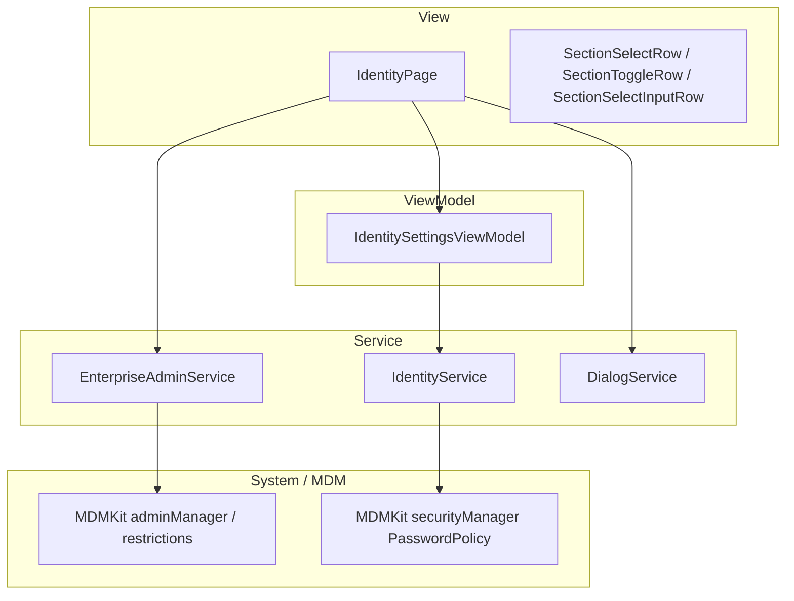
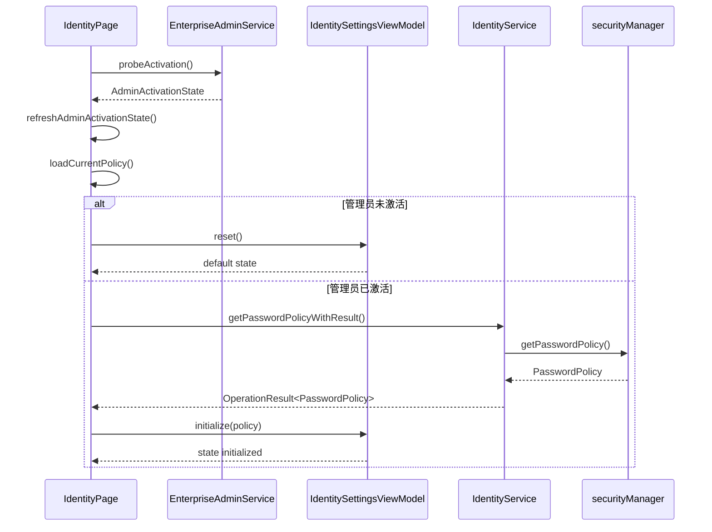
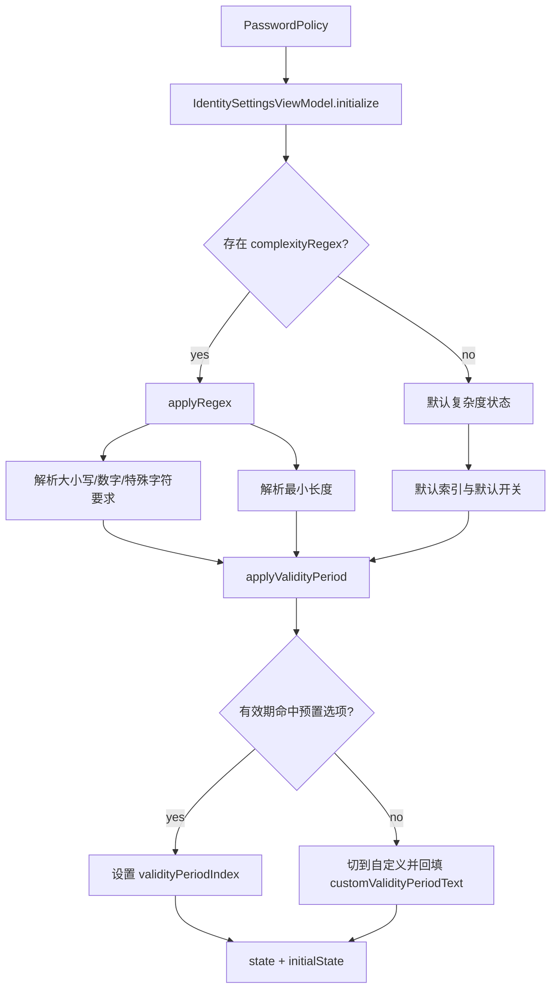
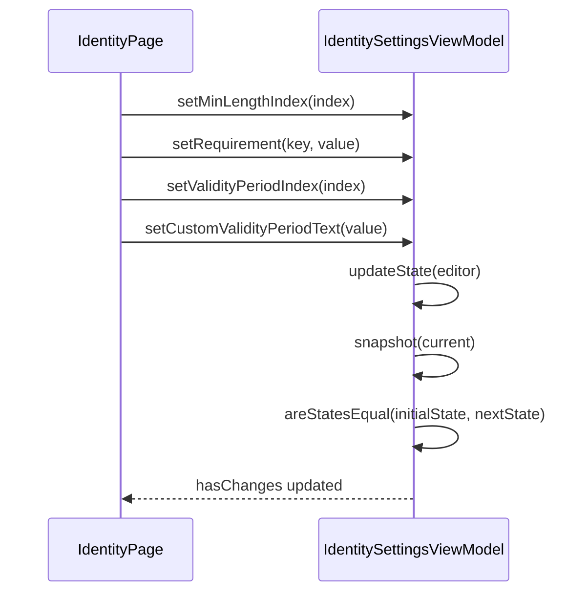
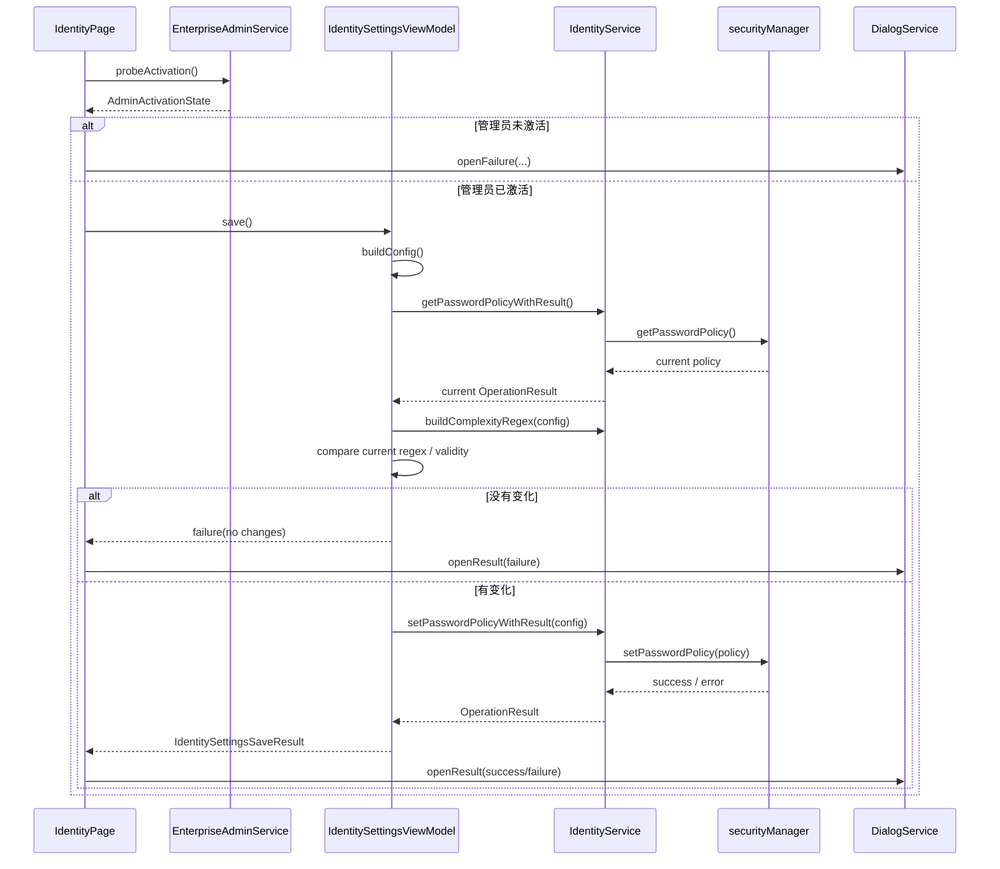
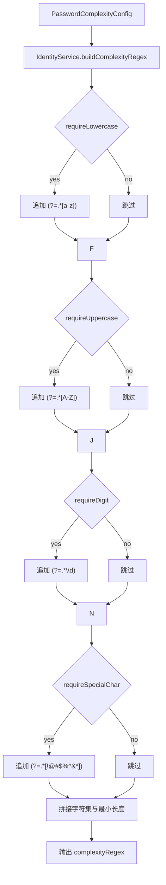
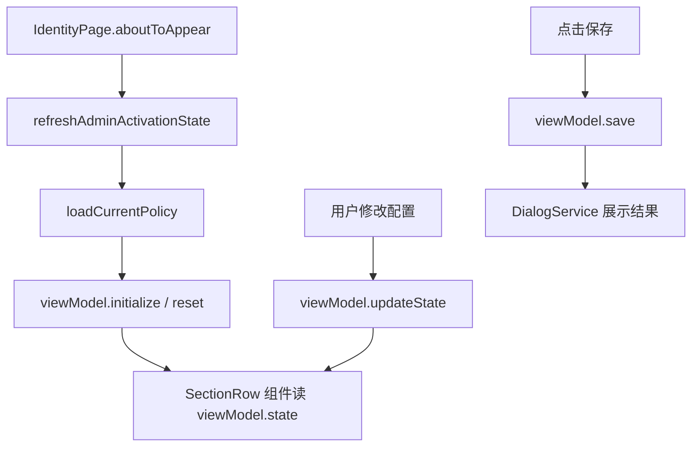

# 身份鉴别组件设计说明

## 1. 文档目的

本文档描述 SecurityTool 中“身份鉴别”组件的功能边界、MVVM 分层、核心状态模型、关键数据流和维护要点，作为后续维护、联调和扩展的基线文档。

当前版本中，身份鉴别模块聚焦于企业管理员维度的口令策略配置，核心语义如下：

- 页面负责展示和交互编排
- ViewModel 负责口令策略状态编辑、差异计算和保存请求
- Service 负责口令策略与系统 MDM PasswordPolicy 的双向转换
- 未激活企业管理员时，页面只能展示配置项，不能真正落策略

---

## 2. 功能范围

身份鉴别组件当前包含一类核心能力：

1. 口令复杂度策略配置

### 2.1 口令复杂度策略配置

当前页面可配置的策略项包括：

- 最小密码长度
- 是否要求包含大写字母
- 是否要求包含小写字母
- 是否要求包含数字
- 是否要求包含特殊字符
- 密码有效期

密码有效期支持两类输入方式：

- 预置选项：永久、30 天、60 天、90 天
- 自定义输入：用户输入非负整数天数，`0` 表示永久有效

### 2.2 管理员激活感知

身份鉴别模块的策略下发依赖企业管理员能力。页面会在进入时探测管理员状态：

- 已激活：读取当前系统口令策略并初始化页面
- 未激活：页面回退到默认状态，保存时给出明确失败提示

---

## 3. 业务语义模型

### 3.1 状态分层

```text
第 1 层：管理员状态
- 决定是否允许真实读取 / 保存系统口令策略

第 2 层：页面编辑态
- 维护当前用户选择的复杂度和有效期配置

第 3 层：系统 PasswordPolicy
- 由 MDMKit securityManager 持有的真实策略
```

### 3.2 页面编辑态语义

ViewModel 内部维护两份状态：

- `initialState`：最近一次成功初始化或保存后的基线状态
- `state`：当前正在编辑的状态

`hasChanges` 的语义为：

- 当前编辑态与基线态不同，则为 `true`
- 相同则为 `false`

这样页面无需自己做差异判断，保存入口只需调用 `viewModel.save()`

---

## 4. 架构设计

组件整体采用轻量 MVVM 组织方式。

### 4.1 分层结构图



### 4.2 页面与 ViewModel 关系

[`IdentityPage.ets`](/C:/Users/mu/Desktop/code/security_tool/entry/src/main/ets/views/IdentityPage.ets) 是页面编排层，主要职责：

- 页面进入时探测管理员状态
- 已激活时读取当前口令策略
- 将用户操作转发给 ViewModel
- 保存时根据结果弹出成功 / 失败对话框

[`IdentitySettingsViewModel.ets`](/C:/Users/mu/Desktop/code/security_tool/entry/src/main/ets/viewmodels/IdentitySettingsViewModel.ets) 负责：

- 维护身份鉴别编辑态
- 将系统 PasswordPolicy 转为页面状态
- 生成待保存的 `PasswordComplexityConfig`
- 对比当前策略和目标策略
- 调用 `IdentityService` 完成落盘

---

## 5. 关键文件职责

### 5.1 页面层

[`IdentityPage.ets`](/C:/Users/mu/Desktop/code/security_tool/entry/src/main/ets/views/IdentityPage.ets)

职责：

- 页面初始化
- 管理员状态探测
- 读取当前策略
- 承接保存按钮点击
- 打开结果对话框

### 5.2 ViewModel

[`IdentitySettingsViewModel.ets`](/C:/Users/mu/Desktop/code/security_tool/entry/src/main/ets/viewmodels/IdentitySettingsViewModel.ets)

职责：

- 状态初始化与重置
- 最小密码长度切换
- 复杂度要求开关切换
- 有效期选项和自定义输入维护
- 差异计算
- 保存校验与保存执行

### 5.3 领域服务

[`IdentityService.ets`](/C:/Users/mu/Desktop/code/security_tool/entry/src/main/ets/services/IdentityService.ets)

职责：

- 构建复杂度正则
- 构建系统可读的附加描述
- 调用 `securityManager.setPasswordPolicy`
- 调用 `securityManager.getPasswordPolicy`
- 将 MDM 调用结果包装成统一 `OperationResult`

### 5.4 管理员状态服务

[`EnterpriseAdminService.ets`](/C:/Users/mu/Desktop/code/security_tool/entry/src/main/ets/services/EnterpriseAdminService.ets)

职责：

- 探测企业管理员是否已激活
- 构造激活命令
- 映射管理员缺失场景

---

## 6. 数据模型

核心模型定义于 [`DataModels.ets`](/C:/Users/mu/Desktop/code/security_tool/entry/src/main/ets/models/DataModels.ets)：

- `PasswordComplexityConfig`
- `AdminActivationState`
- `OperationResult`
- `PASSWORD_LENGTH_OPTIONS`
- `PASSWORD_VALIDITY_OPTIONS`

ViewModel 还定义了本模块专用状态：

- `IdentitySettingsState`
- `IdentitySettingsSaveResult`

### 6.1 页面编辑态

```text
IdentitySettingsState
- minLengthIndex
- requireUppercase
- requireLowercase
- requireDigit
- requireSpecialChar
- validityPeriodIndex
- customValidityPeriodText
- hasChanges
```

### 6.2 系统策略态

系统真实策略来自：

- `securityManager.PasswordPolicy.complexityRegex`
- `securityManager.PasswordPolicy.validityPeriod`
- `securityManager.PasswordPolicy.additionalDescription`

Identity 模块的主要任务，就是在“页面编辑态”和“系统策略态”之间做稳定转换。

---

## 7. 详细数据流图

### 7.1 页面初始化数据流



### 7.2 PasswordPolicy 到页面状态的转换流



### 7.3 用户编辑数据流



### 7.4 保存数据流



### 7.5 正则构建流



### 7.6 页面刷新流



---

## 8. 关键交互说明

### 8.1 页面进入

页面进入时总是先做管理员状态探测，再决定是否加载真实策略：

- 已激活：加载系统真实策略
- 未激活：页面重置为默认值

### 8.2 自定义有效期

当用户选择“自定义”时：

- `validityPeriodIndex` 切换为 `CUSTOM_VALIDITY_OPTION_INDEX`
- 输入框显示
- 输入内容只保留数字字符

### 8.3 保存判定

保存时的判断顺序为：

1. 是否已激活管理员
2. 自定义有效期是否合法
3. 当前编辑结果与系统真实策略是否有差异
4. 调用 MDM 保存

---

## 9. 当前实现状态

### 9.1 已完成

- 口令复杂度策略页面已完成
- 页面、ViewModel、Service 三层职责清晰
- 管理员状态探测已接入
- 系统口令策略读取与保存已接入
- 差异检测、无变化拦截和保存结果提示已完成

### 9.2 当前约束

- 当前模块只覆盖口令复杂度和有效期，不涉及账号锁定、失败次数限制等更丰富策略
- `complexityRegex` 的解析与生成采用当前项目约定格式，后续如系统正则格式变化，需要同步调整 `applyRegex` 与 `buildComplexityRegex`
- 页面暂未做“未保存离开提醒”

---

## 10. 主要验收点

- 管理员激活时进入页面，可正确回显当前口令策略
- 未激活时进入页面，保存会提示管理员未激活
- 切换复杂度项后，`hasChanges` 状态正确变化
- 选择自定义有效期时，非法输入会被拦截
- 未修改直接保存会提示“无变更”
- 保存成功后，再次进入页面可回显新策略

---

## 11. 后续可扩展方向

- 增加失败次数限制、锁定时长等更多身份策略
- 增加策略摘要展示，帮助用户快速理解当前配置
- 增加“恢复系统推荐值”或“恢复默认值”入口
- 将管理员状态提示做成页面级常驻提示条

---

## 12. 维护建议

- 页面层只做管理员探测、初始化和结果提示，不直接拼装正则
- 所有复杂度规则变更统一收口到 `IdentityService.buildComplexityRegex`
- 所有系统 PasswordPolicy 回显逻辑统一收口到 `IdentitySettingsViewModel.initialize`
- 后续新增策略项时，需同时更新：
  - `IdentitySettingsState`
  - `buildConfig`
  - `applyRegex` / `applyValidityPeriod`
  - `IdentityService.buildComplexityRegex`

---

最后更新：2026-03-30  
适用版本：身份鉴别模块当前实现版
