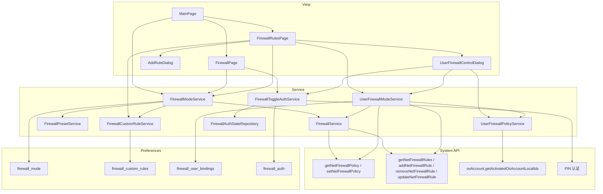
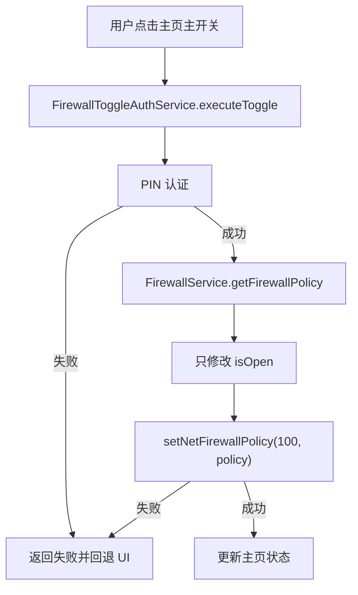
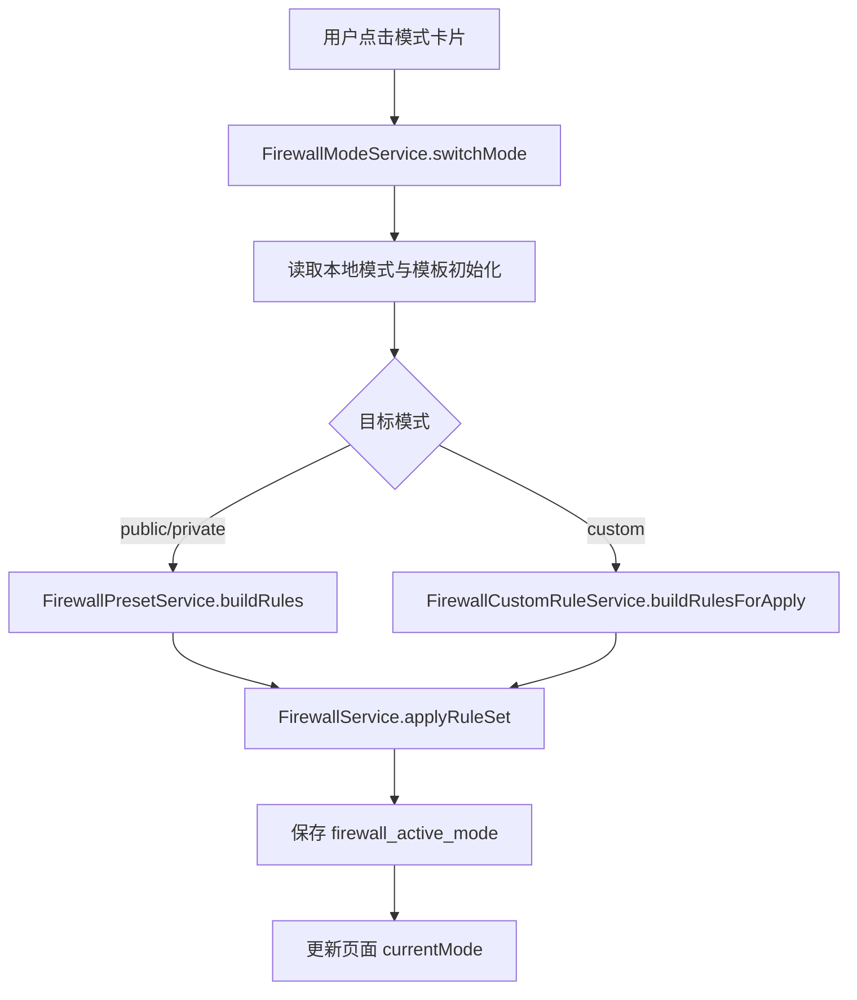
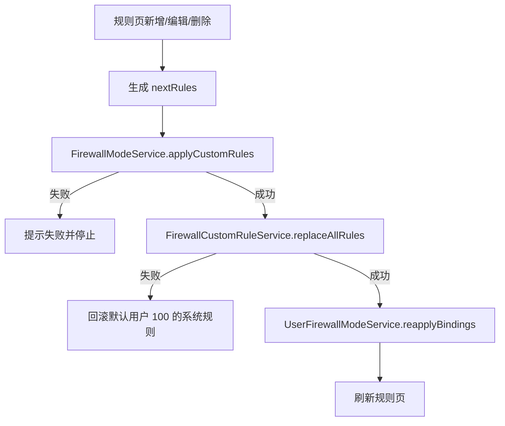
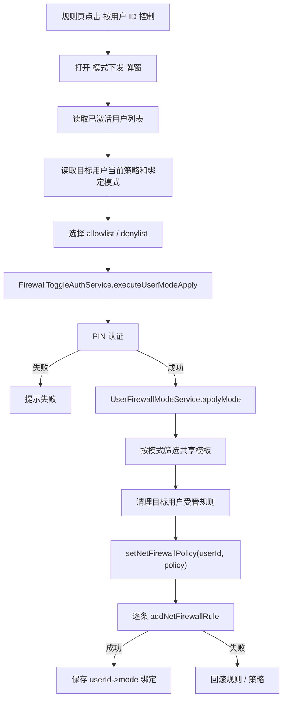
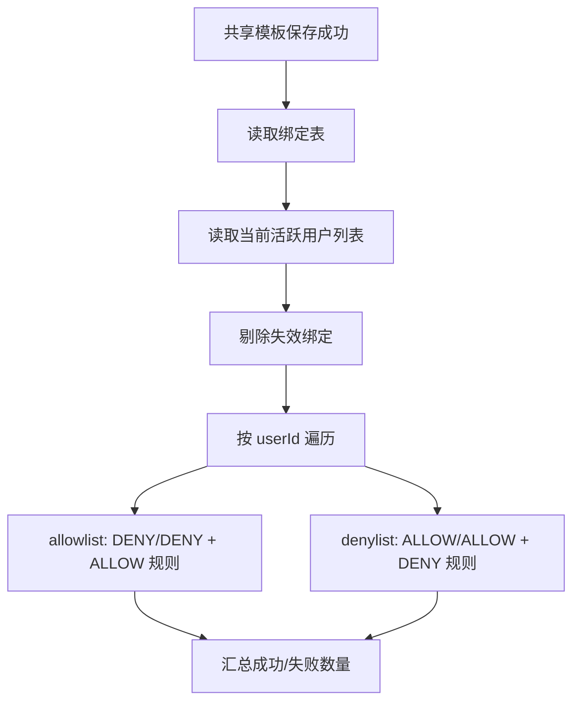

# 防火墙管理组件设计说明

## 1. 文档目的

本文档描述 SecurityTool 中“防火墙管理”组件在当前版本下的功能边界、核心业务语义、页面与服务分层、规则模板持久化机制、用户级模式下发能力、系统接口映射和主要风险边界，作为后续维护、联调和扩展的基线文档。

当前版本已经完成防火墙模块的主链路收口，核心语义如下：

- 右上角开关是主防火墙总开关，只控制 `isOpen`
- 公共网络 / 私有网络 / 自定义模式是默认用户 `100` 的三种主模式
- 自定义模式规则采用“一套共享规则模板 + 单列表编辑”模型
- 自定义规则是否能被“记住”，依赖本地模板持久化，不依赖系统当前规则残留
- “按用户 ID 控制”入口已经迁移到自定义模式规则页，弹窗标题为“模式下发”
- 用户级模式下发支持白名单模式、黑名单模式两种语义

---

## 2. 功能范围

防火墙管理组件当前包含四类核心能力：

1. 主防火墙总开关
2. 预设模式切换
3. 自定义规则维护
4. 按用户 ID 的自定义模式下发

### 2.1 主防火墙总开关

用于控制默认用户 `100` 的主防火墙启用 / 关闭状态。

当前语义：

- 开关点击前必须经过 PIN 认证
- 开关动作只修改系统策略中的 `isOpen`
- 开关动作不会删除当前规则集
- 开关动作不会重置当前模式
- 下发失败或认证失败时，UI 需要回退到操作前状态

### 2.2 预设模式切换

用于在默认用户 `100` 上切换三种主模式：

- 公共网络模式
- 私有网络模式
- 自定义模式

当前语义：

- 模式切换只作用于默认用户 `100`
- 公共网络和私有网络规则由预设模板生成
- 自定义模式规则来自本地保存的共享自定义规则模板
- 切换模式时会整套替换当前受管规则

### 2.3 自定义规则维护

用于维护防火墙自定义规则模板，支持：

- 新增规则
- 编辑规则
- 删除规则
- 冲突校验
- 本地持久化

当前语义：

- 规则页始终展示共享模板的全量内容
- 规则列表不会因为白名单 / 黑名单模式切换而裁剪
- 规则保存成功后，模板写入本地 `preferences`
- 规则保存成功后，默认用户 `100` 的自定义模式会立即重新下发

### 2.4 按用户 ID 的自定义模式下发

用于在自定义模式规则页中，对指定 `userId` 下发用户级模式。

当前支持两种模式：

- 白名单模式
- 黑名单模式
当前语义：

- 用户级模式下发入口位于自定义模式规则页页头
- 下发前必须经过 PIN 认证
- 白名单 / 黑名单模式会调整目标用户默认入站和出站动作
- 已绑定用户在共享规则模板变更后会自动重下发

---

## 3. 业务语义模型

### 3.1 三层控制模型

```text
第 1 层：主防火墙总开关
- 只控制 isOpen
- 不直接重写规则集

第 2 层：默认用户 100 的主模式
- public / private / custom
- 决定默认用户当前整套规则结果

第 3 层：按用户 ID 的模式下发
- allowlist / denylist
- 只在自定义规则页触发
- 对目标 userId 下发共享模板的不同子集
```

### 3.2 两类“模式”的边界

组件内存在两套不同层级的模式概念：

1. 主页面模式

- 作用对象是默认用户 `100`
- 用于表达整页的“公共网络 / 私有网络 / 自定义模式”

2. 用户级模式

- 作用对象是弹窗里选择的目标 `userId`
- 用于表达“白名单模式 / 黑名单模式”

两者不是同一条链路，但如果目标用户选择了 `100`，则会共享同一套系统策略和规则，形成“最后一次下发覆盖前一次结果”的业务边界。

### 3.3 自定义规则的“记忆体”

当前“重新切回自定义模式时，还记得之前规则”的能力，不依赖系统当前规则，而依赖本地持久化的共享模板。

可理解为：

- 系统当前规则 = 当前生效结果
- 本地自定义模板 = 自定义模式的规则记忆体

因此：

- 切到公共网络或私有网络后，系统当前规则会被覆盖
- 但本地保存的共享模板不会丢失
- 重新切回自定义模式时，会从本地模板重新下发

### 3.4 两种用户级模式语义

```text
白名单模式
- 默认双向拒绝
- 只下发 action=ALLOW 的规则

黑名单模式
- 默认双向允许
- 只下发 action=DENY 的规则
```

### 3.5 规则展示与模式切换关系

规则页列表始终展示共享模板的全量规则，不会因为当前准备下发的是白名单还是黑名单而隐藏另一类规则。

例如模板里同时存在：

- 2 条允许规则
- 2 条禁止规则

则在两种模式下，列表都仍展示这 4 条。区别只在下发阶段如何筛选。

---

## 4. 架构设计

组件整体采用“页面编排 + 服务层 + 本地偏好存储 + 系统防火墙接口”的组织方式。

### 4.1 分层结构图



### 4.2 页面职责关系

`MainPage.ets` 是路由与状态编排层，主要负责：

- 进入页面时初始化防火墙模式状态
- 读取默认用户 `100` 当前策略
- 将 `firewallEnabled` 和 `firewallPresetMode` 传给防火墙页面
- 维护“防火墙主页”和“规则页”的页面切换

`FirewallPage.ets` 是防火墙主页，主要负责：

- 展示主开关
- 展示公共网络 / 私有网络 / 自定义模式卡片
- 主开关点击后走 PIN 认证
- 模式切换后调用主模式服务
- 跳转到自定义规则页

`FirewallRulesPage.ets` 是自定义规则页，主要负责：

- 加载共享自定义规则模板
- 处理新增、编辑、删除规则
- 保存模板并回写系统规则
- 打开“模式下发”弹窗
- 在共享模板变更后触发已绑定用户自动重下发

---

## 5. 关键文件职责

### 5.1 页面层

`entry/src/main/ets/pages/MainPage.ets`

职责：

- 初始化防火墙状态
- 维护 `firewallEnabled`
- 维护 `firewallPresetMode`
- 负责防火墙主页和规则页路由切换

### 5.2 防火墙主页

`entry/src/main/ets/views/FirewallPage.ets`

职责：

- 展示主开关
- 展示三张模式卡片
- 处理主开关 PIN 认证和失败回退
- 触发公共网络 / 私有网络 / 自定义模式切换

### 5.3 自定义规则页

`entry/src/main/ets/views/FirewallRulesPage.ets`

职责：

- 读取共享自定义规则模板
- 规则新增 / 编辑 / 删除
- 冲突检测与覆盖确认
- 模板保存
- 对绑定用户自动重下发
- 打开用户级“模式下发”弹窗

### 5.4 用户模式下发弹窗

`entry/src/main/ets/components/UserFirewallControlDialog.ets`

职责：

- 加载可选 `userId` 列表
- 读取目标用户当前系统策略摘要
- 读取目标用户当前绑定模式
- 提供白名单 / 黑名单模式选择
- 调用 PIN 认证和用户级模式下发

### 5.5 系统防火墙服务

`entry/src/main/ets/services/FirewallService.ets`

职责：

- 封装默认用户 `100` 的系统防火墙接口
- 读取 / 写入主防火墙策略
- 分页读取全部规则
- 新增 / 删除 / 更新规则
- 规则 clone、规范化和元数据封装
- 冲突检测和摘要统计

### 5.6 主模式服务

`entry/src/main/ets/services/FirewallModeService.ets`

职责：

- 初始化主模式
- 保存当前主模式到本地
- 切换公共网络 / 私有网络 / 自定义模式
- 将目标规则集整套应用到默认用户 `100`

### 5.7 预设规则服务

`entry/src/main/ets/services/FirewallPresetService.ets`

职责：

- 生成公共网络模式规则
- 生成私有网络模式规则
- 为预设规则写入受管元数据

### 5.8 自定义规则模板服务

`entry/src/main/ets/services/FirewallCustomRuleService.ets`

职责：

- 读写共享自定义规则模板
- 将系统规则迁移为初始模板
- 将模板规则转成可展示规则
- 维护 `customRuleId`

### 5.9 用户策略读取服务

`entry/src/main/ets/services/UserFirewallPolicyService.ets`

职责：

- 读取已激活系统用户列表
- 返回默认选中用户
- 按 `userId` 读取当前系统防火墙策略摘要

用户列表来源边界：

- 用户列表统一从 `SystemUserProvider.loadAvailableUserIds()` 获取
- `SystemUserProvider` 保持“系统已激活用户 + tracked users 合并”的机制
- 账号新增 / 删除事件由 `EnterpriseAdminAbility` 接收后发布 CommonEvent
- `EntryAbility` 在 UIAbility 进程内接收 CommonEvent，并调用 `SystemUserProvider.trackAddedUser/trackRemovedUser`
- `EnterpriseAdminAbility` 不直接写入 tracked users，避免跨进程导致 UIAbility 读不到最新数据
- “模式下发”和“新增规则”弹窗不做打开期间实时刷新，关闭并重新打开时会重新加载用户列表

### 5.10 用户模式服务

`entry/src/main/ets/services/UserFirewallModeService.ets`

职责：

- 维护 `userId -> mode` 绑定关系
- 根据共享模板构建用户级目标规则集
- 下发白名单 / 黑名单模式
- 对已绑定用户自动重下发
- 用户级失败回滚

### 5.11 认证与锁定服务

`entry/src/main/ets/services/FirewallToggleAuthService.ets`

职责：

- 封装主开关 PIN 认证
- 封装用户模式下发 PIN 认证
- 记录认证失败次数与锁定状态
- 输出防火墙审计日志

---

## 6. 数据模型

### 6.1 主模式

主模式使用 `FirewallPresetMode` 表达：

```text
'public' | 'private' | 'custom'
```

其本地持久化位置为：

- store: `firewall_mode`
- key: `firewall_active_mode`

### 6.2 共享自定义规则模板

共享模板通过 `FirewallCustomRuleService` 保存到本地 `preferences`，本质是“带 `customRuleId` 的规则记录数组”。

本地持久化位置为：

- store: `firewall_custom_rules`
- key: `firewall_custom_rules_payload`

模板特点：

- 只保存一套
- 不按用户拆分
- 不随用户模式切换而丢失

### 6.3 用户模式绑定

用户模式绑定通过 `FirewallUserApplyMode` 表达：

```text
'allowlist' | 'denylist'
```

绑定记录结构：

```text
UserFirewallModeBinding
- userId: number
- mode: FirewallUserApplyMode
```

本地持久化位置为：

- store: `firewall_user_bindings`
- key: `firewall_user_bindings_payload`

### 6.4 系统防火墙策略

系统策略核心字段如下：

- `isOpen`
- `inAction`
- `outAction`

当前设计下：

- 主开关只改 `isOpen`
- 白名单 / 黑名单模式会调整 `inAction` 和 `outAction`
- 用户级模式总是调整 `inAction` 和 `outAction`

### 6.5 规则元数据

组件对受管规则会写入 `description` 元数据，标识：

- owner
- mode
- kind
- customRuleId
- templateKey

该元数据用于：

- 识别哪些规则由 SecurityTool 管理
- 区分预设规则与自定义规则
- 将本地模板规则与系统规则建立稳定映射

---

## 7. 详细数据流图

### 7.1 主开关数据流



说明：

- 关闭再重新打开防火墙时，不会重新执行公共网络 / 私有网络 / 自定义模式的规则下发
- 中间只调用 `getNetFirewallPolicy(100)` 与 `setNetFirewallPolicy(100, policy)`

### 7.2 主模式切换数据流



说明：

- 主模式切换只针对默认用户 `100`
- 自定义模式依赖本地共享模板，不依赖系统当前残留规则

### 7.3 自定义规则保存数据流



说明：

- 模板保存先保证默认用户 `100` 的自定义模式结果正确
- 模板保存成功后，再对已绑定用户执行自动重下发
- 自动重下发允许部分成功，不做全局事务回滚

### 7.4 用户级模式下发数据流



### 7.5 共享模板对绑定用户自动重下发流



---

## 8. 关键交互说明

### 8.1 主开关

交互语义：

- 点击后先做 PIN 认证
- 认证通过后才写系统策略
- 写策略失败时回退 UI
- 写策略成功后同步主页状态

当前约束：

- 主开关不是模式切换器
- 主开关不操作规则列表

### 8.2 主模式卡片

交互语义：

- 只有防火墙已开启且无处理中状态时才允许切换
- 公共网络 / 私有网络模式生成预设规则
- 自定义模式读取本地共享模板并重新下发

### 8.3 自定义规则列表

交互语义：

- 列表始终展示共享模板全量规则
- 允许规则和禁止规则都可见
- 切换到白名单 / 黑名单模式时，列表不裁剪

### 8.4 模式下发弹窗

交互语义：

- 从自定义规则页打开
- 标题固定为“模式下发”
- 支持选择目标 `userId`
- 展示当前模式绑定和当前系统策略摘要
- 支持选择白名单模式、黑名单模式
- 点击“下发策略”后走 PIN 认证

### 8.5 规则新增 / 删除 / 编辑效果

新增、删除、编辑操作修改的是共享模板，不是只影响当前选中模式的临时结果。

具体效果如下：

- 新增允许规则
  - 白名单用户会生效
  - 黑名单用户列表可见，但本次不生效
- 新增禁止规则
  - 白名单用户列表可见，但本次不生效
  - 黑名单用户会生效
- 删除允许规则
  - 白名单用户的对应放行效果移除
  - 黑名单用户通常无实际生效变化
- 删除禁止规则
  - 黑名单用户的对应拦截效果移除
  - 白名单用户通常无实际生效变化

### 8.6 自定义模式下两种模式切换流程

当前“两种模式切换”指的是在自定义规则页中，对目标 `userId` 在白名单模式和黑名单模式之间切换。

完整业务流程如下：

1. 用户进入“自定义模式”规则页。
2. 规则页先加载共享自定义规则模板，列表始终展示模板全量规则。
3. 用户点击页头的 `按用户 ID 控制`，打开“模式下发”弹窗。
4. 弹窗加载已激活用户列表，并默认选中前台用户或首个可用用户。
5. 弹窗读取目标 `userId` 当前系统防火墙策略摘要，以及本地保存的当前模式绑定。
6. 用户选择目标模式：
   - 白名单模式
   - 黑名单模式
7. 用户点击 `下发策略` 后，先执行 PIN 认证。
8. 认证通过后，系统读取目标用户当前策略和当前受管规则做快照。
9. 系统根据目标模式从共享模板中构建目标规则集：
   - 白名单模式：只取允许规则
   - 黑名单模式：只取禁止规则
10. 系统清理该用户当前受管规则。
11. 系统写入目标默认策略：
   - 白名单模式：默认入站拒绝，默认出站拒绝
   - 黑名单模式：默认入站允许，默认出站允许
12. 系统将目标规则集整套下发给该用户。
13. 全部成功后，更新该 `userId` 的模式绑定，并刷新弹窗中的当前模式和策略摘要。
14. 如果中途任一步失败，则恢复切换前的规则和默认策略快照。

该流程的两个关键约束如下：

- 切换模式时，修改的是“当前如何使用共享模板下发”，不会删除共享模板本身。
- 规则列表展示不随模式切换裁剪，因此即使当前切到白名单模式，列表里仍然会保留禁止规则，只是本次不会下发给目标用户。

---

## 9. 当前实现状态

### 9.1 已完成

- 主防火墙总开关 PIN 认证与失败回退
- 公共网络 / 私有网络 / 自定义模式切换
- 共享自定义规则模板本地持久化
- 自定义规则新增 / 编辑 / 删除与冲突检测
- 规则页“按用户 ID 控制”入口迁移
- 用户级“模式下发”弹窗
- 白名单 / 黑名单模式下发
- 已绑定用户自动重下发
- 关键页面、接口、下发和回滚日志

### 9.2 已清理的旧语义

本轮设计已经下线以下旧语义：

- 防火墙主页中的旧“按用户 ID 控制”入口
- 用户弹窗中“开启防火墙 / 关闭防火墙”的旧双按钮语义
- 仅服务于“按用户主开关开 / 关”的旧用户级服务链路

### 9.3 当前约束

- 共享自定义规则模板只有一套，不支持每个 `userId` 单独维护一套规则页
- `userId=100` 允许被选择，会与主页面三种主模式共享同一套系统对象
- 自动重下发不是全局事务，允许部分用户失败
- 用户级模式只有白名单 / 黑名单两态，不存在第三种兼容态

---

## 10. 主要验收点

### 10.1 主开关

- 开关点击前必须进行 PIN 认证
- 认证失败时界面状态回退
- 关闭再打开时不会重下发公共网络 / 私有网络规则

### 10.2 主模式切换

- 公共网络模式可以生成更严格的入站规则
- 私有网络模式可以生成局域网放行类规则
- 切回自定义模式时能恢复此前本地保存的共享模板

### 10.3 自定义规则维护

- 规则页始终展示共享模板全量规则
- 允许规则和禁止规则都可以编辑
- 新增 / 删除 / 编辑规则后，默认用户 `100` 的自定义模式结果正确更新

### 10.4 用户级模式下发

- 白名单模式下，目标用户默认入站和出站动作变为双向拒绝，只下发允许规则
- 黑名单模式下，目标用户默认入站和出站动作变为双向允许，只下发禁止规则
- 已绑定用户在模板变更后会自动按绑定模式重下发

### 10.5 日志与安全

- 页面进入 / 退出日志可见
- 用户列表读取、策略读取、模式下发、自动重下发、回滚结果日志可见
- 账号名、密码、PIN 不打印
- 防火墙规则内容允许打印

---

## 11. 风险与边界

### 11.1 默认用户 100 的覆盖边界

如果用户在“模式下发”弹窗中选择了 `userId=100`，则会与主页面的“公共网络 / 私有网络 / 自定义模式”链路共享同一套系统策略和规则。

结果是：

- 主页面切换模式后，会覆盖此前对 `100` 下发的用户级模式结果
- 反过来，对 `100` 下发白名单 / 黑名单模式，也会覆盖主页面当前对 `100` 的结果

当前设计接受该边界，语义为：

- 最后一次下发生效

### 11.2 自动重下发的边界

共享模板保存成功后，对绑定用户的重下发采取“逐用户执行 + 汇总结果”的策略。

当前不做：

- 全局一键回滚所有成功用户
- 跨所有用户的强一致事务

该设计用于控制失败影响面，避免一名用户失败导致模板保存整体不可用。

---

## 12. 维护建议

- 新增防火墙能力时，优先判断是属于“默认用户主模式”还是“用户级模式下发”，避免混到同一条链路
- 修改自定义规则模型时，必须同步评估共享模板存储格式、`customRuleId` 映射和自动重下发逻辑
- 修改用户级模式下发时，必须同步评估 `firewall_user_bindings` 的兼容性
- 修改 PIN 认证逻辑时，必须同时检查主开关和“模式下发”两条受保护操作
- 修改系统权限、包名或签名配置时，必须同步检查 `module.json5`、签名模板和 MDM 激活链路
