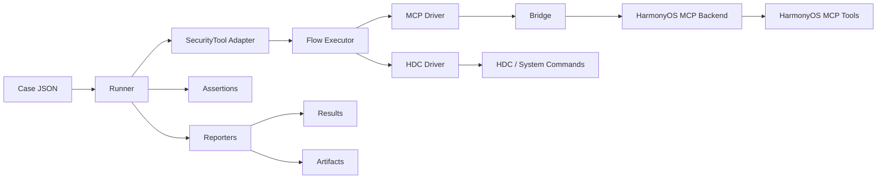
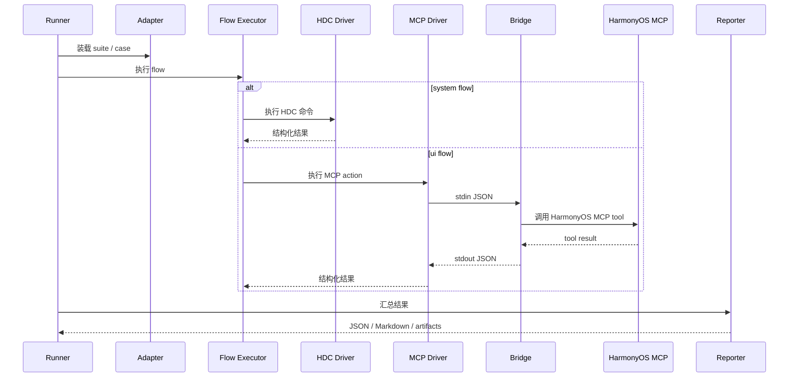

# SecurityTool E2E 框架设计

## 1. 文档目标

本文档定义当前项目的 E2E 测试框架，并约束它未来如何演进为可抽离的 HarmonyOS 通用 E2E 基础设施。

目标：

- 支持真实设备上的页面完整性测试与深度验证
- 支持 `Python runner + HDC + HarmonyOS MCP`
- 支持后续抽离为独立的 `e2e_core`
- 让其他 HarmonyOS 项目通过 `project adapter` 接入
- 明确 `PASS / FAIL / UNKNOWN` 的统一判定口径

非目标：

- 不把业务流程硬编码进 MCP server
- 不让 case 直接依赖坐标、窗口 ID、element handle
- 不要求所有测试都恢复设备到初始状态

## 2. 文档索引

E2E 相关文档分工如下：

- 主设计文档：本文档
- 运行说明：[`scripts/e2e/README.md`](../../../scripts/e2e/README.md)
- Bridge 协议：[`scripts/e2e/docs/MCP_BRIDGE_PROTOCOL.md`](../../../scripts/e2e/docs/MCP_BRIDGE_PROTOCOL.md)
- Bridge 接入说明：[`scripts/e2e/docs/HARMONYOS_MCP_BRIDGE_SETUP.md`](../../../scripts/e2e/docs/HARMONYOS_MCP_BRIDGE_SETUP.md)
- Bridge action 覆盖参考：[`scripts/e2e/docs/BRIDGE_ACTION_COVERAGE.md`](../../../scripts/e2e/docs/BRIDGE_ACTION_COVERAGE.md)
- Bridge action 执行计划参考：[`scripts/e2e/docs/BRIDGE_ACTION_PLANS.md`](../../../scripts/e2e/docs/BRIDGE_ACTION_PLANS.md)

## 3. 设计原则

### 3.1 分层清晰

完整 E2E 不等于 UI 自动化。框架必须同时覆盖：

- 设备动作
- 页面流程
- 状态断言
- 日志与截图证据

### 3.2 原子能力与业务流程分离

- HDC / MCP 只提供原子能力
- flow 层负责页面和业务流程
- case 只描述“测什么”，不描述底层点击细节

### 3.3 以证据驱动判定

每条 case 至少应该有：

- 一个主断言
- 一个辅助证据

不把“截图看起来像成功”作为唯一成功依据。

### 3.4 允许 UNKNOWN

对于依赖外部环境、系统能力或证据不足的场景：

- 不误判为 `PASS`
- 也不粗暴判成 `FAIL`
- 使用 `UNKNOWN` 表达“执行了，但当前证据不足以确认结论”

### 3.5 Core 与 Adapter 分离

为了保证未来可复用，必须区分：

- `E2E Core`
  - runner、driver、assertion、reporter、schema、artifact 规则
  - 不包含项目页面名、包名、业务文案和固定坐标
- `Project Adapter`
  - 项目配置、页面注册表、flow、定位策略、项目专属断言配置

## 4. 当前架构总览

### 4.1 静态架构图



### 4.2 执行时序图



## 5. 当前目录结构

```text
scripts/e2e/
  run_e2e.py
  core/
  drivers/
  assertions/
  reporters/
  adapters/security_tool/
  bridges/
  cases/
    smoke/
    navigation/
    dashboard/
    firewall/
    peripheral/
    identity/
    tool_settings/
    logs/
    legacy/
  docs/
  schemas/
  results/
  artifacts/
```

当前结构判断：

- `core / drivers / assertions / reporters` 已具备未来抽成 `e2e_core` 的雏形
- `adapters/security_tool` 已经承担项目适配职责
- `cases/legacy` 仅用于兼容历史输入，主路径已切换到声明式 case

## 6. 分层职责

### 6.1 Case Layer

负责定义测试意图。

典型字段：

- `case_id`
- `case_name`
- `module`
- `flow`
- `assertions`
- `result_policy`

不应该包含：

- 坐标
- shell 命令
- element handle
- UI 树遍历细节

### 6.2 Flow Layer

负责把业务动作抽象成可复用流程。

示例：

- `app.launch`
- `navigation.open_page`
- `tool_settings.save`
- `firewall.add_rule`

作用：

- 屏蔽页面局部实现细节
- 让 case 不直接依赖 UI 原子动作
- 提供跨 case 复用能力

### 6.3 Driver Layer

负责设备和 UI 原子执行。

当前包括：

- [`hdc_driver.py`](../../../scripts/e2e/drivers/hdc_driver.py)
- [`mcp_driver.py`](../../../scripts/e2e/drivers/mcp_driver.py)

### 6.4 Bridge Layer

负责把 runner 的标准化 action 转成真实 HarmonyOS MCP 调用。

当前包括：

- [`harmonyos_mcp_bridge.py`](../../../scripts/e2e/bridges/harmonyos_mcp_bridge.py)
- [`real_harmonyos_mcp_backend.py`](../../../scripts/e2e/bridges/real_harmonyos_mcp_backend.py)
- [`mock_bridge.py`](../../../scripts/e2e/bridges/mock_bridge.py)
- [`scripted_backend.py`](../../../scripts/e2e/bridges/scripted_backend.py)

### 6.5 Assertion Layer

负责统一判定：

- UI 断言
- 状态断言
- 日志断言
- 行为断言

当前目录：

- [`assertions`](/C:/Users/mu/Desktop/code/security_tool/scripts/e2e/assertions)

### 6.6 Reporter Layer

负责输出：

- 单 case JSON
- suite 汇总 JSON
- suite 汇总 Markdown

当前目录：

- [`reporters`](/C:/Users/mu/Desktop/code/security_tool/scripts/e2e/reporters)

## 7. Core 与 Adapter 的边界

### 7.1 Core 负责

- 读取 case
- 运行 case
- 调度 driver
- 执行 assertion
- 生成结果
- 维护 schema 和 artifact 规则

### 7.2 Adapter 负责

- 项目 bundle 配置
- 主 Ability / 管理员 Ability
- 页面注册表
- 页面锚点
- flow 注册表
- flow 执行器

### 7.3 不应该下沉到 Core 的内容

- 页面中文文案
- 固定导航顺序
- 项目业务规则名
- 项目 route id
- 项目特有表单结构

## 8. 执行链路

推荐执行顺序：

1. 设备预检查
2. 应用状态检查
3. 前置条件校验
4. 执行 flow
5. 执行 assertion
6. 收集截图和日志证据
7. 输出结果

## 9. 当前 suite 结构

当前 adapter 已定义这些 suite：

- `smoke`
- `navigation`
- `firewall`
- `peripheral`
- `identity`
- `tool_settings`
- `logs`
- `completeness`

定义位置：

- [`suites.py`](/C:/Users/mu/Desktop/code/security_tool/scripts/e2e/adapters/security_tool/suites.py)

## 10. Case Schema 与 Result Schema

当前契约文件：

- [`case_schema.json`](../../../scripts/e2e/schemas/case_schema.json)
- [`result_schema.json`](../../../scripts/e2e/schemas/result_schema.json)

### 10.1 Case 最小字段

- `case_id`
- `case_name`
- `module`

推荐扩展字段：

- `flow`
- `assertions`
- `artifacts`
- `result_policy`
- `notes`

### 10.2 Result 最小字段

- `case_id`
- `case_name`
- `module`
- `started_at`
- `finished_at`
- `status`
- `result_policy`
- `steps`
- `environment_snapshot`

当前已稳定的核心结果字段：

- `status`
- `failure_code`
- `failure_stage`
- `primary_evidence`
- `secondary_evidence`
- `environment_snapshot`

## 11. 结果判定规则

### 11.1 PASS

满足：

- 流程执行完成
- 主断言成立
- 没有相反证据

### 11.2 FAIL

满足任一：

- 页面不可达
- 关键控件不存在
- 提交流程失败
- 主断言明确失败
- 出现相反证据

### 11.3 UNKNOWN

适用于：

- 外部环境不足
- bridge/backend 尚未覆盖
- 证据不足
- 当前轮次只验证到页面完整性，不验证更深行为

## 12. 两种执行模式

### 12.1 Completeness Mode

目标：

- 页面功能完整性验证

特点：

- 低侵入
- 不强调恢复初始状态
- 以链路走通为主

### 12.2 Validation Mode

目标：

- 深度功能生效验证

特点：

- 允许更改状态
- 需要更强断言
- 可能涉及日志、导出、浏览器、系统行为

## 13. Environment Snapshot

每次 suite 运行都应携带环境快照，至少包含：

- `project_id`
- `adapter_name`
- `adapter_version`
- `bundle_name`
- `device_id`
- `mode`
- `connected`

作用：

- 保证结果可比对
- 为 `UNKNOWN` 提供上下文
- 支持后续跨设备执行

## 14. 当前框架现状判断

### 14.1 已完成

- `core + adapter + bridge` 主结构已建立
- `completeness` 已切到声明式 case
- `security_tool` adapter 已显式存在
- `flow registry` 和 `flow executor` 已落地
- bridge 协议和 bridge runtime 已建立

### 14.2 仍待完善

- 主文档曾经长期落后于代码，需要持续同步
- 仍有部分业务 action 需要继续补深度验证
- `results / artifacts` 目前仍放在框架目录内，未来抽仓时需要再隔离

## 15. 其他项目如何接入

后续其他 HarmonyOS 项目接入时，建议：

1. 复用 `core / drivers / assertions / reporters / schemas`
2. 新增自己的 `project adapter`
3. 提供自己的：
   - `config`
   - `pages`
   - `flows`
   - `cases`

最小接入输入：

- `project_id`
- `bundle_name`
- `main_ability`
- `admin_ability`（如有）
- 页面注册表
- 最小 flow 集
- 最小 smoke suite

## 16. 推荐实施顺序

1. 先冻结 contract
2. 再收 adapter 边界
3. 再补 bridge/backend
4. 再补深度 assertion
5. 最后再扩更多业务 case

## 17. 结论

当前 E2E 架构方向是合理的，代码层已经具备继续演进为可复用框架的基础。  
当前真正需要持续收口的不是“再堆 case”，而是：

- 保持文档与代码同步
- 保持 adapter 边界稳定
- 逐步把更多业务 flow 从页面完整性推进到深度验证
