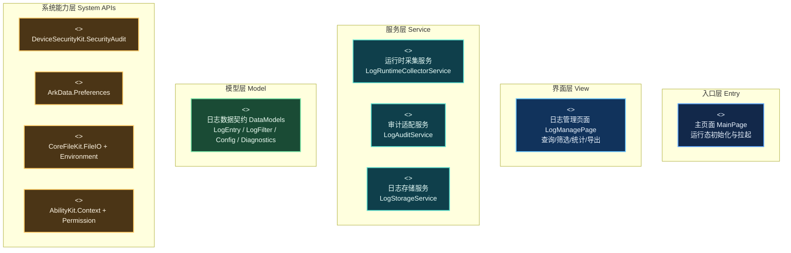
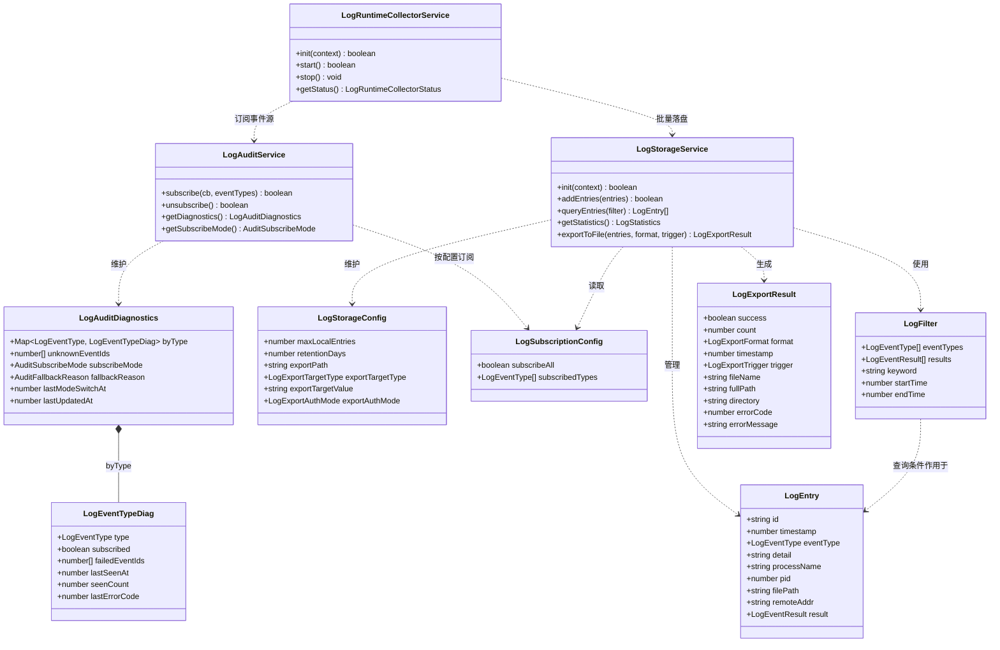
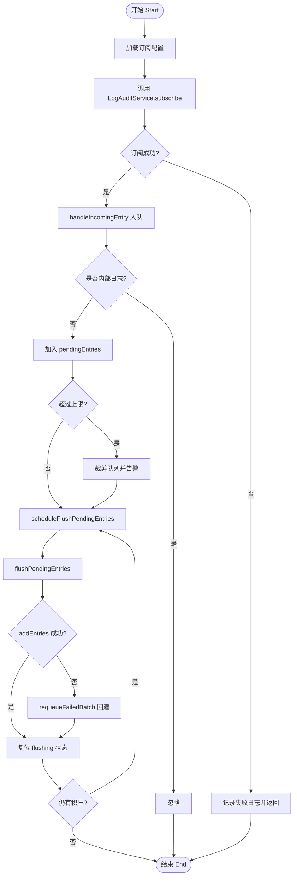
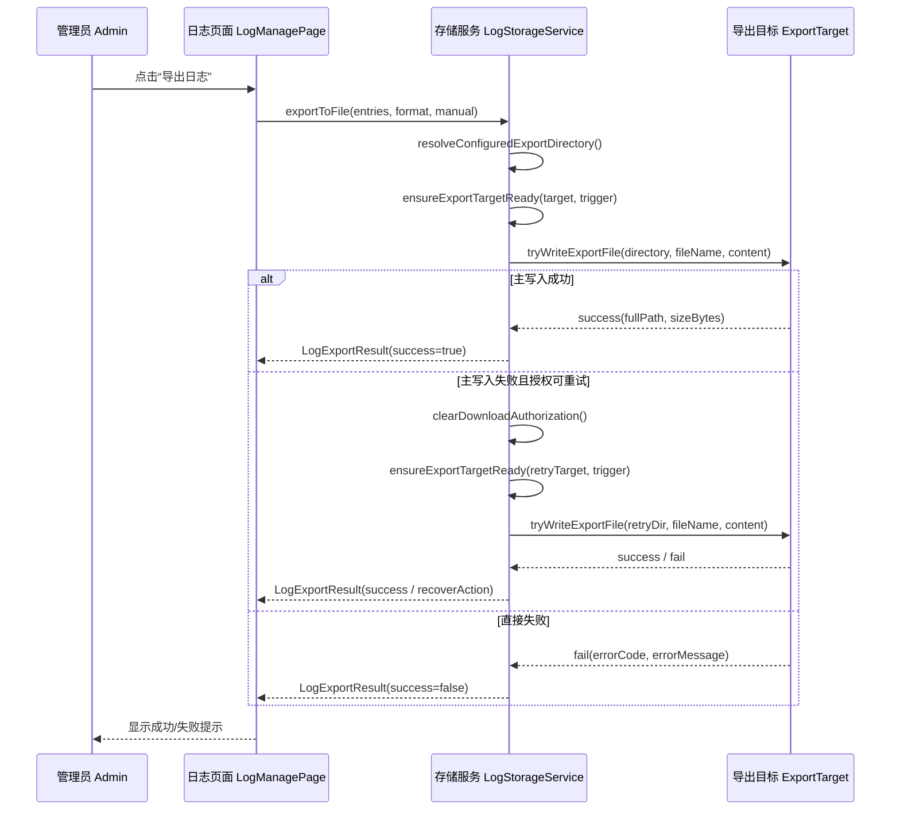

# 好代码评选（日志管理模块）

评选对象：日志管理模块（LogManage）
输出路径：docs/好代码评选.docx

## 功能/模块业务背景

### 项目背景

SecurityTool 面向 2in1 终端场景，提供防火墙、身份鉴别、外设管控与日志审计的统一安全管理能力。日志管理子模块承担“安全事件留痕与追溯”的基础设施职责，也是连接实时审计、问题定位和结果导出的关键一环。

### 业务场景

企业安全管理员在日常运维中需要持续关注实时审计、问题追溯、策略验证与合规留痕。日志管理模块需要把分散在系统 API 的安全事件转化为可查询、可筛选、可导出的统一视图，使采集、查看和留档落在同一条工作链路里。

### 技术挑战

核心挑战包括：高频事件下的采集与持久化稳定性、跨 API 数据字段一致性、导出链路的容错与可观测性。这些挑战分别对应运行时吞吐、跨层协作和结果交付三个方面，决定了该模块不能只停留在“能用”，还需要在结构上保持清晰。

关键代码定位：`entry/src/main/ets/pages/MainPage.ets:77`；`entry/src/main/ets/services/LogRuntimeCollectorService.ets:79`；`entry/src/main/ets/views/LogManagePage.ets:373`。

## 方案设计

### 分层架构图（UML 组件图）

这一部分先从整体结构入手。组件图关注的不是单个函数细节，而是入口、页面、服务、模型和系统能力之间的边界如何划分，以及依赖关系最终落在什么位置。

从这张图可以看到，页面层承接交互与展示，服务层承接运行时逻辑，模型层负责统一数据边界，系统 API 被约束在清晰的调用落点上。这样的分层让查询、采集、诊断、导出各自有明确归属，也避免页面层直接背负过多状态和平台兼容处理。

模块关联摘要：
1. MainPage 初始化并拉起日志运行态。
2. LogManagePage 负责查询、统计、导出与诊断展示。
3. LogRuntimeCollectorService 负责缓冲、刷盘和失败回灌。
4. LogAuditService 负责安全审计订阅与诊断快照。
5. LogStorageService 负责持久化、导出与配置归一化。

对应实现主要集中在以下位置：
代码位置：`entry/src/main/ets/pages/MainPage.ets:77`
代码位置：`entry/src/main/ets/views/LogManagePage.ets:373`
代码位置：`entry/src/main/ets/views/LogManagePage.ets:563`
代码位置：`entry/src/main/ets/services/LogRuntimeCollectorService.ets:180`
代码位置：`entry/src/main/ets/services/LogAuditService.ets:230`
代码位置：`entry/src/main/ets/services/LogStorageService.ets:316`

### 类图（UML 类图）

类图继续沿着同样的边界展开，只是把视角收紧到对象之间的分工。`LogEntry`、`LogFilter` 等模型类负责承载“日志长什么样、查询条件怎么表达、导出结果如何回传”；`LogRuntimeCollectorService`、`LogAuditService`、`LogStorageService` 三个服务类则分别负责采集协调、审计订阅兼容和本地存储导出。把模型类和服务类放在同一张图里，可以直接看出“谁生产数据、谁加工数据、谁持久化数据、谁维护诊断状态”，也能看出为什么这些职责没有堆叠在页面层。

对应实现主要集中在以下位置：
代码位置：`entry/src/main/ets/models/DataModels.ets:603`
代码位置：`entry/src/main/ets/models/DataModels.ets:631`
代码位置：`entry/src/main/ets/models/DataModels.ets:646`
代码位置：`entry/src/main/ets/models/DataModels.ets:672`
代码位置：`entry/src/main/ets/models/DataModels.ets:682`
代码位置：`entry/src/main/ets/services/LogRuntimeCollectorService.ets:16`
代码位置：`entry/src/main/ets/services/LogAuditService.ets:39`
代码位置：`entry/src/main/ets/services/LogStorageService.ets:67`

类职责说明：

- `LogEntry`：日志模块的基础记录对象，统一承载事件类型、时间戳、进程名、文件路径、远端地址和处理结果。无论日志来自审计订阅还是后续导出，这个对象都是贯穿全链路的最小业务单元。
- `LogFilter`：查询条件对象，用来封装页面上的事件类型、结果、关键字和时间范围筛选。它把过滤规则从页面交互中抽离出来，避免查询逻辑散落在多个按钮或状态分支里。
- `LogStorageConfig`：存储与导出配置的聚合对象，集中描述最大缓存条数、保留天数、导出目录和授权方式。它的作用是把“策略”从“执行逻辑”中拆出来，便于统一归一化和持久化。
- `LogSubscriptionConfig`：审计订阅配置对象，定义是全量订阅还是按事件类型订阅。这个类让采集链路可以先读配置再启动，而不是把订阅策略硬编码在采集服务里。
- `LogEventTypeDiag`：单个事件类型的诊断快照，记录该类型是否订阅成功、失败事件 ID、最近一次命中时间和错误码。它解决的是“某一类日志为什么没进来”的定位问题。
- `LogAuditDiagnostics`：订阅诊断总表，聚合各个事件类型的诊断结果，同时记录当前订阅模式、回退原因和最后更新时间。页面层拿到它后可以直接展示“当前是新 API 还是兼容模式”“哪些事件订阅失败”。
- `LogExportResult`：导出动作的回执对象，说明导出是否成功、导出格式、目标文件、错误信息和恢复动作建议。它把导出结果结构化，避免页面只能通过字符串判断成功失败。
- `LogRuntimeCollectorService`：运行时采集协调者，负责启动日志采集、接收审计事件、过滤模块自身产生的内部噪声日志，并按批次把结果写入存储层。它的核心价值是把高频事件入口和落盘节奏控制集中起来，避免页面或审计层直接承担队列管理。
- `LogAuditService`：安全审计适配层，直接对接 `securityAudit` 能力，负责事件类型到事件 ID 的映射、新旧订阅模式兼容、失败事件记录和诊断快照维护。它把平台 API 兼容性问题隔离在服务内部，上层只需要按日志类型订阅即可。
- `LogStorageService`：日志管理模块的数据中心，负责本地持久化、配置加载、查询过滤、统计汇总和导出文件生成。它既向采集链路提供稳定的写入口，也向页面层提供统一的读、算、导出能力，是日志模块最核心的状态管理服务。

### 流程图（UML 活动图）

活动图对应当前采集主链路：订阅、入队、内部日志过滤、限流裁剪、批量刷盘、失败回灌。这里重点不是把每个节点铺满，而是把高频事件进入系统后如何被稳定接住、整理并落盘的节奏表达清楚。

从流程上可以看出，采集链路并不是收到事件后直接写入存储，而是先做噪声过滤、积压控制和批量刷盘，再在失败时进行回灌。这让日志处理更接近可持续运行的服务链路，而不是一次性的事件透传。

对应实现主要集中在以下位置：
代码位置：`entry/src/main/ets/services/LogRuntimeCollectorService.ets:79`
代码位置：`entry/src/main/ets/services/LogRuntimeCollectorService.ets:128`
代码位置：`entry/src/main/ets/services/LogRuntimeCollectorService.ets:167`
代码位置：`entry/src/main/ets/services/LogRuntimeCollectorService.ets:180`
代码位置：`entry/src/main/ets/services/LogRuntimeCollectorService.ets:206`

### 时序图（UML 时序图）

时序图对应当前导出实现：页面发起导出，存储服务解析导出目标，准备授权后写入，必要时执行授权重试。它强调的是导出结果如何形成闭环，而不是只停在“写文件成功”这一瞬间。

从这条时序可以看到，导出链路同时处理目标解析、授权准备、写入结果和失败恢复，最终再以结构化结果回到页面层。这样页面拿到的不是零散状态，而是一份可以直接展示和继续处理的导出回执。

对应实现主要集中在以下位置：
代码位置：`entry/src/main/ets/views/LogManagePage.ets:563`
代码位置：`entry/src/main/ets/services/LogStorageService.ets:316`
代码位置：`entry/src/main/ets/services/LogStorageService.ets:369`
代码位置：`entry/src/main/ets/services/LogStorageService.ets:1186`
代码位置：`entry/src/main/ets/services/LogStorageService.ets:1223`

## 代码片段介绍

以下片段沿着页面层、采集链路、存储链路和数据模型展开，分别说明代码在职责划分、异常处理、可验证性和边界控制上的处理方式。每一节都尽量对应到可直接定位的实现，而不是停留在抽象描述。

### 简洁

筛选条件在 `buildFilter` 中集中构造，`refreshData` 只负责查询与统计刷新，`exportLogs` 负责导出交互，页面层职责边界清晰。查询、统计和导出没有揉在同一段控制流里，读代码时可以顺着用户动作自然找到对应入口。

对应实现主要集中在以下位置：
代码位置：`entry/src/main/ets/views/LogManagePage.ets:373`
代码位置：`entry/src/main/ets/views/LogManagePage.ets:516`
代码位置：`entry/src/main/ets/views/LogManagePage.ets:563`
如需补充直观材料，可优先截取 `refreshData`、`buildFilter`、`exportLogs` 三处相邻代码。

### 可维护

配置更新由 `updateConfig` 统一入口收口，`normalizeStorageConfig`、`normalizeRetentionDays`保证异常配置不会把行为推向不可预测状态。策略修改和数据归一化被集中处理后，后续新增配置项时也更容易保持同一套行为约束。

对应实现主要集中在以下位置：
代码位置：`entry/src/main/ets/services/LogStorageService.ets:676`
代码位置：`entry/src/main/ets/services/LogStorageService.ets:1108`
代码位置：`entry/src/main/ets/services/LogStorageService.ets:1470`
代码位置：`entry/src/main/ets/services/LogStorageService.ets:1488`
如需补充直观材料，可优先截取 `updateConfig` 与归一化函数簇。

### 可测试

#### 可观测性（LOG输出）

日志模块在订阅成功/失败、部分失败、刷盘异常、导出写入异常等关键路径上均有结构化日志输出，便于回归定位和故障复盘。关键状态不是隐含在分支内部，而是能通过日志直接暴露出来，这使运行中的问题更容易被还原。

对应实现主要集中在以下位置：
代码位置：`entry/src/main/ets/services/LogAuditService.ets:101`
代码位置：`entry/src/main/ets/services/LogAuditService.ets:431`
代码位置：`entry/src/main/ets/services/LogRuntimeCollectorService.ets:172`
代码位置：`entry/src/main/ets/services/LogRuntimeCollectorService.ets:189`
代码位置：`entry/src/main/ets/services/LogStorageService.ets:1223`
如需补充直观材料，可优先截取订阅日志、flush 异常日志、导出失败日志。

#### 故障隔离与捕捉

运行时采集链路通过 `try/catch/finally`、失败回灌、授权重试和错误码保留实现局部故障隔离，失败不会直接演变成全链路不可恢复。异常在这里更像被拦截和收束，而不是顺着链路一路放大。

对应实现主要集中在以下位置：
代码位置：`entry/src/main/ets/services/LogRuntimeCollectorService.ets:180`
代码位置：`entry/src/main/ets/services/LogRuntimeCollectorService.ets:206`
代码位置：`entry/src/main/ets/services/LogStorageService.ets:316`
代码位置：`entry/src/main/ets/services/LogStorageService.ets:369`
如需补充直观材料，可优先截取 `flushPendingEntries`、`requeueFailedBatch` 和导出重试分支。

#### 动态调试能力

`getDiagnostics/resetDiagnostics` 已经不只是简单快照，而是暴露 `subscribeMode`、`fallbackReason`、`lastModeSwitchAt`、`unknownEventIds`、`lastUpdatedAt` 等动态诊断信息，页面层也直接消费这些字段。诊断对象既能反映当前状态，也能解释状态是如何演变出来的。

对应实现主要集中在以下位置：
代码位置：`entry/src/main/ets/services/LogAuditService.ets:230`
代码位置：`entry/src/main/ets/services/LogAuditService.ets:254`
代码位置：`entry/src/main/ets/services/LogAuditService.ets:422`
代码位置：`entry/src/main/ets/services/LogAuditService.ets:811`
代码位置：`entry/src/main/ets/views/LogManagePage.ets:1695`
如需补充直观材料，可优先截取诊断快照接口和页面“审计诊断”展示区域。

#### 可被测设计

过滤逻辑和归一化函数具备稳定的输入输出边界，便于构造 `startTime=0`、非法时间、异常事件类型、空 ID 等边界用例，断言结果明确。这里的可测试性来自函数边界本身清楚，而不是后补大量条件分支。

对应实现主要集中在以下位置：
代码位置：`entry/src/main/ets/views/LogManagePage.ets:516`
代码位置：`entry/src/main/ets/services/LogStorageService.ets:165`
代码位置：`entry/src/main/ets/services/LogStorageService.ets:1513`
代码位置：`entry/src/main/ets/services/LogStorageService.ets:1562`
如需补充直观材料，可优先截取 `buildFilter`、`queryEntries` 和 `normalizeEntry` 相关函数。

#### 自动化测试闭环

日志模块的可测试性还延伸到了工程化验证链路。当前仓库中的 CI 工作流会发现并统计 `entry/src/test/*.test.ets`，生成测试报告，并在同一流程里记录覆盖目标；同时，离线 UI 回归材料会输出结构化的 `scenario`、`verdict` 和 `evidence`，便于把页面行为和证据串联起来。这里强调的是项目已经形成可复用的验证能力，而不是把局部材料夸大成全量覆盖。

对应实现主要集中在以下位置：
代码位置：`.github/workflows/ci.yml:120`
代码位置：`.github/workflows/ci.yml:149`
代码位置：`.github/workflows/ci.yml:161`
代码位置：`test-artifacts/ui-regression/README.md:1`
代码位置：`test-artifacts/ui-regression/out/report.json:1`
如需补充直观材料，可优先截取 CI 中 `Run Unit Tests / Generate Test Report / Upload Test Report` 段落，以及 UI 回归 README 的能力说明与 `report.json` 的 `scenario`、`verdict`、`evidence` 结构。

### 安全

当前安全能力重点在导出链路：配置路径先归一化，再执行导出目录合法性判断、URI 过滤和目录存在性校验，避免越界写入与异常路径输入。边界控制发生在真正写入之前，能把问题尽早拦在入口而不是留给失败后的补救。

对应实现主要集中在以下位置：
代码位置：`entry/src/main/ets/services/LogStorageService.ets:824`
代码位置：`entry/src/main/ets/services/LogStorageService.ets:1033`
代码位置：`entry/src/main/ets/services/LogStorageService.ets:1223`
代码位置：`entry/src/main/ets/services/LogStorageService.ets:1291`
如需补充直观材料，可优先截取导出路径归一化、目录合法性检查、目录创建逻辑。

### 可靠

可靠性覆盖查询边界、运行态收敛和刷盘失败恢复三端：`queryEntries` 对时间边界显式收口，`stop` 先停收再 flush，`flushPendingEntries` 失败后回灌并复位状态。链路在异常时会回到可继续工作的状态，而不是把中间态遗留给下一次调用。

对应实现主要集中在以下位置：
代码位置：`entry/src/main/ets/services/LogStorageService.ets:165`
代码位置：`entry/src/main/ets/services/LogRuntimeCollectorService.ets:109`
代码位置：`entry/src/main/ets/services/LogRuntimeCollectorService.ets:128`
代码位置：`entry/src/main/ets/services/LogRuntimeCollectorService.ets:180`
如需补充直观材料，可优先截取 `queryEntries`、`stop`、`handleIncomingEntry`、`flushPendingEntries`。

### 高效

`addEntries` 采用批量归一化与一次拼接，`buildPersistPayload` 通过条数和载荷大小双重裁剪控制写放大和持久化压力。这些处理都直接围绕日志场景的高频写入特点展开，优化点和业务压力是一一对应的。

对应实现主要集中在以下位置：
代码位置：`entry/src/main/ets/services/LogStorageService.ets:130`
代码位置：`entry/src/main/ets/services/LogStorageService.ets:1582`
代码位置：`entry/src/main/ets/services/LogStorageService.ets:1611`
如需补充直观材料，可优先截取 `addEntries`、`normalizeEntriesForAppend`、`buildPersistPayload`。

### 代码设计

`DataModels` 统一承载日志事件枚举、过滤条件、存储配置、订阅配置、导出契约和诊断快照，构成跨层共享的数据边界。页面、服务和导出链路围绕同一套数据契约协作，减少了“各层各写一套状态”的分裂。

对应实现主要集中在以下位置：
代码位置：`entry/src/main/ets/models/DataModels.ets:579`
代码位置：`entry/src/main/ets/models/DataModels.ets:631`
代码位置：`entry/src/main/ets/models/DataModels.ets:646`
代码位置：`entry/src/main/ets/models/DataModels.ets:672`
代码位置：`entry/src/main/ets/models/DataModels.ets:682`
如需补充直观材料，可优先截取日志相关枚举、接口和导出/诊断类型定义。

## 结论

日志管理模块在简洁、可维护、可测试、安全、可靠、高效、代码设计七个维度形成了较完整的证据链。整体看下来，比较突出的不是某一个技巧点，而是采集、诊断、存储、导出几条链路都能在同一套边界下协作，并且在异常、回退和验证上留有足够的落点。当前材料主要以 Mermaid 图、代码锚点和测试产物作为支撑，也尽量把“已经验证的部分”和“已经具备验证能力的部分”区分开来。
